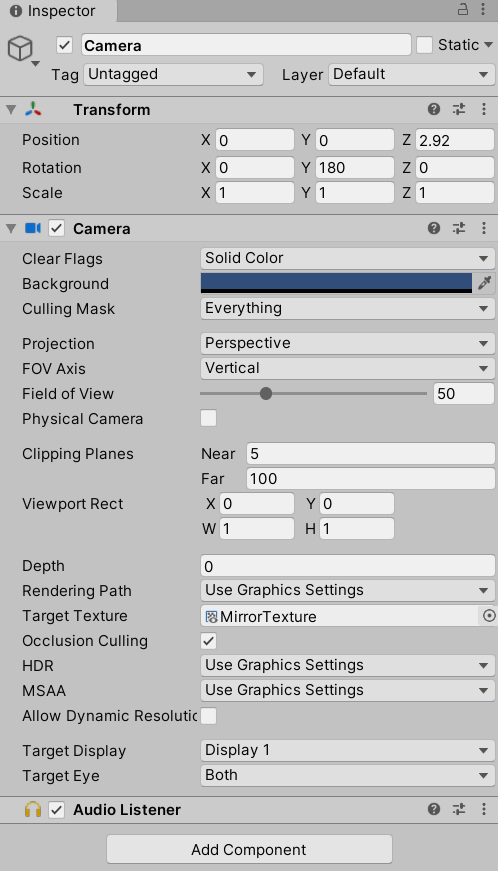

# 10. 高级纹理
在第7章中，学习了法线纹理、渐变纹理、遮罩纹理，它们都属于低维（一维或二维）纹理。

在本章中，将学习更复杂的纹理：

* **立方体纹理（Cubemap）**
* **渲染纹理（Render Texture）**
* **程序纹理（Procedure Texture）**

## 10.1 立方体纹理
在图形学中，**立方体纹理（Cubemap）**是**环境映射（Environment Mapping）**的一种实现方法，还能用于天空盒子（Skybox）。

立方体的每个面表示沿着世界空间下的轴向（上下左右前后）观察所得的图像。使用三维纹理坐标，这个方向矢量从立方体的中心出发向外部延申时，和立方体的6个我哪里之一相交，采样得到的结果就是右该交点计算而来的。


立方体纹理的好处是，实现简单快速，效果比较好。缺点有两方面：一是引入了新的物体、光源或者物体移动了时，要重新生成立方体纹理；二是不能模拟多次反射的结果。

### 10.1.1 天空盒子
**天空盒子（Skybox）**：模拟天空，一个盒子。

使用天空盒子：创建一个Skybox材质，再把它赋给改场景的相关设置。

如何创建Skybox材质：

1. 新建材质，名称是Mat10.1_Skybox
2. 在Skybox的UnityShader下拉菜单中选择Unity自带的Skybox/6Sided，该材质需要6张纹理
3. 使用本书资源中的Assets/Textures/Chapter10/Cubemaps下的6张纹理。需要把6张纹理的WarpMode设置为Clamp，防止在接缝处出现不匹配的现象
4. 材质的其他属性：
    * **TintColor**：控制该材质的整体颜色
    * **Exposure**：调整天空盒子的亮度
    * **Rotation**：调整天空盒子沿+y轴方向旋转的角度


如何为场景添加Skybox：

1. 新建场景，名称是Scene10.1
2. 在Window->Lighting（现在是Window->Rendering->LightingSettings），把Mat10.1_Skybox赋给SkyboxMaterial选项
3. 确保Camera的ClearFlags被设置为Skybox


得到的场景如下。在Unity中，天空盒子是在所有不透明物体之后渲染的，其背后使用的网格是一个立方体或一个细分后的球体。


### 10.1.2 创建用于环境映射的立方体纹理
除了天空盒子，其他最常见的用处是用于环境映射。在Unity5中，创建用于环境映射的立方体纹理的方法有三种：

1. 直接由一些特殊布局的纹理创建
2. 手动创建一个Cubemap资源，再把6张图赋给它
3. 脚本生成

第一种方法，要提供一张具有特殊布局的纹理。一般用HDR图像。

第二种方法是Unity5之前的方法，官方推荐第一种方法，因为可以对纹理数据压缩、支持边缘修正、HDR等功能。

第三种方法，可以根据物体在场景中位置的不同生成不同的立方体纹理。通过Camera.RenderToCubemap来实现。本书资源Assets/Editor/Chapter10/RenderCubemapWizard.cs中，关键代码如下：

```
void OnWizardCreate(){
    // create temporary camera for rendering
    GameObject go=new GameObject("CubemapCamera");
    go.AddComponent<Camera>();
    // Place it on the object
    go.transform.position=renderFromPosition.position;
    // render into cubemap
    go.GetComponent<Camera>().RenderToCubemap(cubemap);

    // destroy temporary camera
    DestroyImmediate(go);
}
```

使用RenderCubemapWizard.cs创建Cubemap的步骤：

1. 使用Scene10.1，创建空的GameObject对象
2. 新建一个用于存储的立方体纹理Create->Legacy->Cubemap，命名Cubemap_0，在它的面板中勾选Readable
3. 将作者提供的编辑器脚本RenderCubemapWizard.cs复制到项目中
4. 菜单栏GameObject->RenderIntoCubemap，打开用于在脚本中渲染立方体的窗口。把第1步创建的GameObject和第2步创建的Cubemap_0拖到对应的选项中
5. 单击窗口中的Render!按钮，就可以把从该位置观察到的世界空间下的6张图像渲染到Cubemap_0中


使用脚本渲染的Cubemap如下，调整FaceSize改变图像质量。环境映射最常见的应用是反射和折射。


### 10.1.3 反射
通过入射光线的方向和表面法线的方向，来计算反射方向，再利用反射方向对立方体纹理采样，来模拟反射效果。

*这节作者没有提供完整代码，我手写后和作者的代码比较，出现很多问题。果然抄代码一时爽，一开始默写就忘。*

*这些是我犯的错误：首先是SubShader和Pass没有加Tags（不记得怎么写了），这个Pass作为BasePass没有加宏。顶点着色器输出结构体v2f没有声明阴影SHADOW_COORDS(4)。worldNormal等方向向量，应该使用fixed3而不是float3。立方体贴图在Cg中的变量类型应该为samplerCUBE而不是sampler3D。最后FallBack使用Reflective/VertexLit。*

完整的反射Shader如下：

```
// Upgrade NOTE: replaced '_Object2World' with 'unity_ObjectToWorld'

Shader "ShaderLearning/Shader10.1_Reflection"{
    Properties{
        _Color("Color Tint",Color)=(1,1,1,1)
        _ReflectColor("Reflection Color",Color)=(1,1,1,1) // 反射颜色
        _ReflectAmount("Reflect Amount",Range(0,1))=1 // 反射程度
        _Cubemap("Reflection Cubemap",Cube)="_Skybox"{} // 环境映射纹理
    }
    SubShader{
        Tags{"RenderrType"="Opaque" "Queue"="Geometry"}
        Pass{
            Tags{"LightMode"="ForwardBase"}

            CGPROGRAM

            #pragma multi_compile_fwdbase

            #pragma vertex vert
            #pragma fragment frag

            #include "Lighting.cginc"
            #include "AutoLight.cginc"

            fixed4 _Color;
            fixed4 _ReflectColor;
            fixed _ReflectAmount;
            samplerCUBE _Cubemap;

            struct a2v{
                float4 vertex:POSITION;
                float3 normal:NORMAL;
            };

            struct v2f{
                float4 pos:SV_POSITION;
                fixed3 worldNormal:TEXCOORD0;
                float3 worldPos:TEXCOORD1;
                fixed3 worldViewDir:TEXCOORD2;
                fixed3 worldRef1:TEXCOORD3;
                SHADOW_COORDS(4)
            };

            v2f vert(a2v v){
                v2f o;

                o.pos=UnityObjectToClipPos(v.vertex);
                o.worldNormal=UnityObjectToWorldNormal(v.normal);
                o.worldPos=mul(unity_ObjectToWorld,v.vertex).xyz;
                o.worldViewDir=UnityWorldSpaceViewDir(o.worldPos); // 视角方向
                // Compute the reflect dir in world space
                // 光路可逆，计算视角方向关于顶点法线的反射方向求得入射光线的方向
                // 处于性能考虑，在顶点着色器中计算反射方向
                // 和在片元着色器中计算的视觉效果差不多
                o.worldRef1=reflect(-o.worldViewDir,o.worldNormal);

                TRANSFER_SHADOW(o);

                return o;
            }

            fixed4 frag(v2f i):SV_Target{
                fixed3 worldNormal=normalize(i.worldNormal);
                fixed3 worldLightDir=normalize(UnityWorldSpaceLightDir(i.worldPos));
                fixed3 worldViewDir=normalize(i.worldViewDir);

                fixed3 ambient=UNITY_LIGHTMODEL_AMBIENT.xyz;

                fixed3 diffuse=_LightColor0.rgb*_Color.rgb*max(0,dot(worldNormal,worldLightDir));

                // Use the reflect dir in world space to access the cubemap
                // 使用texCUBE对立方体纹理采样，i.worldRef1不需要归一化
                fixed3 reflection=texCUBE(_Cubemap,i.worldRef1).rgb*_ReflectColor.rgb;

                UNITY_LIGHT_ATTENUATION(atten,i,i.worldPos);

                // Mix the diffuse color with the reflected color
                fixed3 color=ambient+lerp(diffuse,reflection,_ReflectAmount)*atten;

                return fixed4(color,1.0);
            }

            ENDCG
        }
    }
    FallBack "Reflective/VertexLit"
}
```

运行结果如下：


### 10.1.4 折射
折射：当光线从一种介质（例如空气）斜射入另一种介质（例如玻璃）时，传播方向一般会发生改变。给定入射角时，使用**斯涅尔定律（Snell's Law）**来计算反射角，n1和n2是两个介质的**折射率（index of refraction）**：n1sinθ1=n2sinθ2


完整的折射Shader如下。*与反射的区别是使用了_RefractRatio作为折射率；在顶点着色器中，使用refract计算折射方向；在片元着色器中，根据反射方向用texCUBE采样，最后和漫反射进行插值：*

```
// Upgrade NOTE: replaced '_Object2World' with 'unity_ObjectToWorld'

Shader "ShaderLearning/Shader10.1_Refraction"{
    Properties{
        _Color("Color Tint",Color)=(1,1,1,1)
        _RefractColor("Reflection Color",Color)=(1,1,1,1) // 折射颜色
        _RefractAmount("Reflection Amount",Range(0,1))=1 // 折射程度
        _RefractRatio("Refraction Ratio",Range(0,1))=0.5 // 介质的透射比
        _Cubemap("Reflection Cubemap",Cube)="_Skybox"{} // 环境映射纹理
    }
    SubShader{
        Tags{"RenderrType"="Opaque" "Queue"="Geometry"}
        Pass{
            Tags{"LightMode"="ForwardBase"}

            CGPROGRAM

            #pragma multi_compile_fwdbase

            #pragma vertex vert
            #pragma fragment frag

            #include "Lighting.cginc"
            #include "AutoLight.cginc"

            fixed4 _Color;
            fixed4 _RefractColor;
            fixed _RefractAmount;
            fixed _RefractRatio;
            samplerCUBE _Cubemap;

            struct a2v{
                float4 vertex:POSITION;
                float3 normal:NORMAL;
            };

            struct v2f{
                float4 pos:SV_POSITION;
                fixed3 worldNormal:TEXCOORD0;
                float3 worldPos:TEXCOORD1;
                fixed3 worldViewDir:TEXCOORD2;
                fixed3 worldRefr:TEXCOORD3;
                SHADOW_COORDS(4)
            };

            v2f vert(a2v v){
                v2f o;

                o.pos=UnityObjectToClipPos(v.vertex);
                o.worldNormal=UnityObjectToWorldNormal(v.normal);
                o.worldPos=mul(unity_ObjectToWorld,v.vertex).xyz;
                o.worldViewDir=UnityWorldSpaceViewDir(o.worldPos); // 视角方向

                // Compute the refract dir in world space
                // 计算折射方向
                // 使用refract函数，要归一化
                o.worldRefr=refract(-normalize(o.worldViewDir),normalize(o.worldNormal),_RefractRatio);

                TRANSFER_SHADOW(o);

                return o;
            }

            fixed4 frag(v2f i):SV_Target{
                fixed3 worldNormal=normalize(i.worldNormal);
                fixed3 worldLightDir=normalize(UnityWorldSpaceLightDir(i.worldPos));
                fixed3 worldViewDir=normalize(i.worldViewDir);

                fixed3 ambient=UNITY_LIGHTMODEL_AMBIENT.xyz;

                fixed3 diffuse=_LightColor0.rgb*_Color.rgb*max(0,dot(worldNormal,worldLightDir));

                // Use the refract dir in world space to access the cubemap
                // 使用texCUBE对立方体纹理采样，i.worldRefr不需要归一化
                fixed3 refraction=texCUBE(_Cubemap,i.worldRefr).rgb*_RefractColor.rgb;

                UNITY_LIGHT_ATTENUATION(atten,i,i.worldPos);

                // Mix the diffuse color with the refracted color
                fixed3 color=ambient+lerp(diffuse,refraction,_RefractAmount)*atten;

                return fixed4(color,1.0);
            }

            ENDCG
        }
    }
    FallBack "Reflective/VertexLit"
}
```

运行结果如下：


### 10.1.5 菲涅尔反射
在实时渲染中，经常会用**菲涅尔反射（Fresnel reflection）**来根据视角方向控制反射程度。光线照射到物体表面时，一部分反射，一部分进入物体内部发生折射或散射。

一个著名的近似公式是**Schlick菲涅尔近似等式**：F(v,n)=F0+(1-F0)(1-v·n)^5

其中F0是反射系数，控制菲涅尔反射的强度；v是视角方向，n是表面法线。

另一个应用广泛的等式是**Empricial菲涅尔近似等式**：F(v,n)=max(0,min(1,bias+scale*(1-v·n)^power))

使用上面的菲涅尔近似等式，可以在边界处模拟反射光强、折射光强、漫反射光强之间的变化。在车漆、水面等材质的渲染中经常使用。本节使用Schlick菲涅尔近似等式来模拟菲涅尔反射。

完整代码如下，在片元着色器中计算了菲涅尔系数，计算最终颜色的时候使用这个系数对漫反射颜色和反射颜色进行插值：

```
// Upgrade NOTE: replaced '_Object2World' with 'unity_ObjectToWorld'

Shader "ShaderLearning/Shader10.1_Fresnel"{
    Properties{
        _Color("Color Tint",Color)=(1,1,1,1)
        _FresnelScale("Fresnel Scale",Range(0,1))=0.5
        _Cubemap("Reflection Cubemap",Cube)="_Skybox"{} // 环境映射纹理
    }
    SubShader{
        Tags{"RenderrType"="Opaque" "Queue"="Geometry"}
        Pass{
            Tags{"LightMode"="ForwardBase"}

            CGPROGRAM

            #pragma multi_compile_fwdbase

            #pragma vertex vert
            #pragma fragment frag

            #include "Lighting.cginc"
            #include "AutoLight.cginc"

            fixed4 _Color;
            fixed _FresnelScale;
            samplerCUBE _Cubemap;

            struct a2v{
                float4 vertex:POSITION;
                float3 normal:NORMAL;
            };

            struct v2f{
                float4 pos:SV_POSITION;
                fixed3 worldNormal:TEXCOORD0;
                float3 worldPos:TEXCOORD1;
                fixed3 worldViewDir:TEXCOORD2;
                fixed3 worldRefl:TEXCOORD3;
                SHADOW_COORDS(4)
            };

            v2f vert(a2v v){
                v2f o;

                o.pos=UnityObjectToClipPos(v.vertex);
                o.worldNormal=UnityObjectToWorldNormal(v.normal);
                o.worldPos=mul(unity_ObjectToWorld,v.vertex).xyz;
                o.worldViewDir=UnityWorldSpaceViewDir(o.worldPos); // 视角方向
                // Compute the reflect dir in world space
                // 光路可逆，计算视角方向关于顶点法线的反射方向求得入射光线的方向
                // 处于性能考虑，在顶点着色器中计算反射方向
                // 和在片元着色器中计算的视觉效果差不多
                o.worldRefl=reflect(-o.worldViewDir,o.worldNormal);

                TRANSFER_SHADOW(o);

                return o;
            }

            // 在片元着色器中计算菲涅尔反射
            fixed4 frag(v2f i):SV_Target{
                fixed3 worldNormal=normalize(i.worldNormal);
                fixed3 worldLightDir=normalize(UnityWorldSpaceLightDir(i.worldPos));
                fixed3 worldViewDir=normalize(i.worldViewDir);

                fixed3 ambient=UNITY_LIGHTMODEL_AMBIENT.xyz;

                fixed3 diffuse=_LightColor0.rgb*_Color.rgb*max(0,dot(worldNormal,worldLightDir));

                // Use the reflect dir in world space to access the cubemap
                // 使用texCUBE对立方体纹理采样，i.worldRef1不需要归一化
                fixed3 reflection=texCUBE(_Cubemap,i.worldRefl).rgb;

                // 菲涅尔
                fixed fresnel=_FresnelScale+(1-_FresnelScale)*pow(1-dot(worldViewDir,worldNormal),5);

                UNITY_LIGHT_ATTENUATION(atten,i,i.worldPos);

                // Mix the diffuse color with the reflected color
                // fixed3 color=ambient+lerp(diffuse,reflection,_ReflectAmount)*atten;
                fixed3 color=ambient+lerp(diffuse,reflection,saturate(fresnel)*atten);

                return fixed4(color,1.0);
            }

            ENDCG
        }
    }
    FallBack "Reflective/VertexLit"
}
```

运行结果如下。当_FresnelScale为1时，完全反射Cubemap中的图像；当_FresnelScale为0时，是一个具有边缘光照效果的漫反射物体（*十分不明显*）:


## 10.2 渲染纹理
现代GPU允许我们把整个三维场景渲染到一个中间缓冲中，即**渲染目标纹理（Render Target Texture, RTT）**，而不是传统的帧缓冲或后备缓冲。与之相关的是**多重渲染目标（Multiple Render Target, MRT）**，指GPU允许我们把场景同时渲染到多个渲染目标纹理中。

Unity为渲染目标纹理定义了一种专门的纹理类型：**渲染纹理（Render Texture）**。在Unity中使用渲染纹理有两种方式：

1. 在Project目录下创建渲染纹理，然后把某个相机的渲染目标设置成该渲染纹理
2. 在屏幕后处理时使用GrabPass命令或OnRenderImage函数来获取当前屏幕图像

### 10.2.1 镜子效果
前置步骤：

1. 新建场景，新建材质，新建Shader
2. 创建6个立方体，组成墙体。添加3个点光源，照亮房间
3. 创建3个球体和2个正方体
4. 创建1个四边形Quad，作为镜子
5. 在Project视图下创建渲染纹理Create->RenderTexture，起名为MirrorTexture
6. 创建摄像机，拍摄图像，使用渲染纹理。调整位置、裁剪平面、视角等

渲染贴图和摄像机的设置如下：





完整代码如下，在顶点着色器中计算纹理坐标，在片元着色器中对渲染纹理进行采样和输出：

```
Shader "ShaderLearning/Shader10.2_Mirror"{
    Properties{
        _MainTex("Main Tex",2D)="White"{}
    }

    SubShader{
        Tags{
            "RenderType"="Opaque"
            "Queue"="Geometry"
        }

        Pass{
            Tags{"LightMode"="ForwardBase"}

            CGPROGRAM

            #pragma multi_compile_fwdbase

            #pragma vertex vert
            #pragma fragment frag
            
            #include "Lighting.cginc"
            #include "AutoLight.cginc"

            sampler2D _MainTex;

            struct a2v{
                float4 vertex:POSITION;
                float4 texcoord:TEXCOORD0;
            };

            struct v2f{
                float4 pos:SV_POSITION;
                float2 uv:TEXCOORD0;
            };

            v2f vert(a2v v){
                v2f o;
                o.pos=UnityObjectToClipPos(v.vertex);
                o.uv=v.texcoord;
                // Mirror needs to filp x
                o.uv.x=1-o.uv.x;

                return o;
            }

            fixed4 frag(v2f i):SV_Target{
                return tex2D(_MainTex,i.uv);
            }

            ENDCG
        }
    }
    FallBack "Diffuse"
}
```

运行结果如下：


### 10.2.2 玻璃效果
GrabPass，会把当前屏幕的图像绘制在一张纹理中，以便我们在后续的Pass中访问它。通常会使用GrabPass来实现玻璃等透明材质的模拟。需要使用透明队列（"Queue"="Transparent"）

用GrabPass模拟玻璃效果的原理：首先使用一张法线纹理来修改模型的法线信息，然后用10.1节介绍的反射方法，通过Cubemap来模拟玻璃的反射。在模拟折射时，使用GrabPass获取玻璃后面的屏幕图像，并使用切线空间下的法线对屏幕纹理坐标偏移后，再对屏幕图像进行取样来模拟近似的折射效果。

前置步骤：

1. 新建场景去掉默认天空盒，新建材质和Shader
2. 6面墙围成房间，放置一个立方体作为玻璃，放置球体在内部
3. 创建立方体纹理Cubemap_Glass，用作者的脚本获取纹理

完整代码如下：

```
Shader "ShaderLearning/Shader10.2_GlassRefraction"{
    Properties{
        _MainTex("Main Tex",2D)="white"{}
        _BumpMap("Normal Map",2D)="bump"{}
        _Cubemap("Environment Cubemap",Cube)="_Skybox"{}
        _Distortion("Distortion",Range(0,100))=10 // 模拟折射时图像的扭曲程度
        _RefractAmount("Refract Amount",Range(0.0,1.0))=1.0 // 反射程度
    }

    SubShader{
        // We must be transparent, so other objects are drawn before this one
        Tags{"Queue"="Transparent" "RenderType"="Opaque"}

        // This pass grabs the screen behind the object into a texture
        // We can zccess the result in the next pass as _RefractionTex
        GrabPass{"_RefractionTex"}

        Pass{
            Tags{"LightModel"="ForwardBase"}

            CGPROGRAM

            #pragma multi_compile_fwdbase
            #pragma vertex vert
            #pragma fragment frag
            #include "Lighting.cginc"
            #include "AutoLight.cginc"

            sampler2D _MainTex;
            float4 _MainTex_ST;
            sampler2D _BumpMap;
            float4 _BumpMap_ST;
            samplerCUBE _Cubemap;
            float _Distortion;
            fixed _RefractAmount;
            sampler2D _RefractionTex; // GrabPass指定的纹理名称
            float4 _RefractionTex_TexelSize; // GrabPass得到的纹素大小

            struct a2v{
                float4 vertex:POSITION;
                float2 texcoord:TEXCOORD0;
                float3 normal:NORMAL;
                float4 tangent:TANGENT;
            };

            struct v2f{
                float4 pos:SV_POSITION;
                float4 scrPos:TEXCOORD0;
                float4 uv:TEXCOORD1;
                float4 TtoW0:TEXCOORD2;
                float4 TtoW1:TEXCOORD3;
                float4 TtoW2:TEXCOORD4;
            };

            v2f vert(a2v v){
                v2f o;
                o.pos=UnityObjectToClipPos(v.vertex);

                o.scrPos=ComputeGrabScreenPos(o.pos); // 得到被抓取的屏幕图像的纹理坐标

                o.uv.xy=TRANSFORM_TEX(v.texcoord,_MainTex);
                o.uv.zw=TRANSFORM_TEX(v.texcoord,_BumpMap);

                float3 worldPos=mul(unity_ObjectToWorld,v.vertex).xyz;
                fixed3 worldNormal=UnityObjectToWorldNormal(v.normal);
                fixed3 worldTangent=UnityObjectToWorldDir(v.tangent.xyz);
                fixed3 worldBinormal=cross(worldNormal,worldTangent)*v.tangent.w;

                o.TtoW0=float4(worldTangent.x,worldBinormal.x,worldNormal.x,worldPos.x);
                o.TtoW1=float4(worldTangent.y,worldBinormal.y,worldNormal.y,worldPos.y);
                o.TtoW2=float4(worldTangent.z,worldBinormal.z,worldNormal.z,worldPos.z);

                return o;
            }

            fixed4 frag(v2f i):SV_Target{
                float3 worldPos=float3(i.TtoW0.w,i.TtoW1.w,i.TtoW2.w);
                fixed3 worldViewDir=normalize(UnityWorldSpaceViewDir(worldPos));

                // Get the normal in tangent space
                fixed3 bump=UnpackNormal(tex2D(_BumpMap,i.uv.zw));

                // Compute the offset in tangent space
                float2 offset=bump.xy*_Distortion*_RefractionTex_TexelSize.xy;
                i.scrPos.xy=offset+i.scrPos.xy;
                fixed3 refrCol=tex2D(_RefractionTex,i.scrPos.xy/i.scrPos.w).rgb;

                // Convert the normal to world space
                bump=normalize(half3(dot(i.TtoW0.xyz,bump),dot(i.TtoW1.xyz,bump),dot(i.TtoW2.xyz,bump)));
                fixed3 reflDir=reflect(-worldViewDir,bump);
                fixed4 texColor=tex2D(_MainTex,i.uv.xy);
                fixed3 reflCol=texCUBE(_Cubemap,reflDir).rgb*texColor.rgb;

                fixed3 finalColor=reflCol*(1-_RefractAmount)+refrCol*_RefractAmount;

                return fixed4(finalColor,1);
            }

            ENDCG
        }
    }
}
```

运行效果如下，感觉和作者不同...：


### 10.2.3 渲染纹理 vs. GrabPass
使用方便程度：

* 渲染纹理：要先创建渲染纹理资源和一个额外的相机，再把相机的RenderTarget设置为新建的渲染纹理对象，最后把该渲染纹理传递给相应的Shader
* GrabPass：只需要在Shader中写几行代码

效率上渲染纹理往往好于GrabPass，尤其是移动平台：

* 渲染纹理：可以自定义大小和相机的渲染层
* GrabPass：获取到的图像分辨率和屏幕显示是一致的。在移动设备上，需要CPU读取后备缓冲中的数据，破坏了CPU和GPU之间的并行性

Unity5中引入了**命令缓冲（Command Buffers）**扩展渲染流水线，得到类似抓屏的效果。

## 10.3 程序纹理
**程序纹理（Procedural Texture）**指那些由计算机生成的图像，我们通常用一些特定的算法来创建个性化图案或非常真实的自然元素，例如木头、石子等。

### 10.3.1 在Unity中实现简单的程序纹理
***这节代码知乎电子书错误特别多！！！***

完整代码如下：

```
using System.Collections;
using System.Collections.Generic;
using UnityEngine;

[ExecuteInEditMode] // 让脚本能在编辑器模式下运行
public class ProceduralTextureGeneration : MonoBehaviour
{
    public Material material=null;

    // #region/#ednregion 用于组织代码
    #region Material properties

    // 使用了开源插件SetProperty
    [SerializeField,SetProperty("textureWidth")]
    // 纹理的大小，通常是2的整数幂
    private int m_textureWidth=512;
    public int textureWidth{
        get{
            return m_textureWidth;
        }
        set{
            m_textureWidth=value;
            _UpdateMaterial();
        }
    }

    [SerializeField,SetProperty("backgroundColor")]
    // 纹理的背景颜色
    private Color m_backgroundColor=Color.white;
    public Color backgroundColor{
        get{
            return m_backgroundColor;
        }
        set{
            m_backgroundColor=value;
            _UpdateMaterial();
        }
    }

    [SerializeField,SetProperty("circleColor")]
    // 圆点的颜色
    private Color m_circleColor=Color.yellow;
    public Color circleColor{
        get{
            return m_circleColor;
        }
        set{
            m_circleColor=value;
            _UpdateMaterial();
        }
    }

    [SerializeField,SetProperty("blurFactor")]
    // 模糊因子，用来模糊圆形边界的
    private float m_blurFactor=2.0f;
    public float blurFactor{
        get{
            return m_blurFactor;
        }
        set{
            m_blurFactor=value;
            _UpdateMaterial();
        }
    }

    #endregion

    private Texture2D m_generatedTexture=null;

    // Start is called before the first frame update
    void Start()
    {
        if(material==null){
            Renderer renderer=gameObject.GetComponent<Renderer>();
            if(renderer==null){
                Debug.LogWarning("Cannot find a renderer");
                return;
            }

            // 从Renderer组件中拿到材质
            material=renderer.sharedMaterial;
        }

        _UpdateMaterial();
    }

    // Update is called once per frame
    void Update()
    {
        
    }

    private void _UpdateMaterial(){
        if(material!=null){
            m_generatedTexture=_GenerateProceduralTexture();
            material.SetTexture("_MainTex",m_generatedTexture);
        }
    }

    // 混合颜色
    private Color _MixColor(Color color0, Color color1, float mixFactor){
        Color mixColor=Color.white;
        mixColor.r=Mathf.Lerp(color0.r,color1.r,mixFactor);
        mixColor.g=Mathf.Lerp(color0.g,color1.g,mixFactor);
        mixColor.b=Mathf.Lerp(color0.b,color1.b,mixFactor);
        mixColor.a=Mathf.Lerp(color0.a,color1.a,mixFactor);
        return mixColor;
    }
    private Texture2D _GenerateProceduralTexture(){
        Texture2D proceduralTexture=new Texture2D(textureWidth,textureWidth);

        // 定义园与园之间的间距
        float circleInterval=textureWidth/4.0f;
        // 定义圆的半径
        float radius=textureWidth/10.0f;
        // 定义模糊系数
        float edgeBlur=1.0f/blurFactor;

        for(int w=0;w<textureWidth;w++){
            for(int h=0;h<textureWidth;h++){
                // 使用背景颜色进行初始化
                Color pixel=backgroundColor;

                // 依次画9个圆
                for(int i=0;i<3;i++){
                    for(int j=0;j<3;j++){
                        // 计算当前所绘制的圆的圆心位置
                        Vector2 circleCenter=new Vector2(circleInterval*(i+1),circleInterval*(j+1));

                        // 计算当前像素与圆心的距离
                        float dist=Vector2.Distance(new Vector2(w,h),circleCenter)-radius;

                        // 模糊圆的边界
                        Color color=_MixColor(circleColor,new Color(pixel.r,pixel.g,pixel.b,0.0f),
                        Mathf.SmoothStep(0f,1.0f,dist*edgeBlur));

                        // 与之前得到的颜色进行混合
                        pixel=_MixColor(pixel,color,color.a);
                    }
                }

                proceduralTexture.SetPixel(w,h,pixel);
            }
        }
        proceduralTexture.Apply();

        return proceduralTexture;
    }
}

```

不同参数下的运行结果如下：


*使用起来感觉并不好，卡卡的。改一个参数要生成很久，修改参数的时候鼠标甚至移动不了...*

### 10.3.2 Unity的程序材质
在Unity中，有一类专门使用程序纹理的材质就叫**程序材质（Procedural Materials）**，使用**Substance Designer**软件创建，这种材质以.sbsar为后缀。

略。

# 999. Ref
1. 官方文档Cubemaps：https://docs.unity3d.com/Manual/class-Cubemap.html
2. 官方文档GraphicsCommandBuffers：https://docs.unity3d.com/Manual/GraphicsCommandBuffers.html
3. 开源插件SetProperty：https://github.com/LMNRY/SetProperty