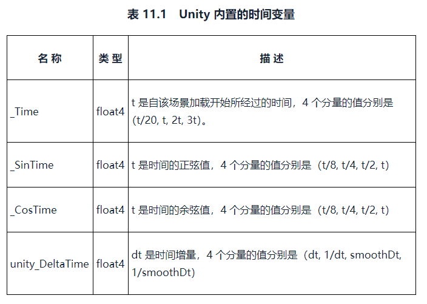
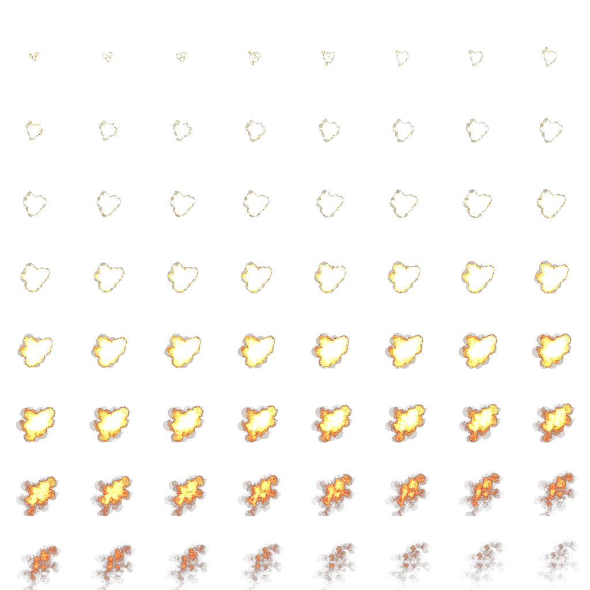
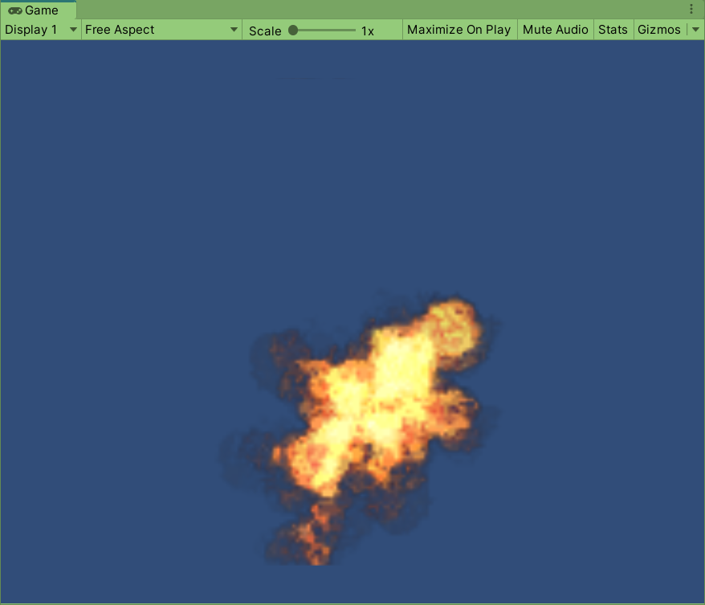
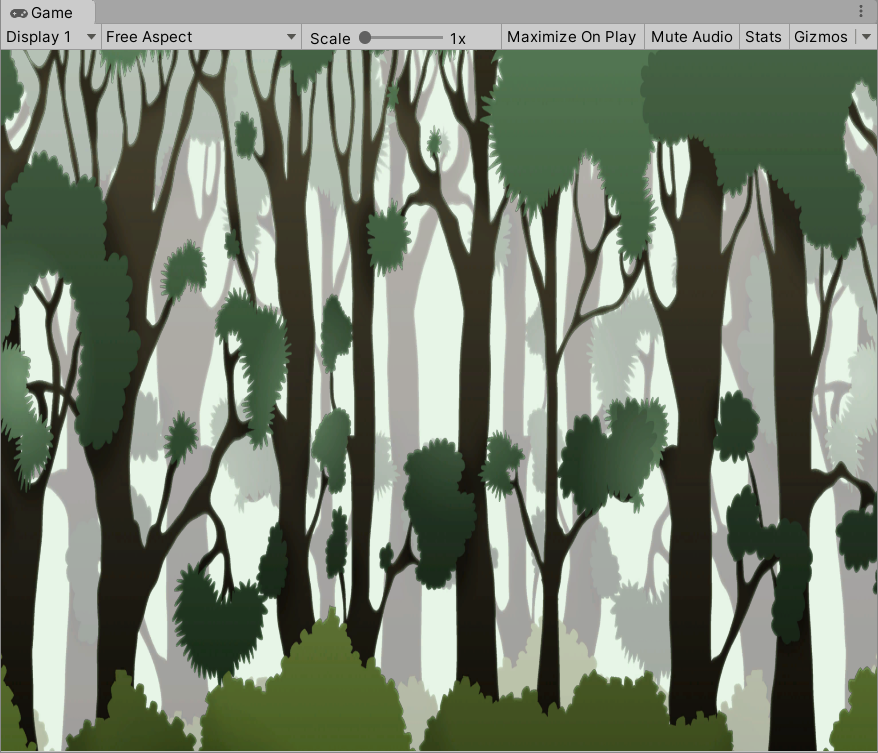
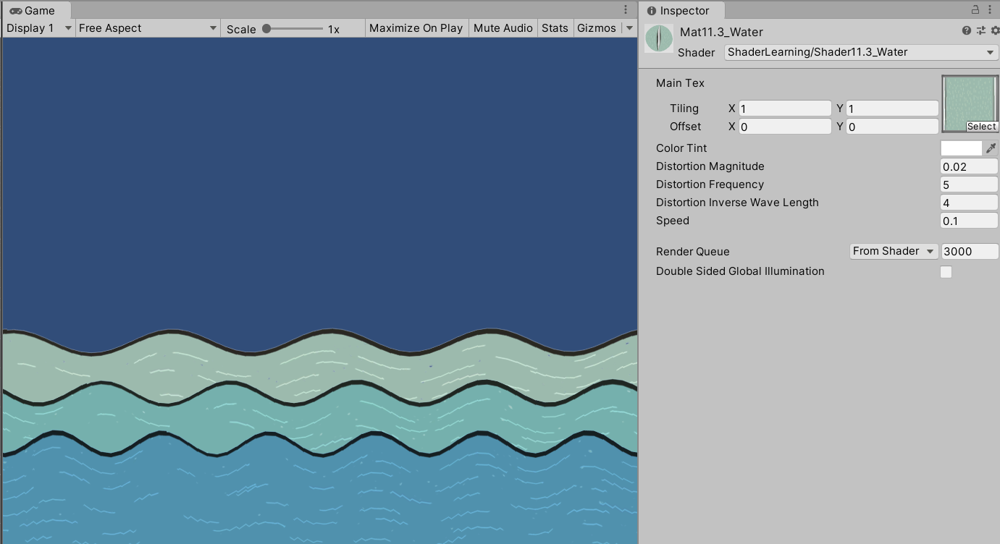
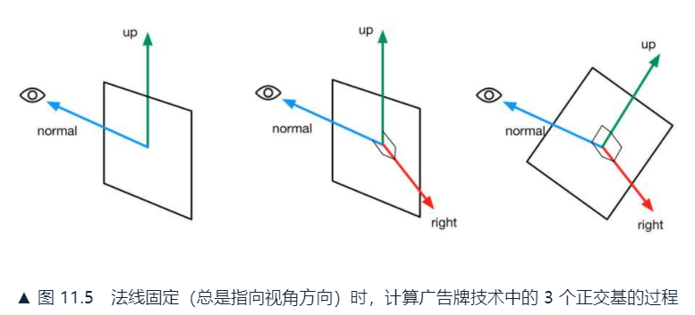
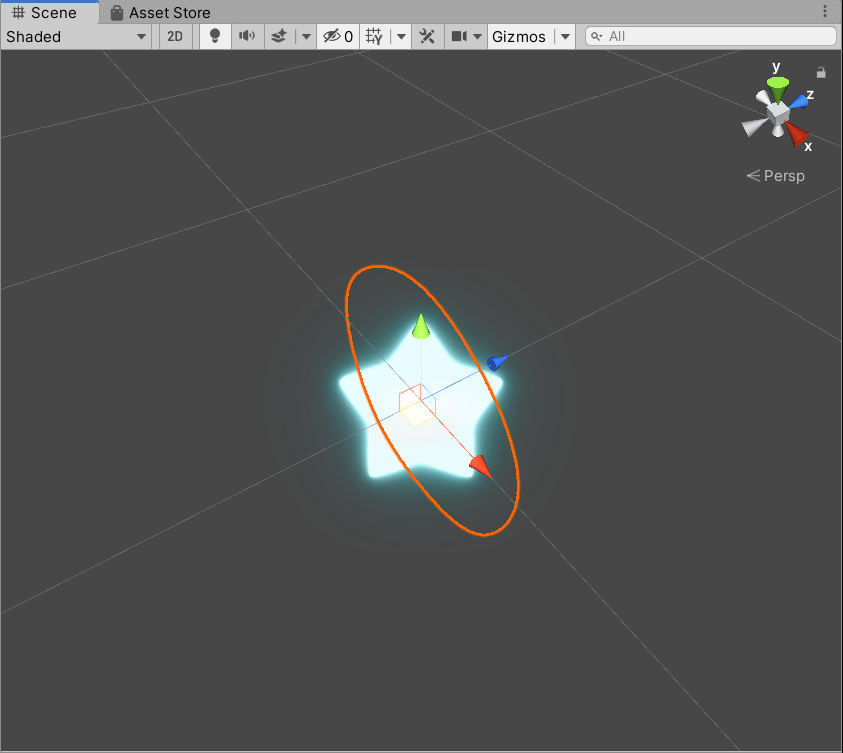

# 11. 让画面动起来
* 时间变量
* 纹理动画
  * 序列帧动画
  * 背景循环滚动动画
* 顶点动画

## 11.1 UnityShader中的内置变量（时间篇）
动画效果往往都是把时间添加到一些变量的计算中，以便在时间变化时画面也可以随之变化。



## 11.2 纹理动画
在游戏中应用广泛。尤其是在资源局限的移动平台上，会使用纹理动画代替复杂的粒子系统模拟动画效果。

### 11.2.1 序列帧动画
完整代码如下：

```
Shader "ShaderLearning/Shader11.2_ImageSequenceAnimation"{
    Properties{
        _Color("Color Tint",Color)=(1,1,1,1)
        _MainTex("Image Sequence",2D)="White"{}
        _HorizontalAmount("Horizontal Amount",Float)=4
        _VerticalAmount("Vertical Amount",Float)=4
        _Speed("Speed",Range(1,100))=30
    }

    SubShader{
        Tags{"Queue"="Transparent" "IgnoreProjector"="True" "RenderType"="Transparent"}

        Pass{
            // 当成是半透明对象
            Tags{"LightMode"="ForwardBase"}

            ZWrite Off
            Blend SrcAlpha OneMinusSrcAlpha

            CGPROGRAM
            #pragma vertex vert
            #pragma fragment frag
            #include "Lighting.cginc"

            fixed4 _Color;
            sampler2D _MainTex;
            float4 _MainTex_ST;
            float _HorizontalAmount;
            float _VerticalAmount;
            fixed _Speed;

            struct a2v{
                float4 vertex:POSITION;
                float4 texcoord:TEXCOORD0;
            };

            struct v2f{
                float4 pos:SV_POSITION;
                float2 uv:TEXCOORD0;
            };

            v2f vert(a2v v){
                v2f o;
                o.pos=UnityObjectToClipPos(v.vertex);
                o.uv=TRANSFORM_TEX(v.texcoord,_MainTex);
                return o;
            }

            fixed4 frag(v2f i):SV_Target{
                float time=floor(_Time.y*_Speed);
                float row=floor(time/_HorizontalAmount);
                float column=time-row*_HorizontalAmount;

                // half2 uv=float2(i.uv.x/_HorizontalAmount,i.uv.y/_VerticalAmount);
                // uv.x+=column/_HorizontalAmount;
                // uv.y-=row/_VerticalAmount;
                half2 uv=i.uv+half2(column,-row);
                uv.x/=_HorizontalAmount;
                uv.y/=_VerticalAmount;

                fixed4 c=tex2D(_MainTex,uv);
                c.rgb*=_Color;

                return c;                
            }

            ENDCG
        }
    }
}
```

主要是在片元着色器中完成对序列帧图像的采样。使用_Time.y得到场景加载后经过的时间，乘以_Speed。计算出应该使用的行和列，构建真正的采样坐标。

使用的有关键帧的图像，和运行时一帧的效果如下：




### 11.2.2 滚动的背景
很多2D游戏使用了不断滚动的背景来模拟角色在场景中的穿梭，用**多个层（layers）**来模拟视差效果。

完整代码如下：

```
Shader "ShaderLearning/Shader11.2_ScrollingBackground"{
    Properties{
        _MainTex("Base Layer (RGB)",2D)="White"{} // 第一层（较远）背景纹理
        _DetailTex("2nd Layer (RGB)",2D)="White"{} // 第二层（较近）背景纹理
        _ScrollX("Base Layer Scroll Speed",Float)=1.0 // 第一层速度
        _Scroll2X("2nd Layer Scroll Speed",Float)=1.0 // 第二层速度
        _Multiplier("Layer Multiplier",Float)=1 // 整体亮度
    }

    SubShader{
        Tags{"Queue"="Geometry" "RenderType"="Opaque"}

        Pass{
            Tags{"LightMode"="ForwardBase"}

            CGPROGRAM

            #pragma multi_compile_fwdbase
            #pragma vertex vert
            #pragma fragment frag
            #include "Lighting.cginc"

            sampler2D _MainTex;
            sampler2D _DetailTex;
            float4 _MainTex_ST;
            float4 _DetailTex_ST;
            float _ScrollX;
            float _Scroll2X;
            float _Multiplier;

            struct a2v{
                float4 vertex:POSITION;
                float4 texcoord:TEXCOORD0;
            };

            struct v2f{
                float4 pos:SV_POSITION;
                float4 uv:TEXCOORD0;
            };

            v2f vert(a2v v){
                v2f o;
                o.pos=UnityObjectToClipPos(v.vertex);

                // 使用_Time.y在水平方向上对纹理坐标进行偏移，达到滚动效果
                o.uv.xy=TRANSFORM_TEX(v.texcoord,_MainTex)+frac(float2(_ScrollX,0.0)*_Time.y);
                o.uv.zw=TRANSFORM_TEX(v.texcoord,_DetailTex)+frac(float2(_Scroll2X,0.0)*_Time.y);

                return o;
            }

            fixed4 frag(v2f i):SV_Target{
                fixed4 firstLayer=tex2D(_MainTex,i.uv.xy);
                fixed4 secondLayer=tex2D(_DetailTex,i.uv.zw);

                fixed4 c=lerp(firstLayer,secondLayer,secondLayer.a);
                c.rgb*=_Multiplier;

                return c;
            }

            ENDCG
        }
    }
    Fallback "VertexLit"
}
```

在顶点着色器中，使用一个float4记录两张贴图的纹理坐标，用_Time.y在水平方向上进行偏移，达到滚动的效果。在片元着色器中，分别采样，用近层的透明通道值通过lerp来混合两张纹理。

将后面一层的速度设置的比前面慢，就有种运动的效果了。运行结果的一帧如下：



## 11.3 顶点动画
常常使用顶点动画来模拟飘动的旗帜、湍流的小溪等。本节学习流动的河流、广告牌技术。

### 11.3.1 流动的河流
完整代码如下：

```
Shader "ShaderLearning/Shader11.3_Water"{
    Properties{
        _MainTex("Main Tex",2D)="White"{}
        _Color("Color Tint",Color)=(1,1,1,1)
        _Magnitude("Distortion Magnitude",Float)=1 // 水流波动的幅度
        _Frequency("Distortion Frequency",Float)=1 // 水流波动的频率
        _InvWaveLength("Distortion Inverse Wave Length",Float)=10 // 波长的倒数
        _Speed("Speed",Float)=0.5
    }

    SubShader{
        // Need to disable batching because of the vertex animation
        Tags{
            "Queue"="Transparent"
            "IgnoreProjector"="True"
            "RenderType"="Transparent"
            "DisableBatching"="True" // 不使用批处理，因为要做顶点动画
        }

        Pass{
            Tags{"LightMode"="ForwardBase"}

            ZWrite Off
            Blend SrcAlpha OneMinusSrcAlpha
            Cull off // 关闭剔除，让水流的每个面都能显示

            CGPROGRAM

            #pragma multi_compile_fwdbase
            #pragma vertex vert
            #pragma fragment frag
            #include "Lighting.cginc"

            sampler2D _MainTex;
            float4 _MainTex_ST;
            fixed4 _Color;
            float _Magnitude;
            float _Frequency;
            float _InvWaveLength;
            float _Speed;

            struct a2v{
                float4 vertex:POSITION;
                float4 texcoord:TEXCOORD0;
            };

            struct v2f{
                float4 pos:SV_POSITION;
                float2 uv:TEXCOORD0;
            };

            // 在顶点着色器中计算顶点动画
            v2f vert(a2v v){
                v2f o;
                
                float4 offset;
                offset.yzw=float3(0.0,0.0,0.0);
                offset.x=sin(_Frequency*_Time.y+v.vertex.x*_InvWaveLength+v.vertex.y*_InvWaveLength+v.vertex.z*_InvWaveLength)*_Magnitude;
                o.pos=UnityObjectToClipPos(v.vertex+offset);

                o.uv=TRANSFORM_TEX(v.texcoord,_MainTex);
                o.uv+=float2(0.0,_Time.y*_Speed);

                return o;
            }

            fixed4 frag(v2f i):SV_Target{
                fixed4 c=tex2D(_MainTex,i.uv);
                c.rgb*=_Color.rgb;

                return c;
            }

            ENDCG
        }
    }

    Fallback "Transparent/VertexLit"
}
```

在SubShader的Tags中，将**DisableBatching**设置为True来禁用**批处理**，因为批处理合并了所有相关的模型，各自的模型空间就丢失了，影响我们在物体的模型空间下对顶点位置进行偏移。之后在顶点着色器中，对顶点的X坐标进行位移。

运行结果的一帧，和其中一个材质的参数如下：



### 11.3.2 广告牌
广告牌技术（Billboarding），会根据视角方向旋转一个被纹理着色的多边形，使多边形看起来好像总是面对摄像机。应用例如渲染烟雾、云朵、闪光效果等。

本质是构建旋转矩阵。使用的基向量通常是**表面法线（normal）**、**指向上的方向（up）**、**指向右的方向（right）**以及**锚点（anchor location）**。

难点在于如何构建3个相互正交的基向量。（*其实也不是很难*）首先会通过初始计算得到目标的表面法线和指向上的方向，两者往往是不垂直的，但两者其中之一是固定的。通过这可以计算出指向右的方向：Right=UpxNormal。例如模拟例子效果时，法线总是指向视角方向， 计算出Right后，在叉积计算出修改后向上的方向：Up=NormalxRight。



完整代码如下：

```
Shader "ShaderLearning/Shader11.3_Billboard"{
    Properties{
        _MainTex("Main Tex",2D)="White"{}
        _Color("Color Tint",Color)=(1,1,1,1)
        _VerticalBillboarding("Vertical Restraints",Range(0,1))=1 // 调整固定法线还是固定向上方向
    }

    SubShader{
        // Need to disable batching because of the vertex animation
        Tags{"Queue"="Transparent" "IgnoreProjector"="True" "RenderType"="Transparent" "DisableBatching"="True"}

        Pass{
            Tags{"LightMode"="ForwardBase"}

            ZWrite Off
            Blend SrcAlpha OneMinusSrcAlpha
            Cull Off

            CGPROGRAM

            #pragma multi_compile_fwdbase
            #pragma vertex vert
            #pragma fragment frag
            #include "Lighting.cginc"

            sampler2D _MainTex;
            float4 _MainTex_ST;
            fixed4 _Color;
            fixed _VerticalBillboarding;

            struct a2v{
                float4 vertex:POSITION;
                float4 texcoord:TEXCOORD0;
            };

            struct v2f{
                float4 pos:SV_POSITION;
                float2 uv:TEXCOORD0;
            };

            // 在模型空间计算3个新的正交基
            v2f vert(a2v v){
                v2f o;

                // Suppose the center in object space is fixed
                // 选择模型空间的原点作为广告牌的锚点
                float3 center=float3(0,0,0);
                // 获取模型空间下的视角位置
                float3 viewer=mul(unity_WorldToObject,float4(_WorldSpaceCameraPos,1));

                float3 normalDir=viewer-center;
                // If _VerticalBillboarding equals 1, we use the desired view dir as the normal dir
                // Which means the normal dir is fixed
                // Or if _VerticalBillboarding equals 0, the y of normal is 0
                // Which means the up dir is fixed
                // 如果_VerticalBillboarding是1，认为法线固定
                // 如果_VerticalBillboarding是0，认为向上固定
                normalDir.y=normalDir.y*_VerticalBillboarding;
                normalDir=normalize(normalDir);

                // Get the approximate up dir
                // If normal dir is already towards up, then the up dir is towards front
                // 得到近似的向上方向
                // 如果法线已经向上，那么向上方向应该朝前
                float3 upDir=abs(normalDir.y)>0.999?float3(0,0,1):float3(0,1,0);
                float3 rightDir=normalize(cross(upDir,normalDir));
                upDir=normalize(cross(normalDir,rightDir));

                // 根据原始的位置相对于锚点的偏移量以及3个正交基
                // 得到新的顶点位置
                float3 centerOffs=v.vertex.xyz-center;
                float3 localPos=center+rightDir*centerOffs.x+upDir*centerOffs.y+normalDir*centerOffs.z;
                o.pos=UnityObjectToClipPos(float4(localPos,1));

                o.uv=TRANSFORM_TEX(v.texcoord,_MainTex);

                return o;
            }

            fixed4 frag(v2f i):SV_Target{
                fixed4 c=tex2D(_MainTex,i.uv);
                c.rgb*=_Color.rgb;
                
                return c;
            }

            ENDCG
        }
    }
    
    Fallback "Transparent/VertexLit"
}
```

主要在顶点着色器中完成3个正交基和新顶点坐标的计算。这里做了顶点计算，也要关闭批处理。运行结果如下，当_VerticalBillboarding为1时法线固定，不管从哪个方向看Billboard，看起来都是朝向看的人：



### 11.3.3 注意事项
* 因为取消了批处理，所以会性能下降。要么为了避免显式使用模型空间中心做锚点，可以利用顶点颜色来存储每个顶点到锚点的距离，商业常见
* 因为顶点重新计算了，用内置的Diffuse做阴影是不正确的。应自定义ShadowCasterPass，要不就用Transparent/VertexLit不要阴影
* 自定义的ShadowCasterPass相关代码略

# 999. Ref
1. 开源游戏素材站：https://opengameart.org/