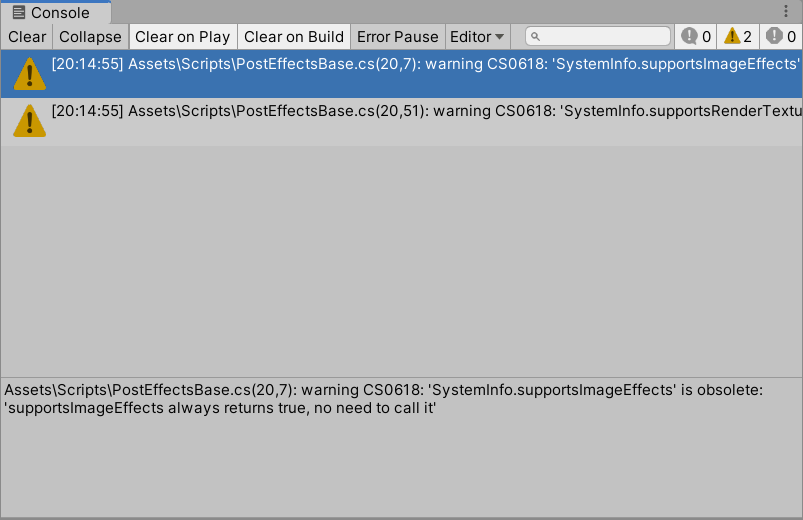
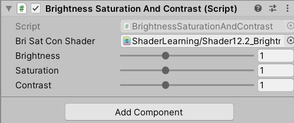

# 第4篇 高级篇
* 第12章 屏幕后处理效果
* 第13章 使用深度和法线纹理
* 第14章 非真实感渲染
* 第15章 使用噪声
* 第16章 Unity中的渲染优化技术

# 12. 屏幕后处理效果
**屏幕后处理效果（screen post-processing effects）** 是游戏中实现屏幕特效的常见方法。

## 12.1 建立一个基本的屏幕后处理脚本系统
给游戏画面添加更多的艺术效果，例如景深（Depth of Field）、运动模糊（Motion Blur）等。

屏幕后处理的基础在于得到渲染后的屏幕图像，即抓取屏幕，使用接口**OnRenderImage函数**：

```
MonoBehaviour.OnRenderImage(RenderTexture src, RenderTexture dest)
```

在OnRenderImage中，利用**Graphics.Blit函数**来完成对渲染纹理的处理，它的3种声明：

```
public static void Blit(Texture src, RenderTexture dest);
public static void Blit(Texture src, RenderTexture dest, Material mat, int pass=-1);
public static void Blit(Texture src, Material mat, int pass=-1);
```

要在Unity种实现屏幕后处理效果，过程通常如下：

1. 先在相机中添加用于后处理的脚本，实现OnRenderImage获取当前屏幕的渲染纹理
2. 再调用Graphics.Blit使用特定的UnityShader来对当前图像进行处理，再把返回的渲染纹理显示再屏幕上

作者提供了一个用于屏幕后处理效果的基类，实现各种效果时要继承这个基类，来检查当前平台是否支持：Assets/Scripts/Chapter12/PostEffectsBase.cs

```
using UnityEngine;
using System.Collections;

// 需要相机，编辑器状态下执行
[ExecuteInEditMode]
[RequireComponent (typeof(Camera))]
public class PostEffectsBase : MonoBehaviour {

	// Called when start
	protected void CheckResources() {
		bool isSupported = CheckSupport();
		
		if (isSupported == false) {
			NotSupported();
		}
	}

	// Called in CheckResources to check support on this platform
	protected bool CheckSupport() {
		if (SystemInfo.supportsImageEffects == false || SystemInfo.supportsRenderTextures == false) {
			Debug.LogWarning("This platform does not support image effects or render textures.");
			return false;
		}
		
		return true;
	}

	// Called when the platform doesn't support this effect
	protected void NotSupported() {
		enabled = false;
	}
	
	// 在Start中检查资源和条件是否满足
	protected void Start() {
		CheckResources();
	}

	// Called when need to create the material used by this effect
	// 检查Shader的可用性
	protected Material CheckShaderAndCreateMaterial(Shader shader, Material material) {
		if (shader == null) {
			return null;
		}
		
		if (shader.isSupported && material && material.shader == shader)
			return material;
		
		if (!shader.isSupported) {
			return null;
		}
		else {
			material = new Material(shader);
			material.hideFlags = HideFlags.DontSave;
			if (material)
				return material;
			else 
				return null;
		}
	}
}
```

## 12.2 调整屏幕的亮度、饱和度和对比度
BrightnessSaturationAndContrast.cs完整代码如下，继承自PostEffectsBase.cs，挂在相机上：

```
using System.Collections;
using System.Collections.Generic;
using UnityEngine;

public class BrightnessSaturationAndContrast : PostEffectsBase
{
    public Shader briSatConShader;
    private Material briSatConMaterial;
    public Material material{
        get{
            briSatConMaterial=CheckShaderAndCreateMaterial(briSatConShader,briSatConMaterial);
            return briSatConMaterial;
        }
    }

    [Range(0.0f,3.0f)]
    public float brightness=1.0f; // 亮度

    [Range(0.0f,3.0f)]
    public float saturation=1.0f; // 饱和度

    [Range(0.0f,3.0f)]
    public float contrast=1.0f; // 对比度

    void OnRenderImage(RenderTexture src, RenderTexture dest){
        if(material!=null){
            material.SetFloat("_Brightness",brightness);
            material.SetFloat("_Saturation",saturation);
            material.SetFloat("_Contrast",contrast);

            Graphics.Blit(src,dest,material);
        }else{
            Graphics.Blit(src,dest);
        }
    }
}
```

*编辑器警告：在PostEffectsBase.cs中，SystemInfo.supportsImageEffects和SystemInfo.supportRenderTexture是obsolete（过时的），这两个永远返回true，不要使用它。（没有找到足够资料，因为是警告，不影响使用。似乎这种判断平台是否支持的方法废弃了）（这里我直接将父类脚本中的if改成了true）*



完整的着色器代码如下：

```
Shader "ShaderLearning/Shader12.2_BrightnessSaturationAndContrast"{
    Properties{
        _MainTex("Base (RGB)",2D)="white"{}
        _Brightness("Brightness",Float)=1
        _Saturation("Saturation",Float)=1
        _Contrast("Contrast",Float)=1
    }

    SubShader{
        Pass{
            // 这些状态设置可以认为是后处理的“标配”
            ZTest Always
            Cull Off
            ZWrite Off

            CGPROGRAM

            #pragma vertex vert
            #pragma fragment frag
            #include "UnityCG.cginc"
            #include "Lighting.cginc"

            sampler2D _MainTex;
            half _Brightness;
            half _Saturation;
            half _Contrast;

            struct v2f{
                float4 pos:SV_POSITION;
                half2 uv:TEXCOORD0;
            };

            // appdata_img只包含顶点坐标和坐标纹理
            v2f vert(appdata_img v){
                v2f o;
                o.pos=UnityObjectToClipPos(v.vertex);
                o.uv=v.texcoord;
                return o;
            }

            fixed4 frag(v2f i):SV_Target{
                fixed4 renderTex=tex2D(_MainTex,i.uv);

                // Apply brightness
                fixed3 finalColor=renderTex.rgb*_Brightness;

                // Apply saturation
                fixed luminace=0.2125*renderTex.r+0.7154*renderTex.g+0.0721*renderTex.b;
                fixed3 luminanceColor=fixed3(luminace,luminace,luminace);
                finalColor=lerp(luminanceColor,finalColor,_Saturation);

                // Apply contrast
                fixed3 avgColor=fixed3(0.5,0.5,0.5);
                finalColor=lerp(avgColor,finalColor,_Contrast);

                return fixed4(finalColor,renderTex.a);
            }

            ENDCG
        }
    }
    Fallback Off
}
```

*这次没有定义a2v的结构体，直接使用了内置结构体appdata_img，这个在UnityCG.cginc的定义如下（详见5.3.1）。包含了常见的vertex和texcoord，不同的是这里texcoord使用的是half2类型，而不是float4。相对的在v2f中，uv也使用了half2类型：*

```
struct appdata_img
{
    float4 vertex : POSITION;
    half2 texcoord : TEXCOORD0;
    UNITY_VERTEX_INPUT_INSTANCE_ID
};
```

将这个着色器给相机上的脚本，就可以修改脚本的属性，改变图像的**亮度/饱和度/对比度**了。效果如下：




*由Shader代码片元着色器的计算可看出。亮度是在原先颜色上直接乘亮度值。饱和度是将灰色图像（原先颜色x(0.2125,0.7154,0.0721)）和原先颜色，根据饱和度值进行插值，如果饱和度值为0，最终颜色会变成灰色图像。对比度是将原先颜色和灰色(0.5,0.5,0.5)，根据对比度值进行插值，如果对比度值为0，最终颜色会变成灰色。*

## 12.3 边缘检测