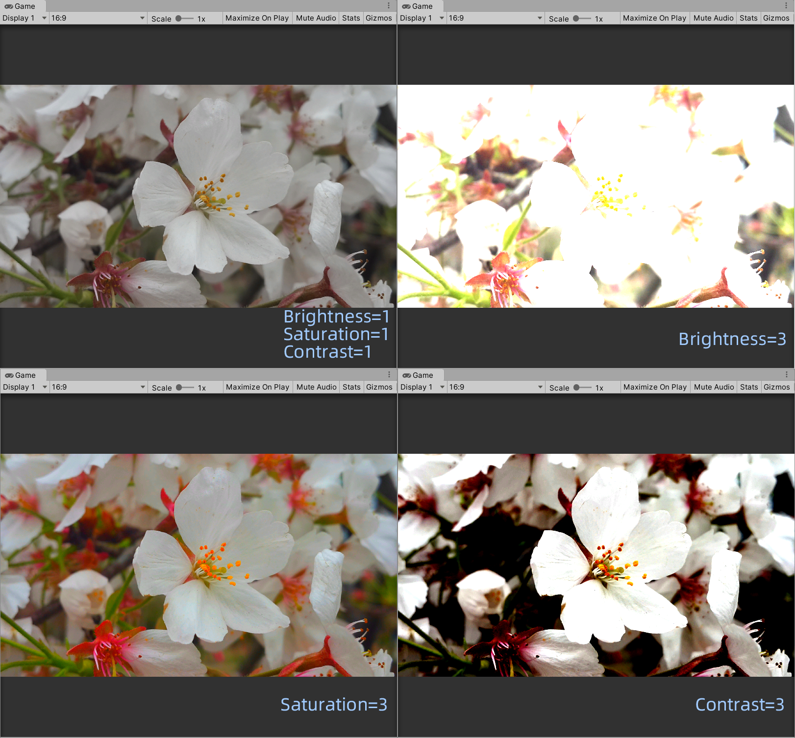

# 第4篇 高级篇
* 第12章 屏幕后处理效果
* 第13章 使用深度和法线纹理
* 第14章 非真实感渲染
* 第15章 使用噪声
* 第16章 Unity中的渲染优化技术

# 12. 屏幕后处理效果
**屏幕后处理效果（screen post-processing effects）** 是游戏中实现屏幕特效的常见方法。

## 12.1 建立一个基本的屏幕后处理脚本系统
给游戏画面添加更多的艺术效果，例如景深（Depth of Field）、运动模糊（Motion Blur）等。

屏幕后处理的基础在于得到渲染后的屏幕图像，即抓取屏幕，使用接口**OnRenderImage函数**：

```
MonoBehaviour.OnRenderImage(RenderTexture src, RenderTexture dest)
```

在OnRenderImage中，利用**Graphics.Blit函数**来完成对渲染纹理的处理，它的3种声明：

```
public static void Blit(Texture src, RenderTexture dest);
public static void Blit(Texture src, RenderTexture dest, Material mat, int pass=-1);
public static void Blit(Texture src, Material mat, int pass=-1);
```

要在Unity种实现屏幕后处理效果，过程通常如下：

1. 先在相机中添加用于后处理的脚本，实现OnRenderImage获取当前屏幕的渲染纹理
2. 再调用Graphics.Blit使用特定的UnityShader来对当前图像进行处理，再把返回的渲染纹理显示再屏幕上

作者提供了一个用于屏幕后处理效果的基类，实现各种效果时要继承这个基类，来检查当前平台是否支持：Assets/Scripts/Chapter12/PostEffectsBase.cs

```
using UnityEngine;
using System.Collections;

// 需要相机，编辑器状态下执行
[ExecuteInEditMode]
[RequireComponent (typeof(Camera))]
public class PostEffectsBase : MonoBehaviour {

	// Called when start
	protected void CheckResources() {
		bool isSupported = CheckSupport();
		
		if (isSupported == false) {
			NotSupported();
		}
	}

	// Called in CheckResources to check support on this platform
	protected bool CheckSupport() {
		if (SystemInfo.supportsImageEffects == false || SystemInfo.supportsRenderTextures == false) {
			Debug.LogWarning("This platform does not support image effects or render textures.");
			return false;
		}
		
		return true;
	}

	// Called when the platform doesn't support this effect
	protected void NotSupported() {
		enabled = false;
	}
	
	// 在Start中检查资源和条件是否满足
	protected void Start() {
		CheckResources();
	}

	// Called when need to create the material used by this effect
	// 检查Shader的可用性
	protected Material CheckShaderAndCreateMaterial(Shader shader, Material material) {
		if (shader == null) {
			return null;
		}
		
		if (shader.isSupported && material && material.shader == shader)
			return material;
		
		if (!shader.isSupported) {
			return null;
		}
		else {
			material = new Material(shader);
			material.hideFlags = HideFlags.DontSave;
			if (material)
				return material;
			else 
				return null;
		}
	}
}
```

## 12.2 调整屏幕的亮度、饱和度和对比度
BrightnessSaturationAndContrast.cs完整代码如下，继承自PostEffectsBase.cs，挂在相机上：

```
using System.Collections;
using System.Collections.Generic;
using UnityEngine;

public class BrightnessSaturationAndContrast : PostEffectsBase
{
    public Shader briSatConShader;
    private Material briSatConMaterial;
    public Material material{
        get{
            briSatConMaterial=CheckShaderAndCreateMaterial(briSatConShader,briSatConMaterial);
            return briSatConMaterial;
        }
    }

    [Range(0.0f,3.0f)]
    public float brightness=1.0f; // 亮度

    [Range(0.0f,3.0f)]
    public float saturation=1.0f; // 饱和度

    [Range(0.0f,3.0f)]
    public float contrast=1.0f; // 对比度

    void OnRenderImage(RenderTexture src, RenderTexture dest){
        if(material!=null){
            material.SetFloat("_Brightness",brightness);
            material.SetFloat("_Saturation",saturation);
            material.SetFloat("_Contrast",contrast);

            Graphics.Blit(src,dest,material);
        }else{
            Graphics.Blit(src,dest);
        }
    }
}
```

*编辑器警告：在PostEffectsBase.cs中，SystemInfo.supportsImageEffects和SystemInfo.supportRenderTexture是obsolete（过时的），这两个永远返回true，不要使用它。（没有找到足够资料，因为是警告，不影响使用。似乎这种判断平台是否支持的方法废弃了）（这里我直接将父类脚本中的if改成了true）*


完整的着色器代码如下：

```
Shader "ShaderLearning/Shader12.2_BrightnessSaturationAndContrast"{
    Properties{
        _MainTex("Base (RGB)",2D)="white"{}
        _Brightness("Brightness",Float)=1
        _Saturation("Saturation",Float)=1
        _Contrast("Contrast",Float)=1
    }

    SubShader{
        Pass{
            // 这些状态设置可以认为是后处理的“标配”
            ZTest Always
            Cull Off
            ZWrite Off

            CGPROGRAM

            #pragma vertex vert
            #pragma fragment frag
            #include "UnityCG.cginc"
            #include "Lighting.cginc"

            sampler2D _MainTex;
            half _Brightness;
            half _Saturation;
            half _Contrast;

            struct v2f{
                float4 pos:SV_POSITION;
                half2 uv:TEXCOORD0;
            };

            // appdata_img只包含顶点坐标和坐标纹理
            v2f vert(appdata_img v){
                v2f o;
                o.pos=UnityObjectToClipPos(v.vertex);
                o.uv=v.texcoord;
                return o;
            }

            fixed4 frag(v2f i):SV_Target{
                fixed4 renderTex=tex2D(_MainTex,i.uv);

                // Apply brightness
                fixed3 finalColor=renderTex.rgb*_Brightness;

                // Apply saturation
                fixed luminace=0.2125*renderTex.r+0.7154*renderTex.g+0.0721*renderTex.b;
                fixed3 luminanceColor=fixed3(luminace,luminace,luminace);
                finalColor=lerp(luminanceColor,finalColor,_Saturation);

                // Apply contrast
                fixed3 avgColor=fixed3(0.5,0.5,0.5);
                finalColor=lerp(avgColor,finalColor,_Contrast);

                return fixed4(finalColor,renderTex.a);
            }

            ENDCG
        }
    }
    Fallback Off
}
```

*这次没有定义a2v的结构体，直接使用了内置结构体appdata_img，这个在UnityCG.cginc的定义如下（详见5.3.1）。包含了常见的vertex和texcoord，不同的是这里texcoord使用的是half2类型，而不是float4。相对的在v2f中，uv也使用了half2类型：*

```
struct appdata_img
{
    float4 vertex : POSITION;
    half2 texcoord : TEXCOORD0;
    UNITY_VERTEX_INPUT_INSTANCE_ID
};
```

将这个着色器给相机上的脚本，就可以修改脚本的属性，改变图像的**亮度/饱和度/对比度**了。效果如下：




*由Shader代码片元着色器的计算可看出。亮度是在原先颜色上直接乘亮度值。饱和度是将灰色图像（原先颜色x(0.2125,0.7154,0.0721)）和原先颜色，根据饱和度值进行插值，如果饱和度值为0，最终颜色会变成灰色图像。对比度是将原先颜色和灰色(0.5,0.5,0.5)，根据对比度值进行插值，如果对比度值为0，最终颜色会变成灰色。*

## 12.3 边缘检测
边缘检测是描边效果的一种实现方法，原理是利用一些边缘检测算子对图像进行 **卷积（convolution）** 操作。

### 12.3.1 什么是卷积
在图像处理中，卷积操作指的是使用一个 **卷积核（kernel）** 对一张图像中的每个像素进行一系列操作，卷积核通常是一个四方形网格结构（例如2x2、3x3的方形区域）。


### 12.3.2 常见的边缘检测算子
边是如何形成的：如果相邻像素之间存在差别明显的颜色、亮度、纹理等属性，我们就会认为它们之间应该有一条边界。这种相邻像素之间的差值可以用 **梯度（gradient）** 来表示。

有几种不同的边缘检测算子：


它们都包含了2个方向的卷积核，分别用于检测水平方向和竖直方向上的边缘信息。对每个像素分别进行一次卷积计算，得到两个方向上的梯度值Gx和Gy，整体的梯度值为G=sqrt(Gx^2+Gy^2)，处于性能考虑有时会使用绝对值操作代替开根号G=|Gx|+|Gy|。

### 12.3.3 实现
本节使用Sobel算子进行边缘检测，实现描边效果。

cs脚本部分如下。*和上节很像，定义了一些变量，调用Shader进行处理*：

```
using System.Collections;
using System.Collections.Generic;
using UnityEngine;

public class EdgeDetection : PostEffectsBase
{
    public Shader edgeDetectShader;
    private Material edgeDetectMaterial=null;
    public Material material{
        get{
            edgeDetectMaterial=CheckShaderAndCreateMaterial(edgeDetectShader,edgeDetectMaterial);
            return edgeDetectMaterial;
        }
    }

    [Range(0.0f,1.0f)]
    public float edgesOnly=0.0f; // 边缘线强度
    public Color edgeColor=Color.black; // 描边颜色
    public Color backgroundColor=Color.white; // 背景颜色

    void OnRenderImage(RenderTexture src, RenderTexture dest){
        if(material!=null){
            material.SetFloat("_EdgeOnly",edgesOnly);
            material.SetColor("_EdgeColor",edgeColor);
            material.SetColor("_BackgroundColor",backgroundColor);

            Graphics.Blit(src,dest,material);
        }else{
            Graphics.Blit(src,dest);
        }
    }
}

```

着色器完整代码如下：

```
Shader "ShaderLearning/Shader12.3_EdgeDetection"{
    Properties{
        _MainTex("Base (RGB)",2D)="white"{}
        _EdgeOnly("Edge Only",Float)=1.0
        _EdgeColor("Edge Color",Color)=(0,0,0,1)
        _BackgroundColor("Background Color",Color)=(1,1,1,1)
    }

    SubShader{
        Pass{
            ZTest Always
            Cull Off
            ZWrite Off

            CGPROGRAM

            #pragma vertex vert
            #pragma fragment fragSobel
            #include "UnityCG.cginc"

            sampler2D _MainTex;
            // 访问某纹理对应的每个纹素的大小
            // 例如一张512x512大小的纹理，该值大约为0.001953（1/512）
            half4 _MainTex_TexelSize; 
            fixed _EdgeOnly;
            fixed4 _EdgeColor;
            fixed4 _BackgroundColor;

            struct v2f{
                float4 pos:SV_POSITION;
                // 对应了使用Sobel算子采样时需要的9个邻域纹理坐标
                half2 uv[9]:TEXCOORD0;
            };

            v2f vert(appdata_img v){
                v2f o;
                o.pos=UnityObjectToClipPos(v.vertex);

                half2 uv=v.texcoord;

                // 把计算采样纹理坐标的代码从片元着色器转移到顶点着色器
                o.uv[0]=uv+_MainTex_TexelSize.xy*half2(-1,-1);
                o.uv[1]=uv+_MainTex_TexelSize.xy*half2(0,-1);
                o.uv[2]=uv+_MainTex_TexelSize.xy*half2(1,-1);
                o.uv[3]=uv+_MainTex_TexelSize.xy*half2(-1,0);
                o.uv[4]=uv+_MainTex_TexelSize.xy*half2(0,0);
                o.uv[5]=uv+_MainTex_TexelSize.xy*half2(1,0);
                o.uv[6]=uv+_MainTex_TexelSize.xy*half2(-1,1);
                o.uv[7]=uv+_MainTex_TexelSize.xy*half2(0,1);
                o.uv[8]=uv+_MainTex_TexelSize.xy*half2(1,1);

                return o;
            }

            // 计算亮度值
            fixed luminace(fixed4 color){
                return 0.2125*color.r+0.7154*color.g+0.0721*color.b;
            }

            // 计算edge值，使用Sobel算子
            half Sobel(v2f i){
                const half Gx[9]={-1,-2,-1,
                                   0,0,0,
                                   1,2,1};
                const half Gy[9]={-1,0,1,
                                  -2,0,2,
                                  -1,0,1};
                half texColor;
                half edgeX=0;
                half edgeY=0;
                for(int it=0;it<9;it++){
                    texColor=luminace(tex2D(_MainTex,i.uv[it]));
                    edgeX+=texColor*Gx[it]; // 叠加x方向梯度
                    edgeY+=texColor*Gy[it]; // 叠加y方向梯度
                }

                half edge=1-abs(edgeX)-abs(edgeY);
                return edge; // edge值越小，表明该位置越可能是一个边缘点
            }

            fixed4 fragSobel(v2f i):SV_Target{
                half edge=Sobel(i); // 得到edge值

                fixed4 withEdgeColor=lerp(_EdgeColor,tex2D(_MainTex,i.uv[4]),edge);
                fixed4 onlyEdgeColor=lerp(_EdgeColor,_BackgroundColor,edge);
                return lerp(withEdgeColor,onlyEdgeColor,_EdgeOnly);
            }    

            ENDCG
        }
    }
    Fallback Off
}
```

新变量_MainTex_TexelSize，获取每个纹素的大小。在顶点着色器中，计算了边缘检测时需要的纹理坐标。片元着色器利用Sobel函数，计算出edge值，根据edge值对最终颜色进行插值。edge值越小越边缘，越使用边缘颜色。其中Sobel函数，使用了Sobel算子，将当前像素周围的像素点进行计算梯度，根据梯度得到edge值。

运行效果如下：


注意本节实现的边缘检测仅仅利用了屏幕颜色信息，在实际应用中，物体的纹理、阴影等会影响检测。**为了得到更准确的边缘信息，往往会在屏幕的深度纹理和法线纹理上进行边缘检测。**

## 12.4 高斯模糊
本节学习卷积的另一个常见应用：高斯模糊。实现模糊的一些方法：

* 均值模糊：卷积，卷积核中各元素相等且相加等于1，即取邻域内各像素的平均值
* 中值模糊：选择邻域内所有像素排序后的中值替换掉原颜色
* 高斯模糊：更高级，用高斯核进行卷积

### 12.4.1 高斯滤波
高斯模糊同样使用了卷积计算，使用的卷积核名为高斯核。高斯核是一个正方形大小的滤波核，其中每个元素的计算都是基于下面的高斯方程：


其中σ是标准方差（一般取值为1），x和y分别对应了当前位置到卷积核中心的整数距离。为了保证滤波后的图像不会变暗，对高斯核中的权重进行归一化和为1，所以e前面的系数实际不会对结果有任何影响。

距离越近，影响越大；维数越高，模糊越多。

可以把二维高斯函数拆成两个以为函数，减少采样次数。因为两个一维高斯核中包含了很多重复的权重，实际只需要记录3个权重值。


本节会使用上述5x5的高斯核对原图像进行高斯模糊，先后调用2个Pass。第一个使用竖直方向的一维高斯核对图像进行滤波，第二个使用水平方向的。

*观察到这两个一维的高斯核的意义：例如竖直方向的高斯核，对应了每行的权重和。水平方向同理。*

### 12.4.2 实现
cs完整代码如下。实现了3种不同方法的OnRenderImage()：

* 版本1：简单实现1次高斯模糊
* 版本2：缩放图像进行降采样
* 版本3：在第2种的降采样基础上，考虑了高斯模糊的迭代次数

```
using System.Collections;
using System.Collections.Generic;
using UnityEngine;

public class GaussianBlur : PostEffectsBase
{
    public Shader gaussianBlurShader;
    private Material gaussianBlurMaterial=null;
    public Material material{
        get{
            gaussianBlurMaterial=CheckShaderAndCreateMaterial(gaussianBlurShader,gaussianBlurMaterial);
            return gaussianBlurMaterial;  
        }
    }

    // Blur iterations - larger number means more blur
    [Range(0,4)]
    public int iterations=3; // 迭代次数

    // Blur spread for each iteration - larget value means more blur
    [Range(0.2f,3.0f)]
    public float blurSpread=0.6f; // 模糊范围

    [Range(1,8)]
    public int downSample=2; // 缩放系数

    /// 1st edition: just apply blur
    /*
    void OnRenderImage(RenderTexture src, RenderTexture dest){
        if(material!=null){
            int rtW=src.width;
            int rtH=src.height;
            // 分配了一块与屏幕图像大小相同的缓冲区
            RenderTexture buffer=RenderTexture.GetTemporary(rtW,rtH,0);

            // Render the vertical pass
            // 第一个Pass，用竖直方向的一维高斯核进行滤波，结果存贮在buffer
            Graphics.Blit(src,buffer,material,0);
            // Render the horizontal pass
            // 第二个Pass，用水平方向的一维高斯核进行滤波，返回最终的屏幕图像
            Graphics.Blit(buffer,dest,material,1);

            // 释放之前分配的缓存
            RenderTexture.ReleaseTemporary(buffer);
        }else{
            Graphics.Blit(src,dest);
        }
    }*/

    /// 2nd edition: scale the render texture
    /// 利用缩放对图像进行降采样，减少需要处理的像素个数提高性能
    /// downSample值越大，性能越好，但过大可能造成像素化
    /*
    void OnRenderImage(RenderTexture src, RenderTexture dest){
        if(material!=null){
            int rtW=src.width/downSample;
            int rtH=src.height/downSample;
            RenderTexture buffer=RenderTexture.GetTemporary(rtW,rtH,0);
            buffer.filterMode=FilterMode.Bilinear; // 滤波模式：双线性

            // Render the vertical pass
            Graphics.Blit(src,buffer,material,0);
            // Render the horizontal pass
            Graphics.Blit(buffer,dest,material,1);

            RenderTexture.ReleaseTemporary(buffer);
        }else{
            Graphics.Blit(src,dest);
        }
    }*/

    /// 3rd edition: use iterations for larger blur
    /// 考虑了高斯模糊的迭代次数
    void OnRenderImage(RenderTexture src, RenderTexture dest){
        if(material!=null){
            int rtW=src.width/downSample;
            int rtH=src.height/downSample;

            RenderTexture buffer0=RenderTexture.GetTemporary(rtW,rtH,0);
            buffer0.filterMode=FilterMode.Bilinear;

            Graphics.Blit(src,buffer0);

            for(int i=0;i<iterations;i++){
                material.SetFloat("_BlurSize",1.0f+i*blurSpread);

                RenderTexture buffer1=RenderTexture.GetTemporary(rtW,rtH,0);

                // Render the vertical pass
                Graphics.Blit(buffer0,buffer1,material,0);

                RenderTexture.ReleaseTemporary(buffer0);
                buffer0=buffer1;
                buffer1=RenderTexture.GetTemporary(rtW,rtH,0);

                // Render the horizontal pass
                Graphics.Blit(buffer0,buffer1,material,1);

                RenderTexture.ReleaseTemporary(buffer0);
                buffer0=buffer1;
            }

            Graphics.Blit(buffer0,dest);
            RenderTexture.ReleaseTemporary(buffer0);
        }else{
            Graphics.Blit(src,dest);
        }
    }
}
```

完整的Shader代码如下。这里在SubShader中新使用了CGINCLUDE/ENDCG来包住一些变量和方法，相当于C++的头文件，可以在Pass中共用，适合Pass中调用了相同的方法时使用。在vertBlurVertical中计算出变换后的y坐标，vertBlurHorizontal中计算出变换后的x，fragBlur进行卷积计算。

```
Shader "ShaderLearning/Shader12.4_GaussianBlur"{
    Properties{
        _MainTex("Base (RGB)",2D)="white"{}
        _BlurSize("Blur Size",Float)=1.0 // 控制采样距离
    }
    
    SubShader{
        CGINCLUDE // 类似于C++中的头文件，不需要包含在Pass中

        #include "UnityCG.cginc"

        sampler2D _MainTex;
        half4 _MainTex_TexelSize;
        float _BlurSize;

        struct v2f{
            float4 pos:SV_POSITION;
            half2 uv[5]:TEXCOORD0;
        };

        v2f vertBlurVertical(appdata_img v){
            v2f o;
            o.pos=UnityObjectToClipPos(v.vertex);

            half2 uv=v.texcoord;

            o.uv[0]=uv;
            o.uv[1]=uv+float2(0.0,_MainTex_TexelSize.y*1.0)*_BlurSize;
            o.uv[2]=uv-float2(0.0,_MainTex_TexelSize.y*1.0)*_BlurSize;
            o.uv[3]=uv+float2(0.0,_MainTex_TexelSize.y*2.0)*_BlurSize;
            o.uv[4]=uv-float2(0.0,_MainTex_TexelSize.y*2.0)*_BlurSize;

            return o;
        }

        v2f vertBlurHorizontal(appdata_img v){
            v2f o;
            o.pos=UnityObjectToClipPos(v.vertex);

            half2 uv=v.texcoord;

            o.uv[0]=uv;
            o.uv[1]=uv+float2(_MainTex_TexelSize.x*1.0,0.0)*_BlurSize;
            o.uv[2]=uv-float2(_MainTex_TexelSize.x*1.0,0.0)*_BlurSize;
            o.uv[3]=uv+float2(_MainTex_TexelSize.x*2.0,0.0)*_BlurSize;
            o.uv[4]=uv-float2(_MainTex_TexelSize.x*2.0,0.0)*_BlurSize;

            return o;
        }

        fixed4 fragBlur(v2f i):SV_Target{
            float weight[3]={0.4026,0.2442,0.0545};

            fixed3 sum=tex2D(_MainTex,i.uv[0]).rgb*weight[0];

            for(int it=1;it<3;it++){
                sum+=tex2D(_MainTex,i.uv[it]).rgb*weight[it];
                sum+=tex2D(_MainTex,i.uv[2*it]).rgb*weight[it];
            }

            return fixed4(sum,1.0);
        }

        ENDCG

        ZTest Always
        Cull Off
        ZWrite Off

        Pass{
            NAME "GAUSSIAN_BLUR_VERTICAL"

            CGPROGRAM

            #pragma vertex vertBlurVertical
            #pragma fragment fragBlur

            ENDCG
        }

        Pass{
            NAME "GAUSSIAN_BLUR_HORIZONTAL"

            CGPROGRAM

            #pragma vertex vertBlurHorizontal
            #pragma fragment fragBlur

            ENDCG
        }
    }
    Fallback Off
}
```

不同参数下的运行结果如下：


## 12.5 Bloom效果
Bloom可以模拟真实相机的一种图像效果，让画面中较亮的区域“扩散”到周围的区域中，造成一种朦胧的效果。

Bloom的实现原理：首先根据一个阈值提取出图像中的较量区域，把它们存储在一张渲染纹理中，再利用高斯模糊对这张渲染纹理进行模糊处理，模拟光线扩散的效果，最后再将其和原图像进行混合，得到最终的效果。

完整cs代码如下。与高斯模糊不同的是，在OnRenderImag()中使用Pass1来提取图像中较亮区域，存储在buffer0中进行高斯模糊。

```
using System.Collections;
using System.Collections.Generic;
using UnityEngine;

public class Bloom : PostEffectsBase
{
    public Shader bloomShader;
    private Material bloomMaterial=null;
    public Material material{
        get{
            bloomMaterial=CheckShaderAndCreateMaterial(bloomShader,bloomMaterial);
            return bloomMaterial;
        }
    }

    // Blur iterations - larger number means more blur.
    [Range(0,4)]
    public int iterations=3;
    
    // Blur spread for each iteration - larger value means more blur
    [Range(0.2f,3.0f)]
    public float blurSpread=0.6f;

    [Range(1,8)]
    public int downSample=2;

    [Range(0.0f,4.0f)]
    public float luminaceThreshold=0.6f; // 控制提取较亮区域时使用的阈值大小

    void OnRenderImage(RenderTexture src, RenderTexture dest){
        if(material!=null){
            material.SetFloat("_LuminanceThreshold",luminaceThreshold);

            int rtW=src.width/downSample;
            int rtH=src.height/downSample;

            RenderTexture buffer0=RenderTexture.GetTemporary(rtW,rtH,0);
            buffer0.filterMode=FilterMode.Bilinear;

            Graphics.Blit(src,buffer0,material,0); // Pass0，提取图像中较亮的区域

            for(int i=0;i<iterations;i++){
                material.SetFloat("_BlurSize",1.0f+i*blurSpread);

                RenderTexture buffer1=RenderTexture.GetTemporary(rtW,rtH,0);

                //Render the vertical pass
                Graphics.Blit(buffer0,buffer1,material,1);

                RenderTexture.ReleaseTemporary(buffer0);
                buffer0=buffer1;
                buffer1=RenderTexture.GetTemporary(rtW,rtH,0);

                // Render the horizontal pass
                Graphics.Blit(buffer0,buffer1,material,2);

                RenderTexture.ReleaseTemporary(buffer0);
                buffer0=buffer1;
            }

            material.SetTexture("_Bloom",buffer0);
            Graphics.Blit(src,dest,material,3);

            RenderTexture.ReleaseTemporary(buffer0);
        }else{
            Graphics.Blit(src,dest);
        }
    }
}
```

完整的Shader代码如下。这次在CGINCLUDE中定义的东西很多，主要分两类，一类是较亮区域使用的，一类是最后混合时使用的。前者是在片元着色器中计算出亮度，减去阈值，结果截取到[0,1]，再乘原来的颜色值，就能提取较亮颜色（暗的地方颜色值0了）。后者将原图像和做了高斯模糊的亮部相加了。

后面有4个Pass。第一个Pass提取亮部；第二和第二Pass做高斯模糊的纵向和横向卷积，使用12.4中高斯模糊Shader的Pass；第四个Pass用于混合。Pass具体的调用在C#脚本中。

```
Shader "ShaderLearning/Shader12.5_Bloom"{
    Properties{
        _MainTex("Base (RGB)",2D)="white"{}
        _Bloom("Bloom (RGB)",2D)="black"{}
        _LuminanceThreshold("Luminance Threshold",Float)=0.5
        _BlurSize("Blur Size",Float)=1.0
    }

    SubShader{
        CGINCLUDE

        #include "UnityCG.cginc"

        sampler2D _MainTex;
        half4 _MainTex_TexelSize;
        sampler2D _Bloom;
        float _LuminanceThreshold;
        float _BlurSize;
        
        struct v2f{
            float4 pos:SV_POSITION;
            half2 uv:TEXCOORD0;
        };

        // 较亮区域使用的顶点着色器
        v2f vertExtractBright(appdata_img v){
            v2f o;
            o.pos=UnityObjectToClipPos(v.vertex);
            o.uv=v.texcoord;
            return o;
        }

        // 计算亮度值
        fixed luminance(fixed4 color){
            return 0.2125*color.r+0.7154*color.g+0.0721*color.b;
        }

        // 较亮区域使用的片元着色器
        fixed4 fragExtractBright(v2f i):SV_Target{
            fixed4 c=tex2D(_MainTex,i.uv);
            // 提取到亮部区域
            fixed val=clamp(luminance(c)-_LuminanceThreshold,0.0,1.0);
            return c*val;
        }

        // 混合时使用的v2f
        struct v2fBloom{
            float4 pos:SV_POSITION;
            half4 uv:TEXCOORD0;
        };

        // 混合时使用的顶点着色器
        v2fBloom vertBloom(appdata_img v){
            v2fBloom o;
            o.pos=UnityObjectToClipPos(v.vertex);
            o.uv.xy=v.texcoord;
            o.uv.zw=v.texcoord;

            #if UNITY_UV_STARTS_AT_TOP
            if(_MainTex_TexelSize.y<0.0)
                o.uv.w=1.0-o.uv.w;
            #endif
            
            return o;
        }
        
        // 混合时使用的片元着色器
        fixed4 fragBloom(v2fBloom i):SV_Target{
            return tex2D(_MainTex,i.uv.xy)+tex2D(_Bloom,i.uv.zw);
        }

        ENDCG

        ZTest Always
        Cull Off
        ZWrite Off

        Pass{
            CGPROGRAM
            #pragma vertex vertExtractBright
            #pragma fragment fragExtractBright
            ENDCG
        }

        // 第二个和第三个Pass直接使用12.4节高斯模糊的
        UsePass "ShaderLearning/Shader12.4_GaussianBlur/GAUSSIAN_BLUR_VERTICAL"
        UsePass "ShaderLearning/Shader12.4_GaussianBlur/GAUSSIAN_BLUR_HORIZONTAL"

        Pass{
            CGPROGRAM
            #pragma vertex vertBloom
            #pragma fragment fragBloom
            ENDCG
        }
    }
    Fallback Off
}
```

运行结果如下：


## 12.6 运动模糊
运动模糊效果可以让物体运动看起来更加平滑。实现有多种方法：

1. **累积缓存（accumulation buffer）**混合多张连续的图像。当物体快速移动产生多张图像后，我们取它们之间的平均值作为最后的运动模糊图像。这种暴力的方法对性能的消耗很大
2. **速度缓存（velocity buffer）**存储各个像素当前的运动速度，然后利用该值来决定模糊的方向和大小

本节使用第一种方法累积缓存来实现。

完整的C#代码如下。*在OnRenderImage中，先对保存渲染结果的贴图进行判断是否有效，无效的话就重新创建，然后调用Shader进行运动模糊操作。这里有个**恢复操作（restore operation）**，文档解释说如果在不先进行清除或丢弃的情况下渲染到纹理，就执行了恢复操作。调用这个MarkRestoreExpected()，是告诉Unity我们要恢复了，让Unity不要发出警告。*

>表示预期将进行 RenderTexture 恢复操作。在移动图形仿真模式下，当执行 RenderTexture“恢复”操作时，Unity 会发出警告。如果在不先进行清除或丢弃 (DiscardContents) 的情况下渲染到纹理，就会执行恢复操作。对于许多移动 GPU 和多 GPU 系统来说，这是一项代价高昂的操作，应该予以避免。但是，如果渲染效果要求必须进行 RenderTexture 恢复，则您可以调用该函数来指示 Unity 恢复操作是预期行为，不要发出警告。

```
using System.Collections;
using System.Collections.Generic;
using UnityEngine;

public class MotionBlur : PostEffectsBase{
    public Shader motionBlurShader;
    private Material motionBlurMaterial=null;
    public Material material{
        get{
            motionBlurMaterial=CheckShaderAndCreateMaterial(motionBlurShader,motionBlurMaterial);
            return motionBlurMaterial;
        }
    }

    [Range(0.0f,0.9f)]
    public float blurAmount=0.5f; // 越大运动拖尾的效果越明显
    private RenderTexture accumulationTexture;

    // 在脚本不运行时，销毁accumulationTexture
    // 因为希望在下一次开始应用运动模糊时重新叠加图像
    void OnDisable(){
        DestroyImmediate(accumulationTexture);
    }

    void OnRenderImage(RenderTexture src,RenderTexture dest){
        if(material!=null){
            // Create the accumulation texture
            // 判断accumulationTexture是否有效
            if(accumulationTexture==null || accumulationTexture.width!=src.width ||
            accumulationTexture.height!=src.height){
                DestroyImmediate(accumulationTexture);
                accumulationTexture=new RenderTexture(src.width,src.height,0);
                // 使它不会显示在Hierarchy中，也不会保存到场景中
                accumulationTexture.hideFlags=HideFlags.HideAndDontSave;
                Graphics.Blit(src,accumulationTexture);
            }

            // We are accumulating motion over frames without clear/discard
            // by design, so silence any performance warnings from Unity
            // 恢复操作
            accumulationTexture.MarkRestoreExpected();

            material.SetFloat("_BlurAmount",1.0f-blurAmount);

            Graphics.Blit(src,accumulationTexture,material);
            Graphics.Blit(accumulationTexture,dest);
        }else{
            Graphics.Blit(src,dest);
        }
    }
}
```

完整的Shader代码如下：

```
Shader "ShaderLearning/Shader12.6_MotionBlur"{
    Properties{
        _MainTex("Base (RGB)",2D)="white"{}
        _BlurAmount("Blur Amount",Float)=1.0
    }

    SubShader{
        CGINCLUDE

        #include "UnityCG.cginc"

        sampler2D _MainTex;
        fixed _BlurAmount;

        struct v2f{
            float4 pos:SV_POSITION;
            half2 uv:TEXCOORD0;
        };

        v2f vert(appdata_img v){
            v2f o;
            o.pos=UnityObjectToClipPos(v.vertex);
            o.uv=v.texcoord;
            return o;
        }

        // RGB通道片元着色器
        // 对当前图像采样，将A通道设为_BlurAmount
        // 以便在后面混合时可以使用A通道
        fixed4 fragRGB(v2f i):SV_Target{
            return fixed4(tex2D(_MainTex,i.uv).rgb,_BlurAmount);
        }

        // A通道片元着色器
        // 直接返回采样结果
        // 为了维护A通道的值，不受混合使用的A通道值影响
        half4 fragA(v2f i):SV_Target{
            return tex2D(_MainTex,i.uv);
        }

        ENDCG

        ZTest Always
        Cull Off
        ZWrite Off

        Pass{
            Blend SrcAlpha OneMinusSrcAlpha
            ColorMask RGB

            CGPROGRAM

            #pragma vertex vert
            #pragma fragment fragRGB

            ENDCG
        }

        Pass{
            Blend One Zero
            ColorMask A

            CGPROGRAM

            #pragma vertex vert
            #pragma fragment fragA

            ENDCG
        }
    }
    Fallback Off
}
```

运行效果如下。将BlurAmount调到0.9，移动相机可以得到运动模糊的图像。(*这个拖尾消失的很慢，效果也不尽人意，感觉这个实现方法也就看看而已，不能用于实际项目...*)


## 12.7 扩展阅读
1. 更多特效的实现（*此链接内容已丢失*）：https://docs.unity3d.com/Manual/comp-ImageEffects.html
2. GPU Gems：https://developer.nvidia.com/gpugems/gpugems/contributors

# 999. Ref
* RenderTexture.MarkRestoreExpected：https://docs.unity3d.com/cn/2019.4/ScriptReference/RenderTexture.MarkRestoreExpected.html