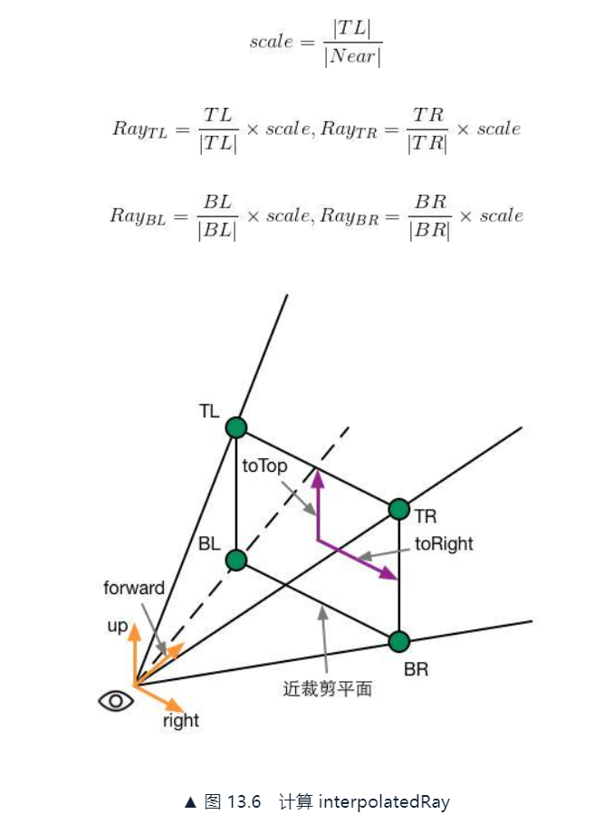

# 13. 使用深度和法线纹理
本章学习如何在Unity中获取深度纹理和法线纹理来实现特定的屏幕后处理效果。有时候只在屏幕颜色图像上进行操作实现屏幕后处理效果不好，例如边缘检测。

## 13.1 获取深度和法线纹理
### 13.1.1 背后的原理
总体来说，这些深度值来自于顶点变换后得到的归一化的设备坐标（Normalized Device Coordinates, NDC）。坐标变换到NDC后z分量范围是[-1,1]，将其映射到能存储在一张图像中：d=0.5·Zndc+0.5。d是深度纹理中的像素值，Zndc是NDC坐标中的z分量。


* 延迟渲染路径，深度信息在G-Buffer中，可以访问到
* 不能直接访问到时，Unity会判断渲染队列是否≤2500（Background/Geometry/AlphaTest），如果满足就把他渲染到深度和法线纹理中。在Shader中必须**设置正确的RenderType标签**

可以选择让相机生成一张深度纹理或一张深度+法线纹理：

* 仅深度纹理：精度通常是24位或16位
* 深度+法线纹理：会创建一张和屏幕分辨率相同、精度为32位(RGBA8)的纹理，RG通道是观察空间下的法线信息，BA通道是深度信息

### 13.1.2 如何获取
通过在脚本中设置相机的depthTextureMode，设置好后可以在Shader中通过声明_CameraDepthTexture来访问。

```
camera.depthTextureMode=DepthTextureMode.Depth; // 获取深度纹理
camera.depthTextureMode=DepthTextureMode.DepthNormals; // 获取深度+法线纹理

camera.depthTextureMode|=DepthTextureMode.Depth;
camera.depthTextureMode|=DepthTextureMode.DepthNormals; // 同时产生一张深度和深度+法线纹理
```

使用SAMPLE_DEPTH_TEXTURE宏对深度纹理进行采样，处理由于平台差异造成的问题：

```
float d=SAMPLE_DEPTH_TEXTURE(_CameraDepthTexture,i.uv);
```

这样对投影纹理采样：

```
float d=SAMPLE_DEPTH_TEXTURE_PROJ(_CameraDepthTexture,UNITY_PROJ_COORD(i.scrPos)); // HLSLSupport.cginc
```

因为深度值往往是非线性的，而我们需要线性的深度值，这需要倒推顶点变换的过程，最终结果如下（推算过程略，详见原书）：


上面这个值使用Unity辅助函数Linear01Depth来得到。还有个LinearEyeDepty可以得到时间空间，范围[Near,Far]的深度值。使用tex2D对_CameraDepthNormalsTexture进行采样，最后使用DecodeDepthNormal对采样结果进行解码，得到深度值和法线方向，它在UnityCG.cginc中的定义如下：

```
inline void DecodeDepthNormal(float4 enc, out float depth, out float3 normal)
{
    depth=DecodeFloatRG(enc.zw);
    normal=DecodeViewNormalStereo(enc);
}
```

以上depth是[0,1]的线性深度值，法线是视角空间下的法线方向。

### 13.1.3 查看深度和法线纹理
*给相机挂一个脚本，在帧调试器中就可以看到深度纹理和深度+法线纹理：*

```
using System.Collections;
using System.Collections.Generic;
using UnityEngine;

[ExecuteInEditMode]
[RequireComponent (typeof(Camera))]
public class DepthNormalTexture : PostEffectsBase
{
    public Shader DepthNormalShader;
    private Material DepthNormalMaterial=null;
    public Material material{
        get{
            DepthNormalMaterial=CheckShaderAndCreateMaterial(DepthNormalShader,DepthNormalMaterial);
            return DepthNormalMaterial;
        }
    }

    [Range(0,1)]
    public int DepthNormalValue=0;

    void Awake()
    {
        GetComponent<Camera>().depthTextureMode|=DepthTextureMode.Depth;
        GetComponent<Camera>().depthTextureMode|=DepthTextureMode.DepthNormals;
    }

    void OnRenderImage(RenderTexture src, RenderTexture dest){
        if(material!=null){
            // RenderTexture DepthNormalTexture=new RenderTexture(src.width,src.height,0);
            material.SetInt("_DepthNormalValue",DepthNormalValue);
            Graphics.Blit(src,dest,material);
        }else{
            Graphics.Blit(src,dest);
        }
    }
}
```


*我的深度图看起来是红色的，不知道是为啥？一般来说应该是黑白的吧，我这个只用R通道记录了？*

*再做一个Shader，在片元着色器中输出转换或解码后的深度和法线值。*

```
Shader "ShaderLearning/Shader13.1_DepthNormalTexture"
{
    Properties
    {
        _MainTex ("Base (RGB)", 2D) = "white" {}
        _DepthNormalValue("Depth Normal Value",int)=0
    }
    SubShader{
        Pass{
            CGPROGRAM

            #include "UnityCG.cginc"
            #pragma vertex vert
            #pragma fragment frag

            sampler2D _MainTex;
            fixed _DepthNormalValue;
            sampler2D _CameraDepthTexture;
            sampler2D _CameraDepthNormalsTexture;

            struct v2f{
                float4 pos:SV_POSITION;
                half2 uv:TEXCOORD0;
            };

            v2f vert(appdata_img v){
                v2f o;
                o.pos=UnityObjectToClipPos(v.vertex);
                o.uv=v.texcoord;
                return o;
            }

            fixed4 frag(v2f i):SV_Target{
                float depth=SAMPLE_DEPTH_TEXTURE(_CameraDepthTexture,i.uv);
                float linearDepth=Linear01Depth(depth);
                fixed3 normal=DecodeViewNormalStereo(tex2D(_CameraDepthNormalsTexture,i.uv));
                fixed4 linearDepthColor=fixed4(linearDepth,linearDepth,linearDepth,1.0);
                fixed4 normalColor=fixed4(normal*0.5+0.5,1.0);

                return lerp(linearDepthColor,normalColor,_DepthNormalValue);
            }
            
            ENDCG
        }
    }
    Fallback Off
}

```

*结果如下，分别是线性空间下的深度纹理，和解码后并被映射到[0,1]的视角空间下的法线纹理：*


## 13.2 再谈运动模糊
之前是使用多张屏幕图像来模拟运动模糊，另一种应用更加广泛的技术是使用速度映射图。

本节使用深度纹理，在片元着色器中为每个像素计算其在世界空间下的位置，计算前一帧和当前帧的位置差，生成该像素的速度。有点是可以在一个屏幕后处理步骤中完成整个效果的模拟，缺点是在片元着色器中进行了两次矩阵乘法的操作，对性能有影响。

编写后处理脚本，完整C#代码如下。主要做的事情是通过**camera.projectionMatrix**和**camera.worldToCameraMatrix**得到当前相机的视角矩阵和投影矩阵，计算得到当前帧的视角乘投影矩阵后，传给Shader调用Pass，并存下来作为下一帧的前一帧的视角乘投影矩阵。

```
using System.Collections;
using System.Collections.Generic;
using UnityEngine;

public class MotionBlurWithDepthTexture : PostEffectsBase
{
    public Shader motionBlurShader;
    private Material motionBlurMaterial=null;
    public Material material{
        get{
            motionBlurMaterial=CheckShaderAndCreateMaterial(motionBlurShader,motionBlurMaterial);
            return motionBlurMaterial;
        }
    }
    [Range(0.0f,1.0f)]
    public float blurSize=0.5f; // 运动模糊时模糊图像使用的大小
    private Camera myCamera;
    public Camera camera{
        get{
            if(myCamera==null){
                myCamera=GetComponent<Camera>();
            }
            return myCamera;
        }
    }
    private Matrix4x4 previousViewProjectionMatrix; // 保存上一帧相机的视角*投影矩阵
    
    void OnEnable(){
        camera.depthTextureMode|=DepthTextureMode.Depth;
    }

    void OnRenderImage(RenderTexture src, RenderTexture dest){
        if(material!=null){
            material.SetFloat("_BlurSize",blurSize);

            // 前一帧的视角*投影矩阵
            material.SetMatrix("_PreviousViewProjectionMatrix",previousViewProjectionMatrix);
            Matrix4x4 currentViewProjectionMatrix=camera.projectionMatrix*camera.worldToCameraMatrix;
            Matrix4x4 currentViewProjectionInverseMatrix=currentViewProjectionMatrix.inverse;
            // 当前帧的视角*投影矩阵的逆矩阵
            material.SetMatrix("_CurrentViewProjectionInverseMatrix",currentViewProjectionInverseMatrix);
            previousViewProjectionMatrix=currentViewProjectionMatrix;

            Graphics.Blit(src,dest,material);
        }else{
            Graphics.Blit(src,dest);
        }
    }
}
```

完整的Shader代码如下，主要是在片元着色器中做了计算：

```
Shader "ShaderLearning/Shader13.2_MotionBlurWithDepthTexture"{
    Properties{
        _MainTex("Base (RGB)",2D)="white"{}
        _BlurSize("Blur Size",Float)=1.0
        // 没有定义上一帧和当前帧的视角*投影矩阵
        // 因为Unity没有提供矩阵类型的属性，但依然可以在CG代码块中定义
    }
    SubShader{
        CGINCLUDE

        #include "UnityCG.cginc"

        sampler2D _MainTex;
        half4 _MainTex_TexelSize;
        sampler2D _CameraDepthTexture; // 深度纹理
        float4x4 _PreviousViewProjectionMatrix; // 前一帧矩阵
        float4x4 _CurrentViewProjectionInverseMatrix; // 当前帧矩阵
        half _BlurSize;

        struct v2f{
            float4 pos:SV_POSITION;
            half2 uv:TEXCOORD0;
            half2 uv_depth:TEXCOORD1;
        };

        v2f vert(appdata_img v){
            v2f o;
            o.pos=UnityObjectToClipPos(v.vertex);
            o.uv=v.texcoord;
            o.uv_depth=v.texcoord;

            #if UNITY_UV_STARTS_AT_TOP
            if(_MainTex_TexelSize.y<0)
                o.uv_depth.y=1-o.uv_depth.y;
            #endif

            return o;
        }

        fixed4 frag(v2f i):SV_Target{
            // Get the depth buffer value at this pixel
            float d=SAMPLE_DEPTH_TEXTURE(_CameraDepthTexture,i.uv_depth);
            // H is the viewport position at this pixel in the range -1 to 1
            float4 H=float4(i.uv.x*2-1,i.uv.y*2-1,d*2-1,1);
            // Transform by the view-projection inverse
            float4 D=mul(_CurrentViewProjectionInverseMatrix,H);
            // Divide by w to get the world position
            float4 worldPos=D/D.w;

            // Current viewport position
            float4 currentPos=H;
            // Use the world position, and transform by the previous view-projection matrix
            float4 previousPos=mul(_PreviousViewProjectionMatrix,worldPos);
            // Convert to nonhomogeneous points [-1,1] by dividing by w
            previousPos/=previousPos.w;

            // Use this frame's position and last frame's to compute the pixel velocity
            float2 velocity=(currentPos.xy-previousPos.xy)/2.0f;

            float2 uv=i.uv;
            float4 c=tex2D(_MainTex,uv);
            uv+=velocity*_BlurSize;
            for(int it=1;it<3;it++,uv+=velocity*_BlurSize){
                float4 currentColor=tex2D(_MainTex,uv);
                c+=currentColor;
            }
            c/=3;

            return fixed4(c.rgb,1.0);
        }

        ENDCG

        Pass{
            ZTest Always
            Cull Off
            ZWrite Off

            CGPROGRAM

            #pragma vertex vert
            #pragma fragment frag

            ENDCG
        }
    }
    Fallback Off
}
```

点击Play使用作者提供的Translating.cs让相机不断运动，得到的运动模糊效果如下（*感觉有些僵硬，特别是在相机快要停下来，速度发生变换的时候，会抖一下。感觉不够自然*）：


以上是片元着色器中使用逆矩阵来重建每个像素在世界空间下的位置的做法，这种做法往往会影响性能。在Unity自带的ImageEffect包有更多运动模糊的实现方法。

## 13.3 全局雾效
**雾效（Fog）**是游戏里经常使用的一种效果。有这些方法实现：

* 内置的基于距离的线性或指数雾效。效果有限，不能个性化操作
* 在Shader中添加#pragma multi_compile_fog，并使用相关宏。效果有限，不能个性化操作
* 本节经过一次屏幕后处理的全局雾效。自由度高，可以模拟均匀的雾、基于距离的线性/指数雾、基于高度的雾等

关键是根据**深度纹理来重建每个像素在世界空间下的位置**。

### 13.3.1 重建世界坐标
知道相机在世界空间下的位置，以及世界空间下该像素相对于相机的偏移量，把它们相加就可以得到该像素的世界坐标：

```
// interpolatedRay是由顶点着色器输出并插值后得到的射线
// 包含了该像素到相机的方向和距离信息
float4 worldPos = _WorldSpaceCameraPos + linearDepth * interpolatedRay;
```

interpolatedRay的推导何计算过程略，详见原书。



### 13.3.2 雾的计算
需要计算一个**雾效系数f**，作为混合原始颜色和雾的颜色的混合系数：

```
float3 afterFog = f * fogColor + (1 - f) * origColor;
```

雾效系数f的一些计算方法：

* 线性（Linear）：f = (Dmax - |z|) / (Dmax - Dmin)，Dmin和Dmax表示受雾影响的最小和最大距离
* 指数（Exponential）：f = e ^ (-d · |z|)，d是控制雾浓度的参数
* 指数的平方（Exponential Squared）：f = e ^ -(d - |z|)²，d是控制雾浓度的参数
* 高度：f = (Hend - y) / (Hend - Hstart)，Hstart和Hend表示受雾影响的起始和终止高度

### 13.3.3 实现
完整的C#代码如下。在OnRenderImage中，计算了四个方向的矢量并保存在视锥矩阵frustumCornors中。再将frustumCornors和视角*投影矩阵传给Shader，调用Blit完成：

```
using System.Collections;
using System.Collections.Generic;
using UnityEngine;

public class FogWithDepthTexture : PostEffectsBase
{
    public Shader fogShader;
    private Material fogMaterial = null;
    public Material material
    {
        get
        {
            fogMaterial = CheckShaderAndCreateMaterial(fogShader, fogMaterial);
            return fogMaterial;
        }
    }
    private Camera myCamera;
    public Camera camera
    {
        get
        {
            if (myCamera == null)
            {
                myCamera = GetComponent<Camera>();
            }
            return myCamera;
        }
    }
    private Transform myCameraTransform;
    public Transform cameraTransform
    {
        get
        {
            if (myCameraTransform == null)
            {
                myCameraTransform = camera.transform;
            }
            return myCameraTransform;
        }
    }
    [Range(0.0f, 3.0f)]
    public float fogDensity = 1.0f; // 雾的浓度
    public Color fogColor = Color.white; // 雾的颜色
    public float fogStart = 0.0f; // 起始高度
    public float fogEnd = 2.0f; // 终止高度

    void OnEnable()
    {
        camera.depthTextureMode |= DepthTextureMode.Depth;
    }

    void OnRenderImage(RenderTexture src, RenderTexture dest)
    {
        if (material != null)
        {
            Matrix4x4 frustumCorners = Matrix4x4.identity; // 视锥矩阵

            float fov = camera.fieldOfView;
            float near = camera.nearClipPlane;
            float far = camera.farClipPlane;
            float aspect = camera.aspect; // 长宽比

            float halfHeight = near * Mathf.Tan(fov * 0.5f * Mathf.Deg2Rad);
            Vector3 toRight = cameraTransform.right * halfHeight * aspect;
            Vector3 toTop = cameraTransform.up * halfHeight;

            Vector3 topLeft = cameraTransform.forward * near + toTop - toRight;
            float scale = topLeft.magnitude / near;
            topLeft.Normalize();
            topLeft *= scale; // RayTL

            Vector3 topRight = cameraTransform.forward * near + toTop + toRight;
            topRight.Normalize();
            topRight *= scale; // RayTR

            Vector3 bottomLeft = cameraTransform.forward * near - toTop - toRight;
            bottomLeft.Normalize();
            bottomLeft *= scale; // RayBL

            Vector3 bottomRight = cameraTransform.forward * near - toTop + toRight;
            bottomRight.Normalize();
            bottomRight *= scale; // RayBR

            frustumCorners.SetRow(0, bottomLeft);
            frustumCorners.SetRow(1, bottomRight);
            frustumCorners.SetRow(2, topRight);
            frustumCorners.SetRow(3, topLeft);

            material.SetMatrix("_FrustumCornersRay", frustumCorners);
            material.SetMatrix("_ViewProjectionInverseMatrix", (camera.projectionMatrix *
            camera.worldToCameraMatrix).inverse);

            material.SetFloat("_FogDensity", fogDensity);
            material.SetColor("_FogColor", fogColor);
            material.SetFloat("_FogStart", fogStart);
            material.SetFloat("_FogEnd", fogEnd);

            Graphics.Blit(src, dest, material);
        }
        else
        {
            Graphics.Blit(src, dest);
        }
    }
}
```

Shader代码如下，在顶点着色器中计算interpolatedRay，在片元着色器中加上雾的颜色：

```
Shader "ShaderLearning/Shader13.3_FogWithDepthTexture"{
    Properties{
        _MainTex("Base (RGB)",2D)="white"{}
        _FogDensity("Fog Density", Float)=1.0
        _FogColor("Fog Color",Color)=(1,1,1,1)
        _FogStart("Fog Start",Float)=0.0
        _FogEnd("Fog End",Float)=1.0
    }
    SubShader{
        CGINCLUDE

        #include "UnityCG.cginc"

        float4x4 _FrustumCornersRay;
        sampler2D _MainTex;
        half4 _MainTex_TexelSize;
        sampler2D _CameraDepthTexture;
        half _FogDensity;
        fixed4 _FogColor;
        float _FogStart;
        float _FogEnd;

        struct v2f{
            float4 pos:SV_POSITION;
            half2 uv:TEXCOORD0;
            half2 uv_depth:TEXCOORD1;
            float4 interpolatedRay:TEXCOORD2;
        };

        v2f vert(appdata_img v){
            v2f o;
            o.pos=UnityObjectToClipPos(v.vertex);
            o.uv=v.texcoord;
            o.uv_depth=v.texcoord;

            #if UNITY_UV_STARTS_AT_TOP
            if(_MainTex_TexelSize.y<0)
                o.uv_depth.y=1-o.uv_depth.y;
            #endif

            // 判断该点对应哪个角
            int index=0;
            if(v.texcoord.x<0.5 && v.texcoord.y<0.5){
                index=0;
            }else if(v.texcoord.x>0.5 && v.texcoord.y<0.5){
                index=1;
            }else if(v.texcoord.x>0.5 && v.texcoord.y>0.5){
                index=2;
            }else{
                index=3;
            }

            #if UNITY_UV_STARTS_AT_TOP
            if(_MainTex_TexelSize.y<0)
                index=3-index;
            #endif

            o.interpolatedRay=_FrustumCornersRay[index];

            return o;
        }

        fixed4 frag(v2f i):SV_Target{
            float linearDepth=LinearEyeDepth(SAMPLE_DEPTH_TEXTURE(_CameraDepthTexture,i.uv_depth));
            float3 worldPos=_WorldSpaceCameraPos+linearDepth*i.interpolatedRay.xyz; // 世界空间的位置

            float fogDensity=(_FogEnd-worldPos.y)/(_FogEnd-_FogStart);
            fogDensity=saturate(fogDensity*_FogDensity);

            fixed4 finalColor=tex2D(_MainTex,i.uv);
            finalColor.rgb=lerp(finalColor.rgb,_FogColor.rgb,fogDensity);

            return finalColor;
        }

        ENDCG

        Pass{
            ZTest Always
            Cull Off
            ZWrite Off

            CGPROGRAM
            #pragma vertex vert
            #pragma fragment frag
            ENDCG
        }
    }
    Fallback Off
}
```

运行结果如下：


## 13.4 再谈边缘检测
使用Sobel算子对屏幕图像进行边缘检测的描边效果，会得到很多不希望的线，例如阴影也被瞄上了黑边。本节使用深度和法线纹理的边缘检测，不受纹理和光照的影响。

本节使用Roberts算子：


Roberts算子的本质是计算左上角和右下角的差值，乘以右上角和左下角的差值，作为评估边缘的依据。

# 999. Ref
1. 在透视投影和正交投影中使用深度缓冲重建世界坐标：https://www.derschmale.com/2014/03/19/reconstructing-positions-from-the-depth-buffer-pt-2-perspective-and-orthographic-general-case/