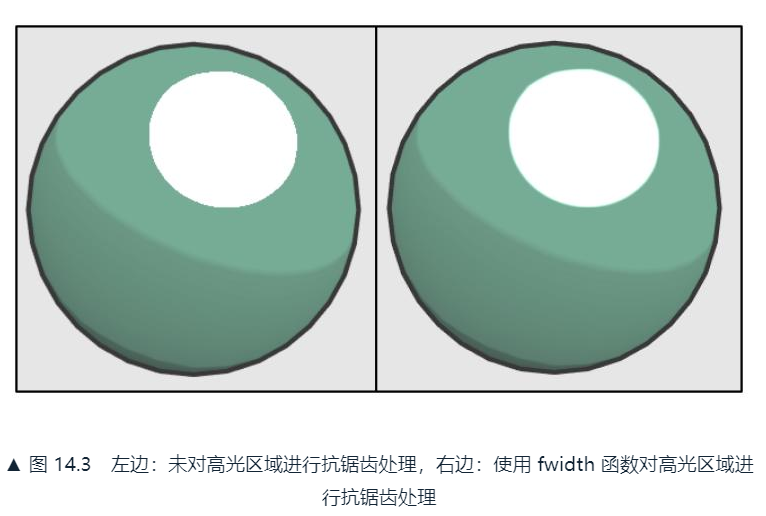
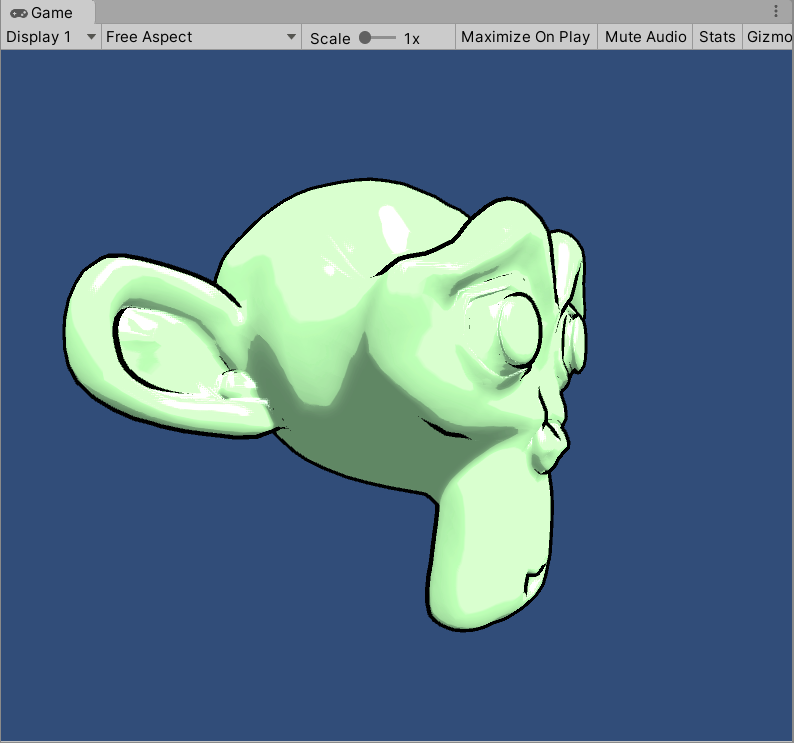
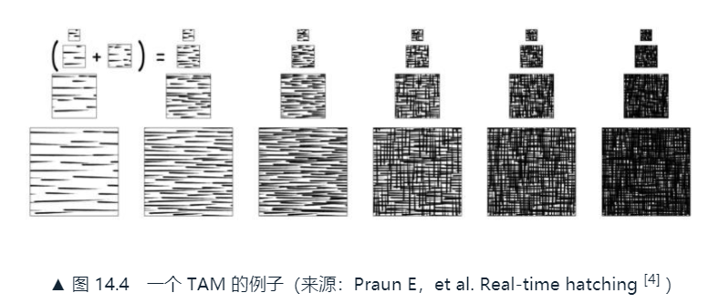
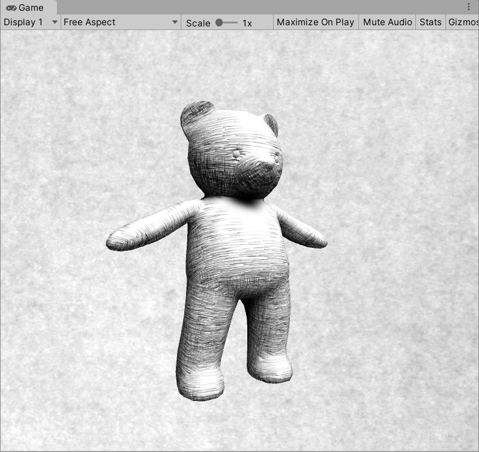

# 14. 非真实感渲染
除了**照相写实主义（photorealism）**，很多游戏使用了**非真实感渲染（Non-Photorealistic Rendering, NPR）**，如卡通、水彩风格等。

## 14.1 卡通风格的渲染
这种风格的游戏画面通常有一些共有的特点，例如物体被黑色的线条描边，分明的明暗变化等。

实现卡通渲染的方法之一是**基于色调的着色技术（tone-based shading）**。（7.3节使用的渐变纹理有类似的效果）：

* 使用漫反射系数对一维纹理采样，控制漫反射的色调
* 高光往往是一块块分界明显的纯色区域
* 通常要在物体边缘部分绘制轮廓，本节介绍基于模型的描边方法，实现简单效果不错

### 14.1.1 渲染轮廓线
近20年，有许多绘制模型轮廓线的方法被先后提出来，在《Real Time Rendering, third edition》一书中，作者把这些方法分成了5种类型：

1. **基于观察角度和表面法线的轮廓线渲染**：简单快速，效果不好
2. **过程式几何轮廓线渲染**：使用两个Pass渲染，先渲染背面的面片使轮廓可见，再正常渲染正面的面片。快速有效，适合绝大多数表面光滑的模型，不适合类似立方体这样平整的模型
3. **基于图像处理的轮廓线渲染**：12、13章介绍的边缘检测方法。适用于任何种类的模型，但一些深度和法线变化很小的无法检测，如桌子上的纸张
4. **基于轮廓边检测的轮廓线渲染**：前面的方法无法控制轮廓线的渲染风格，这种可以检测出精准的轮廓边，然后直接渲染它们。判断相邻两个三角面片，是否一个朝正面一个朝背面，判断是否满足(n0·v>0)≠(n1·v>0)，通过几何着色器帮助下完成。缺点是实现相对复杂，而且还有动画连贯性问题，因为是逐帧单独提取，所以帧与帧之间会出现跳跃
5. **混合上述几种渲染方法**：例如先找到精确的轮廓边，把模型和轮廓边渲染到纹理中，再用图像处理的方法识别出轮廓线，并在图像空间下进行风格化渲染

本节使用过程式几何轮廓线渲染的方法。在第一个Pass中，使用轮廓线颜色渲染整个背面面片，在视角空间下把模型顶点沿着法线方向向外扩展一段距离，让背部轮廓线可见：

```
viewPos = viewPos + viewNormal * _Outline;
```

为了防止内凹模型发生背面面片遮挡正面的情况，扩张之前要对顶点法线的z分量进行处理使它们等于定值，然后法线归一化再扩张顶点。这样的好处是扩张后的背面更加扁平化，降低了遮挡正面的可能性：

```
viewNormal.z = -0.5;
viewNormal = normalize(viewNormal);
viewPos = viewPos + viewNormal * _Outline;
```

### 14.1.2 添加高光
和Blinn-Phong模型类似，要计算normal和halfDir的点乘结果，然后和一个阈值进行比较。使用**step函数**进行比较，第一个参数是参考值，第二个是带比较的数值，如果后者大于前者，就返回1，否则0：

```
float spec = dot(worldNormal, worldHalfDir);
spec = step(threshold, spec);
```

但这种方法会在边界造成锯齿，这是因为突变。为了抗锯齿，可以在边界处很小的一块区域进行平滑处理。使用了CG的**smoothstep函数**，w是一个很小的值，当spec-threshold小于-w时返回0，大于w时返回1，否则在0到1之间进行差值。w的值可以通过CG的**fwidth函数**得到领域像素之间的近似导数值：

```
float spec = dot(worldNormal, worldHalfDir);
spec = lerp(0, 1, smoothstep(-w, w, spec - threshold));
```



### 14.1.3 实现
完整的Shader代码如下：

```
// Upgrade NOTE: replaced '_Object2World' with 'unity_ObjectToWorld'
// Upgrade NOTE: replaced '_World2Object' with 'unity_WorldToObject'

Shader "ShaderLearning/Shader14.1_ToonShading"{
    Properties{
        _Color("Color Tint", Color) = (1, 1, 1, 1)
        _MainTex("Main Tex", 2D) = "white"{}
        _Ramp("Ramp Texture", 2D) = "white"{} // 漫反射色调的渐变纹理
        _Outline("Outline", Range(0, 1)) = 0.1 // 轮廓线宽度
        _OutlineColor("Outline Color", Color) = (0, 0, 0, 1) // 轮廓线颜色
        _Specular("Specular", Color) = (1, 1, 1, 1) // 高光反射颜色
        _SpecularScale("Specular Scale", Range(0, 0.1)) = 0.01 // 高光反射阈值
    }
    SubShader{
        CGINCLUDE

        #include "UnityCG.cginc"
        #include "AutoLight.cginc"
        #include "Lighting.cginc"

        fixed4 _Color;
        sampler2D _MainTex;
        float4 _MainTex_ST;
        sampler2D _Ramp;
        fixed _Outline;
        fixed4 _OutlineColor;
        fixed4 _Specular;
        fixed _SpecularScale;

        ENDCG

        // 渲染背面
        Pass{
            NAME "OUTLINE"
            Cull Front

            CGPROGRAM

            #pragma vertex vert
            #pragma fragment frag

            struct a2v{
                float4 vertex : POSITION;
                float3 normal : NORMAL;
            };

            struct v2f{
                float4 pos : SV_POSITION;
            };

            // 扩张顶点
            v2f vert(a2v v){
                v2f o;

                // 顶点坐标从模型到观察空间
                // float4 pos = mul(UNITY_MATRIX_MV, v.vertex);
                float3 pos = UnityObjectToViewPos(v.vertex);
                // 法线方向从模型到观察空间
                float3 normal = mul((float3x3)UNITY_MATRIX_IT_MV, v.normal);
                // 设置法线z分量，归一化后将顶点沿其方向扩张
                normal.z = -0.5;
                pos = pos + float4(normalize(normal), 0) * _Outline;
                // 顶点坐标从观察到裁剪空间
                // o.pos = mul(UNITY_MATRIX_P, pos);
                o.pos = mul(UNITY_MATRIX_P, float4(pos, 1));

                return o;
            }

            // 用轮廓线颜色渲染整个背面
            float4 frag(v2f i) : SV_Target{
                return float4(_OutlineColor.rgb, 1);
            }
            
            ENDCG
        }

        // 渲染正面
        Pass{
            Tags{ "LightMode" = "ForwardBase"}

            Cull Back

            CGPROGRAM

            #pragma vertex vert
            #pragma fragment frag
            #pragma multi_compile_fwdbase

            struct a2v{
                float4 vertex : POSITION;
                float4 texcoord : TEXCOORD0;
                float3 normal : NORMAL;
            };
            
            struct v2f{
                float4 pos : POSITION;
                float2 uv : TEXCOORD0;
                float3 worldNormal : TEXCOORD1;
                float3 worldPos : TEXCOORD2;
                SHADOW_COORDS(3)
            };

            v2f vert(a2v v){
                v2f o;

                o.pos = UnityObjectToClipPos(v.vertex);
                o.uv = TRANSFORM_TEX(v.texcoord, _MainTex);
                o.worldNormal = mul(v.normal, (float3x3)unity_WorldToObject);
                o.worldPos = mul(unity_ObjectToWorld, v.vertex).xyz;

                TRANSFER_SHADOW(o);

                return o;
            }

            fixed4 frag(v2f i) : SV_Target{
                fixed3 worldNormal = normalize(i.worldNormal);
                fixed3 worldLightDir = normalize(UnityWorldSpaceLightDir(i.worldPos));
                fixed3 worldViewDir = normalize(UnityWorldSpaceViewDir(i.worldPos));
                fixed3 worldHalfDir = normalize(worldLightDir + worldViewDir);

                fixed4 c = tex2D(_MainTex, i.uv);
                fixed3 albedo = c.rgb * _Color.rgb;

                fixed3 ambient = UNITY_LIGHTMODEL_AMBIENT * albedo;

                UNITY_LIGHT_ATTENUATION(atten, i, i.worldPos);

                fixed diff = dot(worldNormal, worldLightDir);
                diff = (diff * 0.5 + 0.5) * atten;

                fixed3 diffuse = _LightColor0.rgb * albedo * tex2D(_Ramp, float2(diff,diff)).rgb;

                fixed spec = dot(worldNormal, worldHalfDir);
                fixed w = fwidth(spec) * 2.0; // 对高光区域边界抗锯齿的阈值
                fixed3 specular = _Specular.rgb * lerp(0, 1, smoothstep(-w, w, spec + _SpecularScale -1)) *
                    step(0.0001, _SpecularScale);

                return fixed4(ambient + diffuse + specular, 1.0);
            }

            ENDCG
        }
    }
    Fallback "Diffuse"
}
```



## 14.2 素描风格的渲染
微软研究院的Praun等人在2001年的SIGGRAPH上发表了论文，使用提前生成的素描纹理来实现实时的素描风格渲染，这些纹理组成了一个**色调艺术映射（Tonal Art Map, TAM）**，如下图从左到右笔触逐渐增多，从上到下对应每张纹理的多级渐远纹理（mipmaps）:



本节使用简化版，不考虑mipmaps的生成，直接使用6张素描纹理进行渲染。在顶点着色器计算逐顶点的光照，根据光照结果决定6张纹理的混合权重，并传给片元着色器。在片元着色器中根据这些权重来混合6张纹理的采样结果。

完整Shader代码如下：

```
// Upgrade NOTE: replaced '_Object2World' with 'unity_ObjectToWorld'

Shader "ShaderLearning/Shader14.2_Hatching"{
    Properties{
        _Color("Color Tint", Color) = (1, 1, 1, 1)
        _TileFactor("Tile Factor", Float) = 1 // 纹理平铺系数，越大素描线条越密
        _Outline("Outline", Range(0, 1)) = 0.1
        _Hatch0("Hatch 0", 2D) = "white"{} // 对应了6张素描纹理，线条密度依次增大
        _Hatch1("Hatch 1", 2D) = "white"{}
        _Hatch2("Hatch 2", 2D) = "white"{}
        _Hatch3("Hatch 3", 2D) = "white"{}
        _Hatch4("Hatch 4", 2D) = "white"{}
        _Hatch5("Hatch 5", 2D) = "white"{}
    }

    SubShader{
        Tags{"RenderType" = "Opaque" "Queue" = "Geometry"}
        UsePass "ShaderLearning/Shader14.1_ToonShading/OUTLINE" // 使用轮廓线Pass

        Pass{
            Tags{"LightMode" = "ForwardBase"}

            CGPROGRAM
            
            #include "UnityCG.cginc"
            #include "AutoLight.cginc"
            #include "Lighting.cginc"

            #pragma vertex vert
            #pragma fragment frag
            #pragma multi_compile_fwdbase

            fixed4 _Color;
            float _TileFactor;
            fixed _Outline;
            sampler2D _Hatch0;
            sampler2D _Hatch1;
            sampler2D _Hatch2;
            sampler2D _Hatch3;
            sampler2D _Hatch4;
            sampler2D _Hatch5;

            struct a2v{
                float4 vertex : POSITION;
                float3 normal : NORMAL;
                float4 texcoord : TEXCOORD0;
            };

            struct v2f{
                float4 pos : SV_POSITION;
                float2 uv : TEXCOORD0;
                fixed3 hatchWeights0 : TEXCOORD1;
                fixed3 hatchWeights1 : TEXCOORD2;
                float3 worldPos : TEXCOORD3;
                SHADOW_COORDS(4)
            };

            v2f vert(a2v v){
                v2f o;
                
                o.pos = UnityObjectToClipPos(v.vertex);
                o.uv = v.texcoord.xy * _TileFactor;

                fixed3 worldLightDir = normalize(WorldSpaceLightDir(v.vertex));
                fixed3 worldNormal = UnityObjectToWorldNormal(v.normal);
                fixed diff = max(0, dot(worldLightDir, worldNormal)); // 漫反射系数

                o.hatchWeights0 = fixed3(0, 0, 0);
                o.hatchWeights1 = fixed3(0, 0, 0);

                float hatchFactor = diff * 7.0;

                // 计算对应的纹理混合权重
                if (hatchFactor > 6.0){
                    // Pure white, do nothing
                } else if (hatchFactor > 5.0){
                    o.hatchWeights0.x = hatchFactor - 5.0;
                } else if (hatchFactor > 4.0){
                    o.hatchWeights0.x = hatchFactor - 4.0;
                    o.hatchWeights0.y = 1.0 - o.hatchWeights0.x;
                } else if (hatchFactor > 3.0){
                    o.hatchWeights0.y = hatchFactor - 3.0;
                    o.hatchWeights0.z = 1.0 - o.hatchWeights0.y;
                } else if (hatchFactor > 2.0){
                    o.hatchWeights0.z = hatchFactor - 2.0;
                    o.hatchWeights1.x = 1.0 - o.hatchWeights0.z;
                } else if (hatchFactor > 1.0){
                    o.hatchWeights1.x = hatchFactor - 1.0;
                    o.hatchWeights1.y = 1.0 - o.hatchWeights1.x;
                } else{
                    o.hatchWeights1.y = hatchFactor;
                    o.hatchWeights1.z = 1.0 - o.hatchWeights1.y;
                }

                // o.worldPos = UnityObjectToWorldDir(v.vertex);
                o.worldPos = mul(unity_ObjectToWorld, v.vertex).xyz;

                TRANSFER_SHADOW(o);
                return o;
            }

            fixed4 frag(v2f i) : SV_Target{
                fixed4 hatchTex0 = tex2D(_Hatch0, i.uv) * i.hatchWeights0.x;
                fixed4 hatchTex1 = tex2D(_Hatch1, i.uv) * i.hatchWeights0.y;
                fixed4 hatchTex2 = tex2D(_Hatch2, i.uv) * i.hatchWeights0.z;
                fixed4 hatchTex3 = tex2D(_Hatch3, i.uv) * i.hatchWeights1.x;
                fixed4 hatchTex4 = tex2D(_Hatch4, i.uv) * i.hatchWeights1.y;
                fixed4 hatchTex5 = tex2D(_Hatch5, i.uv) * i.hatchWeights1.z;
                fixed4 whiteColor = fixed4(1, 1, 1, 1) * (1 -
                    i.hatchWeights0.x - i.hatchWeights0.y - i.hatchWeights0.z -
                    i.hatchWeights1.x - i.hatchWeights1.y - i.hatchWeights1.z);
                
                fixed4 hatchColor = hatchTex0 + hatchTex1 + hatchTex2 +
                    hatchTex3 + hatchTex4 + hatchTex5 + whiteColor;

                UNITY_LIGHT_ATTENUATION(atten, i, i.worldPos);
                return fixed4(hatchColor.rgb * _Color.rgb * atten, 1.0);
            }

            ENDCG
        }
    }

    Fallback "Diffuse"
}
```

运行效果如下：



## 14.3 扩展阅读
1. 国际讨论会NPAR(Non-Photorealistic Animation and Rendering)上有许多关于非真实感渲染的论文
2. 浙江大学耿卫东《艺术化绘制的图形学原理与方法》（英文名：The Algorithms and Principles of Non-photorealistic Graphics）
3. Unity资源商店一个免费的卡通资源包，实现了包括轮廓线渲染等卡通风格的渲染，ToonShaderFree：https://assetstore.unity.com/packages/vfx/shaders/toon-shader-free-21288
4. Unity资源商店一个收费的卡通资源包，包含了更多的卡通风格UnityShader，ToonStylesShaderPack
5. 收费资源包，铅笔渲染、蜡笔渲染等多种手绘风格的NPR效果，HandDrawnShaderPack：https://assetstore.unity.com/packages/vfx/shaders/hand-drawn-shader-pack-12465

## 14.4 参考文献
略

# 999. Ref
1. 一种风格化的卡通高光的实现：https://blog.csdn.net/candycat1992/article/details/47284289
2. 使用Photoshop等软件创建相似的素描纹理的方法：https://alastaira.wordpress.com/2013/11/01/hand-drawn-shaders-and-creating-tonal-art-maps/