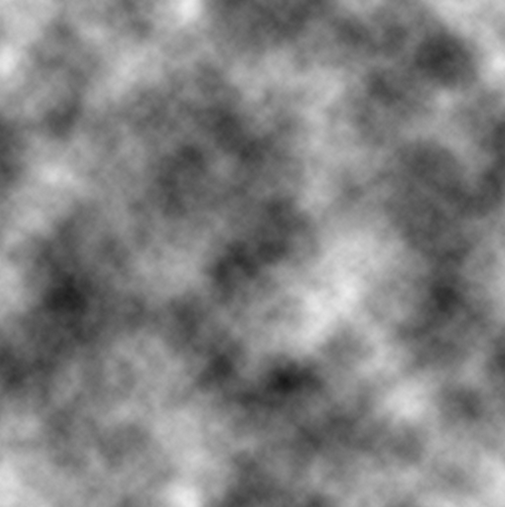
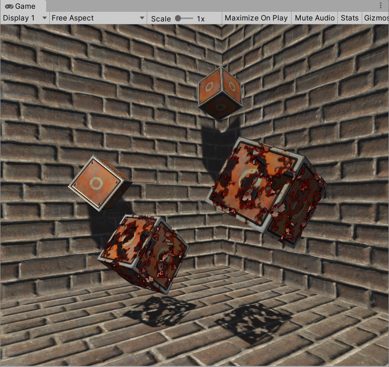
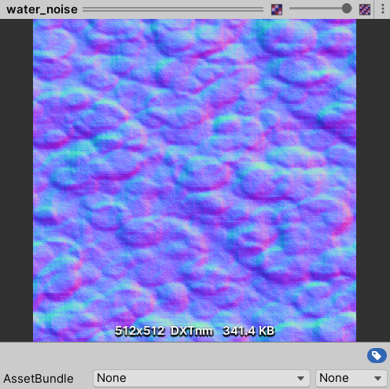
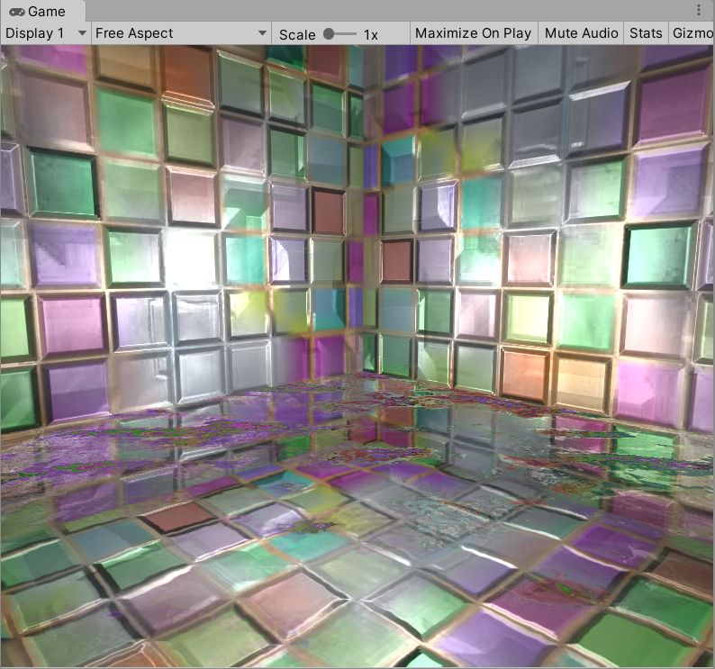
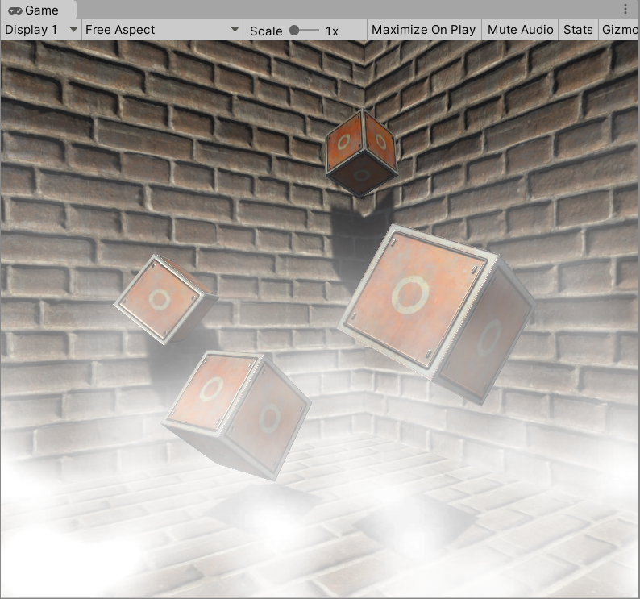

# 15. 使用噪声
向规则的事物里添加一些“杂乱无章”的效果

## 15.1 消融效果
**消融（dissolve）**效果常见于游戏中的角色死亡、地图烧毁等效果。在这些效果中，消融往往从不同的区域开始，并向看似随机的方向扩张，最后整个物体都消失不见。

原理是噪声纹理+透明度测试。对噪声纹理采样的结果和某个控制消融程度的阈值比较，如果小于阈值，就使用clip函数把它对应的像素裁剪掉，这部分就对应了“烧毁”的区域。而镂空区域边缘的烧焦效果则是将两种颜色混合，再用pow函数处理后，与原纹理颜色混合的结果。

完整的Shader代码如下。主要是对噪声纹理进行采样，使用clip去掉不显示的像素。另外加了一个投影的Pass：

```
// Upgrade NOTE: replaced '_Object2World' with 'unity_ObjectToWorld'

Shader "ShaderLearning/Shader15.1_Dissolve"{
    Properties{
        _BurnAmount("Burn Amount", Range(0.0, 1.0)) = 0.0 // 消融程度
        _LineWidth("Burn Line Width", Range(0.0, 0.2)) = 0.1 // 烧焦线宽
        _MainTex("Base (RGB)", 2D) = "white"{}
        _BumpMap("Normal Map", 2D) = "bump" {}
        _BurnFirstColor("Burn First Color", Color) = (1, 0, 0, 1) // 火焰边缘颜色1
        _BurnSecondColor("Burn Second Color", Color) = (1, 0, 0, 1) // 火焰边缘颜色2
        _BurnMap("Burn Map", 2D) = "white" {} // 噪声纹理
    }

    SubShader{
        Tags{"RenderType" = "Opaque" "Queue" = "Geometry"}
        Pass{
            Tags{"LightMode" = "ForwardBase"}
            Cull Off // 关闭剔除，渲染双面。因为消融会裸露模型内部

            CGPROGRAM

            #include "Lighting.cginc"
            #include "AutoLight.cginc"
            #pragma multi_compile_fwdbase
            #pragma vertex vert
            #pragma fragment frag

            fixed _BurnAmount;
            fixed _LineWidth;
            sampler2D _MainTex;
            float4 _MainTex_ST;
            sampler2D _BumpMap;
            float4 _BumpMap_ST;
            fixed4 _BurnFirstColor;
            fixed4 _BurnSecondColor;
            sampler2D _BurnMap;
            float4 _BurnMap_ST;

            struct a2v{
                float4 vertex : POSITION;
                float4 texcoord : TEXCOORD0;
                float3 normal : NORMAL;
                float4 tangent : TANGENT;
            };

            struct v2f{
                float4 pos : SV_POSITION;
                float2 uvMainTex : TEXCOORD0;
                float2 uvBumpMap : TEXCOORD1;
                float2 uvBurnMap : TEXCOORD2;
                float3 lightDir : TEXCOORD3;
                float3 worldPos : TEXCOORD4;
                SHADOW_COORDS(5)
            };

            v2f vert(a2v v){
                v2f o;
                o.pos = UnityObjectToClipPos(v.vertex);

                o.uvMainTex = TRANSFORM_TEX(v.texcoord, _MainTex);
                o.uvBumpMap = TRANSFORM_TEX(v.texcoord, _BumpMap);
                o.uvBurnMap = TRANSFORM_TEX(v.texcoord, _BurnMap);

                TANGENT_SPACE_ROTATION; // 把光源方向从模型空间变换到切线空间
                o.lightDir = mul(rotation, ObjSpaceLightDir(v.vertex)).xyz;
                o.worldPos = mul(unity_ObjectToWorld, v.vertex).xyz;

                TRANSFER_SHADOW(o);
                return o;
            }

            fixed4 frag(v2f i) : SV_Target{
                fixed3 burn = tex2D(_BurnMap, i.uvBurnMap).rgb;

                clip(burn.r - _BurnAmount);

                float3 tangentLightDir = normalize(i.lightDir);
                fixed3 tangentNormal = UnpackNormal(tex2D(_BumpMap, i.uvBumpMap));

                fixed3 albedo = tex2D(_MainTex, i.uvMainTex).rgb;

                fixed3 ambient = UNITY_LIGHTMODEL_AMBIENT.xyz * albedo;

                fixed3 diffuse = _LightColor0.rgb * albedo * max(0,dot(tangentNormal,tangentLightDir));

                fixed t = 1 - smoothstep(0.0, _LineWidth, burn.r - _BurnAmount);
                fixed3 burnColor = lerp(_BurnFirstColor, _BurnSecondColor, t);
                burnColor = pow(burnColor, 5); // 让效果更接近烧焦的痕迹

                UNITY_LIGHT_ATTENUATION(atten, i, i.worldPos);
                fixed3 finalColor = lerp(ambient + diffuse * atten, burnColor, t * step(0.0001, _BurnAmount));

                return fixed4(finalColor, 1);
            }

            ENDCG
        }

        // Pass to render object as a shadow caster
        // 投射阴影
        Pass{
            Tags{"LightMode" = "ShadowCaster"}

            CGPROGRAM

            #pragma vertex vert
            #pragma fragment frag
            #pragma multi_compile_shadowcaster
            #include "UnityCG.cginc"

            fixed _BurnAmount;
            sampler2D _BurnMap;
            float4 _BurnMap_ST;

            struct v2f{
                V2F_SHADOW_CASTER;
                float2 uvBurnMap : TEXCOORD1;
            };

            v2f vert(appdata_base v){
                v2f o;

                TRANSFER_SHADOW_CASTER_NORMALOFFSET(o);

                o.uvBurnMap = TRANSFORM_TEX(v.texcoord, _BurnMap);

                return o;
            }

            fixed4 frag(v2f i) : SV_Target{
                fixed3 burn = tex2D(_BurnMap, i.uvBurnMap).rgb;

                clip(burn.r - _BurnAmount);

                SHADOW_CASTER_FRAGMENT(i)
            }

            ENDCG
        }
    }
}
```

使用这样的噪声纹理作为BurnMap：



运行效果如下：



## 15.2 水波效果
在模拟实时水面的过程中也会使用噪声纹理。此时噪声纹理会用作一个高度图，不断修改水面的法线方向。

本节会使用一个由噪声纹理得到的法线贴图，实现一个包含菲涅尔反射的水面效果。

做法是用立方体纹理（Cubemap）作为环境纹理，模拟反射。用GrabPass获取当前屏幕的渲染纹理，使用切线空间下的法线方向对屏幕坐标进行偏移，再使用该坐标对渲染纹理进行屏幕采样，模拟近似的折射效果。使用噪声纹理来生成水波的法线，随着时间变化不断平移，模拟波光粼粼的效果。另外不使用定值来混合反射和折射颜色，而是用菲涅尔系数来动态决定混合系数：fresnel = pow(1 - max(0, v · n), 4)

其中v和n分别对应了视角方向和法线方向，它们之间的夹角越小，fresnel值越小，反射越弱，折射越强。

完整Shader代码如下：

```
Shader "ShaderLearning/Shader15.2_WaterWave"{
    Properties{
        _Color("Main Color", Color) = (0, 0.15, 0.115, 1) // 水面颜色
        _MainTex("Base (RGB)", 2D) = "white" {} // 水面波纹材质纹理
        _WaveMap("Wave Map", 2D) = "bump" {} // 由噪声纹理生成的法线纹理
        _Cubemap("Environment Cubemap", Cube) = "_Skybox" {} // 用于模拟反射的立方体纹理
        _WaveXSpeed("Wave Horizontal Speed", Range(-0.1, 0.1)) = 0.01 // 法线纹理在X方向的平移速度
        _WaveYSpeed("Wave Vertical Speed", Range(-0.1, 0.1)) = 0.01 // 法线纹理在Y方向的平移速度
        _Distortion("Distortion", Range(0, 100)) = 10 // 控制模拟折射时图像的扭曲程度
    }

    SubShader{
        // We must be transparent, so other objects are drawn before this one.
        // 确保其他所有不透明物体都已经被渲染到屏幕上了
        Tags{"Queue" = "Transparent" "RenderType" = "Opaque"}

        // This pass grabs the screen behind the object into a texture.
        // We can access the result in the next pass as _RefractionTex
        // 抓取屏幕图像，保存在_RefractionTex中
        GrabPass{"_RefractionTex"}

        Pass{
            CGPROGRAM

            #include "UnityCG.cginc"
            #pragma vertex vert
            #pragma fragment frag

            fixed4 _Color;
            sampler2D _MainTex;
            float4 _MainTex_ST;
            sampler2D _WaveMap;
            float4 _WaveMap_ST;
            samplerCUBE _Cubemap;
            fixed _WaveXSpeed;
            fixed _WaveYSpeed;
            float _Distortion;
            sampler2D _RefractionTex;
            float4 _RefractionTex_TexelSize;

            struct a2v{
                float4 vertex : POSITION;
                float4 texcoord : TEXCOORD0;
                float3 normal : NORMAL;
                float4 tangent : TANGENT;
            };

            struct v2f{
                float4 pos : SV_POSITION;
                float4 scrPos : TEXCOORD0;
                float4 uv : TEXCOORD1;
                float4 TtoW0 : TEXCOORD2;
                float4 TtoW1 : TEXCOORD3;
                float4 TtoW2 : TEXCOORD4;
            };

            v2f vert(a2v v){
                v2f o;
                o.pos = UnityObjectToClipPos(v.vertex);
                o.scrPos = ComputeGrabScreenPos(o.pos); // 对应被抓取屏幕图像的采样坐标
                o.uv.xy = TRANSFORM_TEX(v.texcoord, _MainTex);
                o.uv.zw = TRANSFORM_TEX(v.texcoord, _WaveMap);

                float3 worldPos = mul(unity_ObjectToWorld, v.vertex).xyz;
                fixed3 worldNormal = UnityObjectToWorldNormal(v.normal);
                fixed3 worldTangent = UnityObjectToWorldDir(v.tangent.xyz);
                fixed3 worldBinormal = cross(worldNormal, worldTangent) * v.tangent.w;

                o.TtoW0 = float4(worldTangent.x, worldBinormal.x, worldNormal.x, worldPos.x);
                o.TtoW1 = float4(worldTangent.y, worldBinormal.y, worldNormal.y, worldPos.y);
                o.TtoW2 = float4(worldTangent.z, worldBinormal.z, worldNormal.z, worldPos.z);

                return o;
            }

            fixed4 frag(v2f i) : SV_Target{
                float3 worldPos = float3(i.TtoW0.w, i.TtoW1.w, i.TtoW2.w);
                fixed3 viewDir = normalize(UnityWorldSpaceViewDir(worldPos));
                float2 speed = _Time.y * float2(_WaveXSpeed, _WaveYSpeed);

                // Get the normal in tangent space
                // 模拟两层交叉的水面波动效果
                fixed3 bump1 = UnpackNormal(tex2D(_WaveMap, i.uv.zw + speed)).rgb;
                fixed3 bump2 = UnpackNormal(tex2D(_WaveMap, i.uv.zw - speed)).rgb;
                fixed3 bump = normalize(bump1 + bump2);

                // Compute the offset in tangent space
                // 模拟折射效果
                float2 offset = bump.xy * _Distortion * _RefractionTex_TexelSize.xy;
                // 偏移量和屏幕坐标的z分量相乘，模拟深度越大、折射越大的效果
                i.scrPos.xy = offset * i.scrPos.z + i.scrPos.xy;
                fixed3 refrCol = tex2D(_RefractionTex, i.scrPos.xy / i.scrPos.w).rgb;

                // Convert the normal to world space
                bump = normalize(half3(dot(i.TtoW0.xyz, bump), dot(i.TtoW1.xyz, bump), dot(i.TtoW2.xyz, bump)));
                fixed4 texColor = tex2D(_MainTex, i.uv.xy + speed);
                fixed3 reflDir = reflect(-viewDir, bump);
                fixed3 reflCol = texCUBE(_Cubemap, reflDir).rgb * texColor.rgb * _Color.rgb;

                fixed fresnel = pow(1 - saturate(dot(viewDir, bump)), 4);
                fixed3 finalColor = reflCol * fresnel +refrCol * (1 - fresnel);

                return fixed4(finalColor, 1);
            }

            ENDCG
        }
    }
}
```

使用作者提供的water_noise.png，导入后要记得将贴图类型改为NormalMap，并**勾选CreateFromGrayscale**。



最终效果如下（*感觉效果一般般，水面还是很假*）：



## 15.3 再谈全局雾效
13.3节使用深度纹理实现了一种基于屏幕后处理的全局高度雾效。有时我们希望可以模拟一种不均匀的雾效，同时让雾不断飘动，使雾看起来更加飘渺，这可以通过噪声纹理来实现。

在13.3的基础上，添加了噪声相关的参数和属性，并在Shader的片元着色器中对高度的计算添加了噪声的影响。

使用屏幕后处理，完整的C#脚本如下：

```
using System.Collections;
using System.Collections.Generic;
using UnityEngine;

public class FogWithNoise : PostEffectsBase{
    public Shader fogShader;
    private Material fogMaterial = null;
    public Material material{
        get{
            fogMaterial = CheckShaderAndCreateMaterial(fogShader, fogMaterial);
            return fogMaterial;
        }
    }
    private Camera myCamera;
    new public Camera camera{
        get{
            if (myCamera == null){
                myCamera = GetComponent<Camera>();
            }
            return myCamera;
        }
    }
    private Transform myCameraTransform;
    public Transform cameraTransform{
        get{
            if(myCameraTransform == null){
                myCameraTransform = camera.transform;
            }

            return myCameraTransform;
        }
    }
    [Range(0.1f, 3.0f)]
    public float fogDensity = 1.0f; // 雾的浓度
    public Color fogColor = Color.white; // 雾的颜色
    public float fogStart = 0.0f; // 雾效起始高度
    public float fogEnd = 2.0f; // 雾效终止高度
    public Texture noiseTexture; // 噪声纹理
    [Range(-0.5f, 0.5f)]
    public float fogXSpeed = 0.1f; // 噪声纹理在X方向上的移动速度
    [Range(-0.5f, 0.5f)]
    public float fogYSpeed = 0.1f; // 噪声纹理在Y方向上的移动速度
    [Range(-0.5f, 0.5f)]
    public float noiseAmount = 1.0f; // 噪声程度

    void OnEnable(){
        camera.depthTextureMode |= DepthTextureMode.Depth;
    }

    void OnRenderImage(RenderTexture src, RenderTexture dest){
        if(material != null){
            Matrix4x4 frustumCorners = Matrix4x4.identity;

            // Compute frustumCorners
            float fov = camera.fieldOfView;
            float near = camera.nearClipPlane;
            float far = camera.farClipPlane;
            float aspect = camera.aspect; // 长宽比

            float halfHeight = near * Mathf.Tan(fov * 0.5f * Mathf.Deg2Rad);
            Vector3 toRight = cameraTransform.right * halfHeight * aspect;
            Vector3 toTop = cameraTransform.up * halfHeight;

            Vector3 topLeft = cameraTransform.forward * near + toTop - toRight;
            float scale = topLeft.magnitude / near;
            topLeft.Normalize();
            topLeft *= scale; // RayTL

            Vector3 topRight = cameraTransform.forward * near + toTop + toRight;
            topRight.Normalize();
            topRight *= scale; // RayTR

            Vector3 bottomLeft = cameraTransform.forward * near - toTop - toRight;
            bottomLeft.Normalize();
            bottomLeft *= scale; // RayBL

            Vector3 bottomRight = cameraTransform.forward * near - toTop + toRight;
            bottomRight.Normalize();
            bottomRight *= scale; // RayBR

            frustumCorners.SetRow(0, bottomLeft);
            frustumCorners.SetRow(1, bottomRight);
            frustumCorners.SetRow(2, topRight);
            frustumCorners.SetRow(3, topLeft);

            material.SetMatrix("_FrustumCornersRay", frustumCorners);
            // material.SetMatrix("_ViewProjectionInverseMatrix", (camera.projectionMatrix * camera.worldToCameraMatrix).inverse);

            material.SetFloat("_FogDensity", fogDensity);
            material.SetColor("_FogColor", fogColor);
            material.SetFloat("_FogStart", fogStart);
            material.SetFloat("_FogEnd", fogEnd);

            material.SetTexture("_NoiseTex", noiseTexture);
            material.SetFloat("_FogXSpeed", fogXSpeed);
            material.SetFloat("_FogYSpeed", fogYSpeed);
            material.SetFloat("_NoiseAmount", noiseAmount);

            Graphics.Blit(src, dest, material);
        }else{
            Graphics.Blit(src, dest);
        }
    }
}
```

完整的Shader如下：

```
Shader "ShaderLearning/Shader15.3_FogWithNoise"{
    Properties{
        _MainTex("Base (RGB)", 2D) = "white" {}
        _FogDensity("Fog Density", Float) = 1.0
        _FogColor("Fog Color", Color) = (1, 1, 1, 1)
        _FogStart("Fog Start", Float) = 0.0
        _FogEnd("Fog End", Float) = 1.0
        _NoiseTex("Noise Texture", 2D) = "white" {}
        _FogXSpeed("Fog Horizontal Speed", Float) = 0.1
        _FogYSpeed("Fog Vertical Speed", Float) = 0.1
        _NoiseAmount("Noise Amount", Float) =1
    }

    SubShader{
        CGINCLUDE

        #include "UnityCG.cginc"

        float4x4 _FrustumCornersRay;
        sampler2D _MainTex;
        half4 _MainTex_TexelSize;
        sampler2D _CameraDepthTexture;
        half _FogDensity;
        fixed4 _FogColor;
        float _FogStart;
        float _FogEnd;
        sampler2D _NoiseTex;
        half _FogXSpeed;
        half _FogYSpeed;
        half _NoiseAmount;

        struct v2f{
            float4 pos:SV_POSITION;
            half2 uv:TEXCOORD0;
            half2 uv_depth:TEXCOORD1;
            float4 interpolatedRay:TEXCOORD2;
        };

        v2f vert(appdata_img v){
            v2f o;
            o.pos=UnityObjectToClipPos(v.vertex);
            o.uv=v.texcoord;
            o.uv_depth=v.texcoord;

            #if UNITY_UV_STARTS_AT_TOP
            if(_MainTex_TexelSize.y<0)
                o.uv_depth.y=1-o.uv_depth.y;
            #endif

            // 判断该点对应哪个角
            int index=0;
            if(v.texcoord.x<0.5 && v.texcoord.y<0.5){
                index=0;
            }else if(v.texcoord.x>0.5 && v.texcoord.y<0.5){
                index=1;
            }else if(v.texcoord.x>0.5 && v.texcoord.y>0.5){
                index=2;
            }else{
                index=3;
            }

            #if UNITY_UV_STARTS_AT_TOP
            if(_MainTex_TexelSize.y<0)
                index=3-index;
            #endif

            o.interpolatedRay=_FrustumCornersRay[index];

            return o;
        }

        fixed4 frag(v2f i) : SV_Target{
            float linearDepth = LinearEyeDepth(SAMPLE_DEPTH_TEXTURE(_CameraDepthTexture, i.uv_depth));
            float3 worldPos = _WorldSpaceCameraPos + linearDepth * i.interpolatedRay.xyz;

            float2 speed = _Time.y * float2(_FogXSpeed, _FogYSpeed);
            float noise = (tex2D(_NoiseTex, i.uv + speed).r - 0.5) * _NoiseAmount;

            float fogDensity = (_FogEnd - worldPos.y) / (_FogEnd - _FogStart);
            fogDensity = saturate(fogDensity * _FogDensity * (1 + noise));

            fixed4 finalColor = tex2D(_MainTex, i.uv);
            finalColor.rgb = lerp(finalColor.rgb, _FogColor.rgb, fogDensity);

            return finalColor;
        }

        ENDCG

        Pass{
            CGPROGRAM
            #pragma vertex vert
            #pragma fragment frag
            ENDCG
        }
    }
    Fallback Off
}
```

运行结果如下：



## 15.4 扩展阅读
噪声纹理可以被认为是一种程序纹理（Procedure Texture），它们都是由计算机利用某些算法生成的。Perlin噪声可以用于生成更自然的噪声纹理，Worley噪声通常用于模拟石头、水、纸张等多孔噪声。

1. Perlin噪声：https://en.wikipedia.org/wiki/Perlin_noise
2. Worley噪声：https://en.wikipedia.org/wiki/Worley_noise
3. Understanding Perlin Noise：http://adrianb.io/2014/08/09/perlinnoise.html
4. Worley1998年发表的论文中，有Worley噪声的算法和实现细节
5. 很多程序噪声在Unity中的实现：http://scrawkblog.com/category/procedural-noise/（*连接失效了*）

## 15.5 参考文献
略