# 2. 渲染流水线
渲染流水线的最终目的在于生成一张二维纹理，即我们在电脑屏幕上看到的所有效果。
它的输入是一个虚拟摄像机、一些光源、一些Shader以及纹理等。

## 2.1. 综述
Shader是渲染流水线中的一个环节，本节会给出简化后的渲染流水线的工作流程。

### 2.1.1. 什么是流水线
将串行的工作分解为并行的工作同时进行。理想情况下，把一个非流水线系统分成n个流水线阶段，且每个阶段耗费时间相同的话，会使整个系统得到n倍的速度提升。

### 2.1.2. 什么是渲染流水线
应用阶段->几何阶段->光栅化阶段

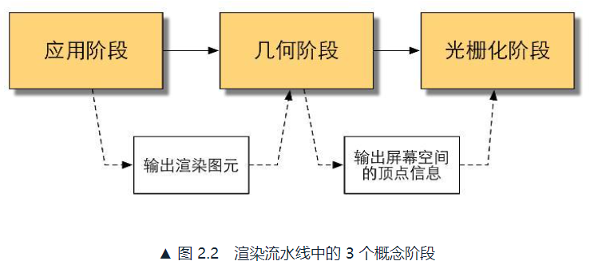

* 应用阶段ApplicationStage：CPU实现，开发者主导。输出渲染图元RenderingPrimitives（几何信息，点、线、三角面等）
    * 准备场景数据，相机位置、视锥体、场景模型、光源等
    * 粗粒度剔除Culling
    * 设置每个模型的渲染状态，材质、纹理、Shader等
* 几何阶段GeometryStage：GPU进行，处理所有和我们要绘制的几何相关的事情。把顶点坐标变换到屏幕空间中，输出屏幕空间的二维顶点坐标、每个顶点对应的深度值、着色等信息
* 光栅化阶段RasterizerStage：GPU进行，决定每个渲染图元中的哪些像素应该被绘制在屏幕上。对上阶段的逐顶点数据（纹理坐标、顶点颜色等）进行插值，逐像素处理

概念流水线，根据基本功能划分。与硬件实现的GPU流水线区别。

## 2.2. CPU和GPU之间的通信
应用阶段过程如下：
* 把数据加载到显存中
* 设置渲染状态
* 调用DrawCall

### 2.2.1. 把数据加载到显存中
硬盘（HardDiskDrive，HDD）->内存（RandomAccessMemory，RAM）->显存（VideoRandomAccessMemory，VRAM）

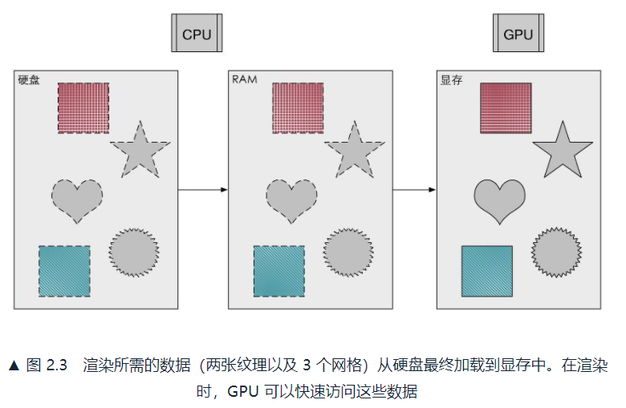

### 2.2.2. 设置渲染状态
渲染状态定义了场景中的网格是怎么被渲染的。例如使用哪个顶点着色器（VertexShader）/片元着色器（FragmentShader）、光源属性、材质等。

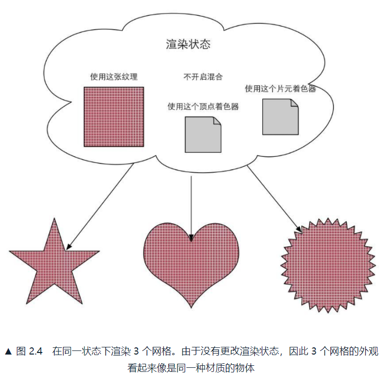

### 2.2.3. 调用DrawCall
DrawCall是一个命令，发起方是CPU，接收方是GPU。仅指向一个需要被渲染的图元（Primitives）列表。

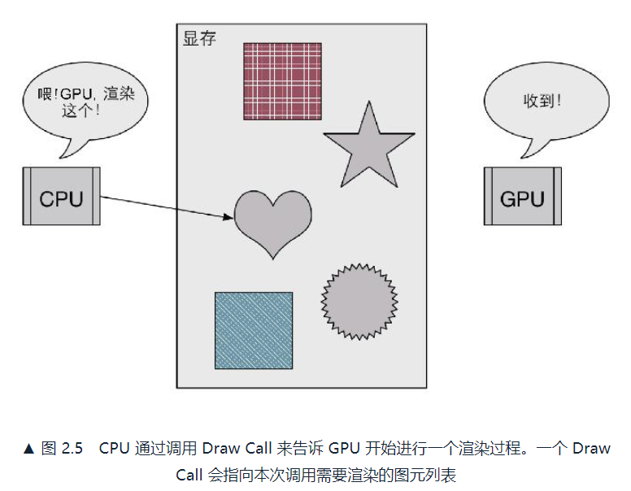

## 2.3. GPU流水线

### 2.3.1. 概述
每个阶段GPU提供了不同的可配置性或可编程性。

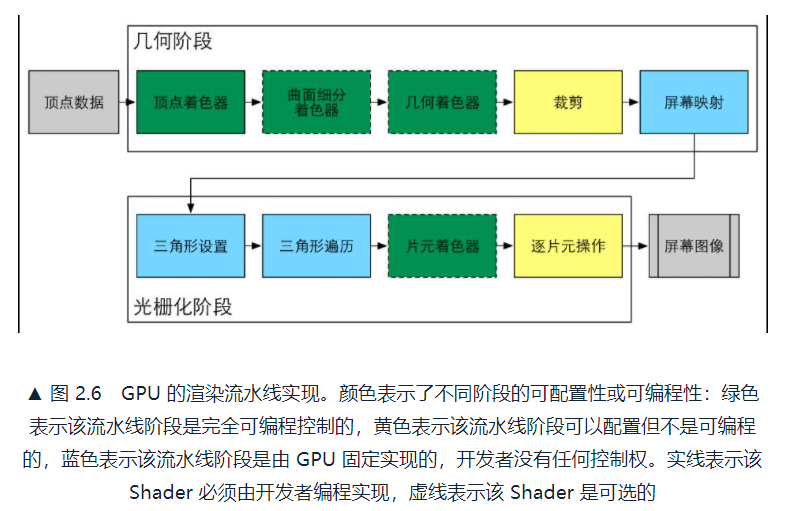

* 几何阶段
    * 顶点着色器（VertexShader）：完全可编程，实现顶点的空间变换、顶点着色等
    * 曲面细分着色器（TessellationShader）：可选着色器，用于细分图元
    * 几何着色器（GeometryShader）可选着色器，执行逐图元着色操作
    * 裁剪（Clipping）：将不在相机视野内的顶点裁剪掉，可配置
    * 屏幕映射（ScreenMapping）：不可配置和编程
* 光栅化阶段
    * 三角形设置（TriangleSetup）：固定函数阶段
    * 三角形遍历（TriangleTraversal）：固定函数阶段
    * 片元着色器（FragmentShader）：完全可编程，实现逐片元(Per-Fragment)的着色操作
    * 逐片元操作(Per-FragmentOperations)：修改颜色、深度缓冲、进行混合等。可配置

### 2.3.2. 顶点着色器
输入进来的每个顶点都会调用一次顶点着色器，互相独立，并行处理。主要工作：坐标变换和逐顶点光照。

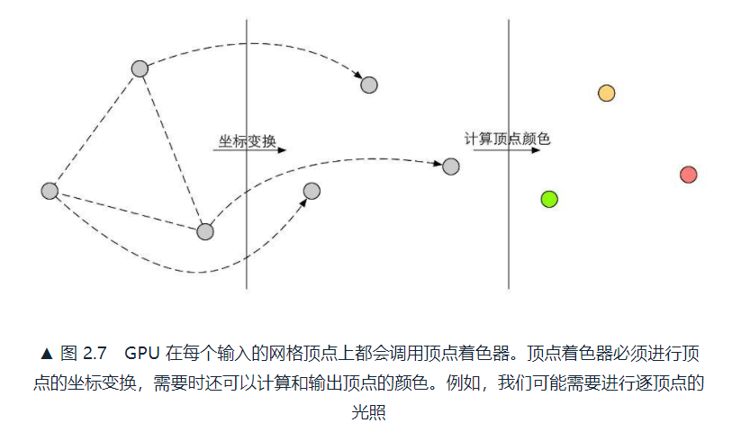

坐标变换，最基本且必须完成的工作是，把顶点坐标从模型空间转换到齐次裁剪空间。最后得到归一化的设备坐标（NormalizedDeviceCoordinates，NDC）。

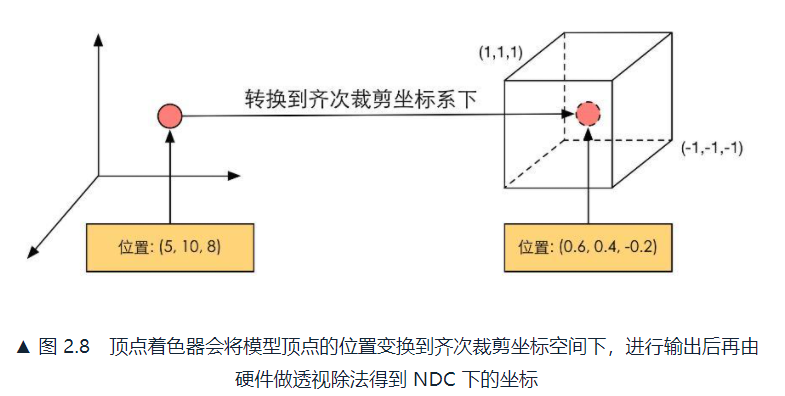

### 2.3.3. 裁剪
不在相机视野内的物体不需要被处理。一个图元和相机视野有3种关系：
* 完全在视野内：继续传递给下一阶段
* 部分在视野内：需要进行裁剪（Clipping），使用新的顶点来代替
* 完全在视野外：不会向下传递

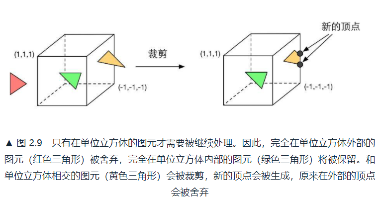

### 2.3.4. 屏幕映射
屏幕映射（ScreenMapping）的任务是把每个图元x和y坐标转换到屏幕坐标系（ScreenCoordinates）。不处理z坐标。

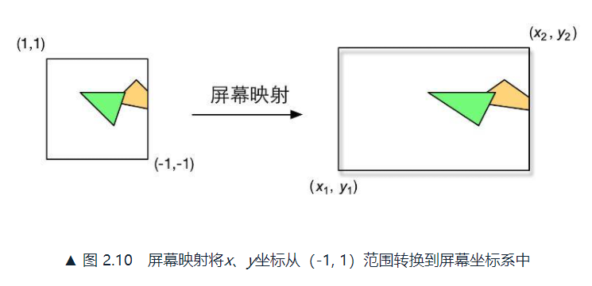

### 2.3.5. 三角形设置
计算三角网格表示数据，计算每条边上的像素坐标。

### 2.3.6. 三角形遍历
检查每个像素是否被一个三角网络所覆盖，是则生成一个片元。也叫扫描变换（ScanConversion）。

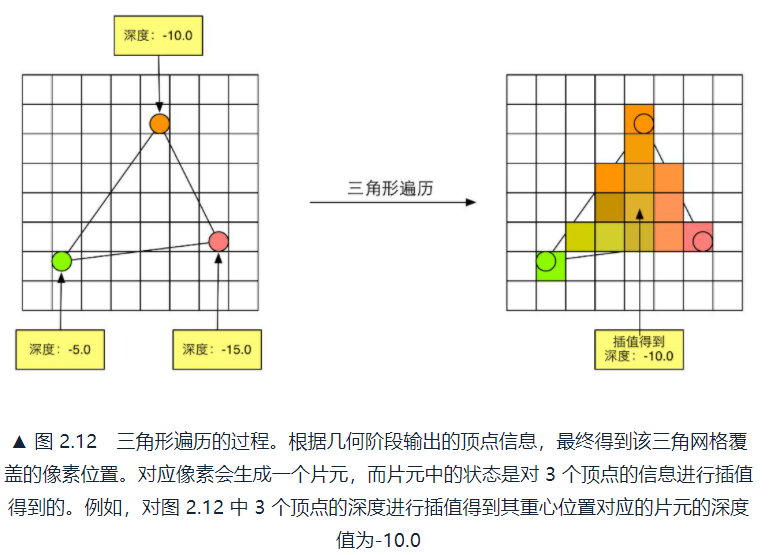

### 2.3.7. 片元着色器
在DirectX中，称为像素着色器（PixelShader）。输出颜色值..纹理采样。一般仅影响单个片元。

### 2.3.8. 逐片元操作
在DirectX中，称为输出合并阶段（Output-Merger）。主要任务：
1. 决定每个片元的可见性
2. 合并颜色

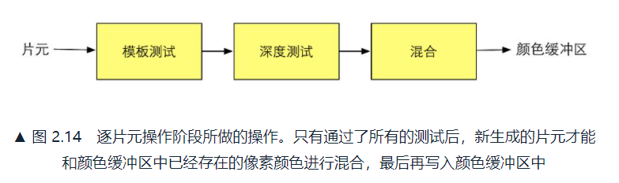

决定可见性：
* 模板测试（StencilTest）：将片元位置的模板值，和参考值进行比较。
* 深度测试（DepthTest）：将片元的深度值，和深度缓冲区的深度值进行比较。

合并颜色。对于不透明物体，可以关闭混合，用片元着色器得到的颜色值覆盖颜色缓冲区的像素值。对于半透明物体，要混合。

如果在执行片元着色器之前就进行这些测试，可以提高GPU性能，早点知道那些片元会被舍弃。深度测试提前执行的技术Early-Z。透明度测试会导致禁用提前测试，使性能下降。

为了避免我们看到正在进行光栅化的图元，GPU会使用双重缓冲（DoubleBuffering）。渲染在幕后，在后置缓冲(BackBuffer)中，一旦完成，GPU会交换后置缓冲区和前置缓冲（FrontBuffer）的内容。

### 2.3.9. 总结
真正实现更加复杂，因为图形接口差异具体实现方法不尽相同。

Unity为我们封装了功能，可以方便实现大部分常见效果，但封装导致了编程自由度下降。

## 2.4. 一些容易困惑的地方

### 2.4.1. 什么是OpenGL/DirectX
OpenGL/DirectX图像应用编程接口。运行在CPU上的应用程序->调用OpenGL/DirectX等图形接口，将数据存在显存，发出DrawCall->显卡驱动翻译成GPU能理解的代码。

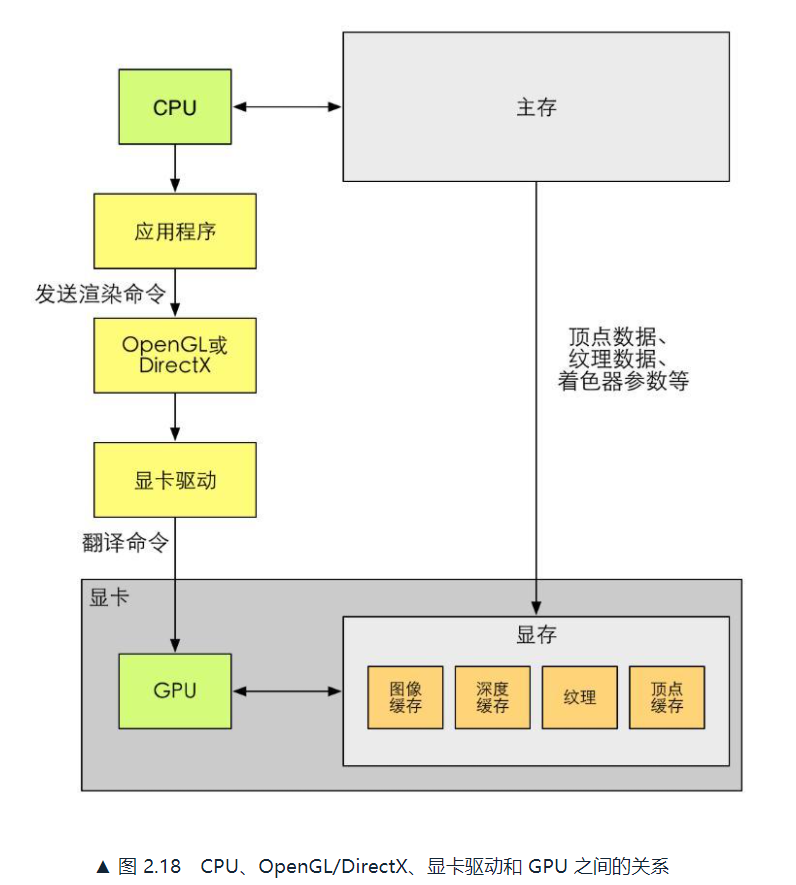

### 2.4.2. 什么是HLSL、GLSL、CG
着色语言（ShadingLanguage）：
* DirectX的HLSL（HighLevelShadingLanguage）
* OpenGL的GLSL（OpenGLShadingLanguage）
* NVIDIA的CG（C for Graphic）

在UnityShader中，可以选择使用哪种，但有所区别。

### 2.4.3. 什么是DrawCall
DrawCall，CPU调用图像编程接口，以命令GPU进行渲染的操作。

> 问题一：CPU和GPU是如何实现并行工作的？

> 命令缓冲区（CommandBuffer），让CPU和GPU可以并行工作。CPU向其中添加命令，GPU从中读取命令，添加和读取的过程是相互独立的。

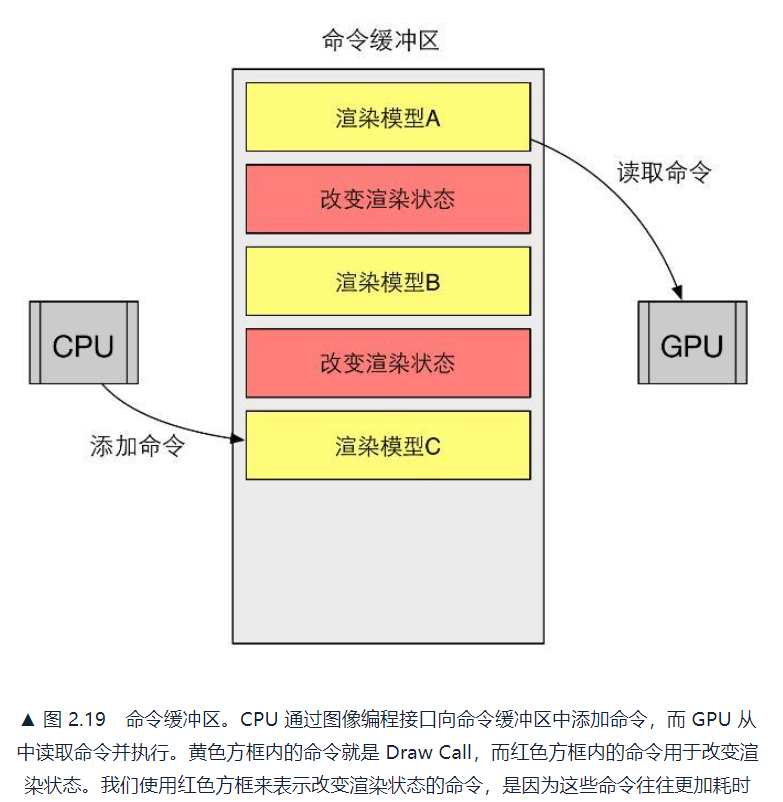

> 问题二：为什么DrawCall多了会影响帧率？

> GPU渲染能力很强，速度往往快于CPU提交命令的速度。如果DrawCall的数量太多，CPU会耗费大量时间造成过载。

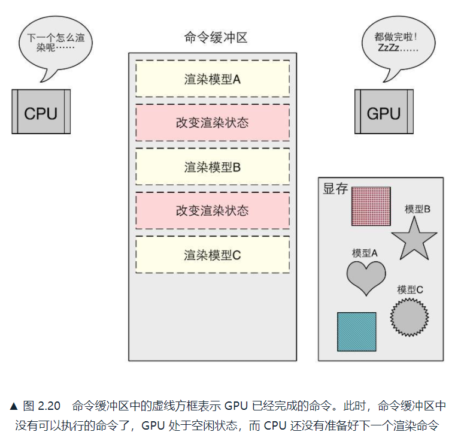

> 问题三：如何减少DrawCall？

> 这里讨论批处理方法（Batching）。把很多小的DrawCall合并成一个大的DrawCall，更适合合并静态的物体，因为只需合并一次。

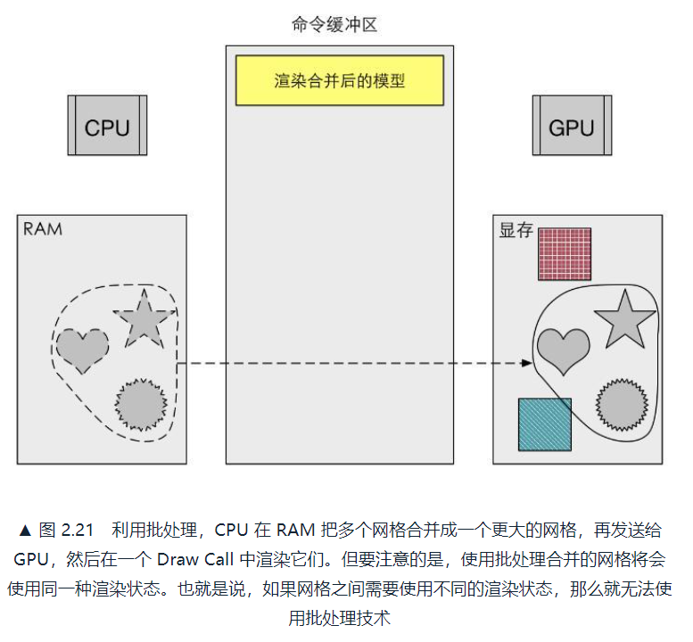

为了减少DrawCall的开销，需要注意：
1. 避免使用大量很小的网格，合并小网格
2. 避免使用过多的材质，尽量在不同网格之间共用同一个材质

### 2.4.4. 什么是固定管线渲染
固定函数的流水线（Fixed-Function Pipeline），简称为固定管线，只给开发者一些配置操作。随着时代的发展，可编程渲染管线应运而生，如顶点着色器、片元着色器。

## 2.5. 那么，你明白什么是Shader了吗
Shader所在阶段，就是渲染流水线的一部分：
* GPU流水线上一些可高度编程的阶段，由着色器编译出来的最终代码会在GPU上运行
* 有一些特定类型的着色器，如顶点着色器、片元着色器
* 依靠着色器我们可以控制流水线中的渲染细节

## 2.6. 扩展阅读
1. 实时渲染：Tomas Akenine-Möller / Eric Haines / Naty Hoffman 《Real-Time Rendering》
2. 批处理：M Wloka 《Batch, Batch, Batch: What does it really mean?》