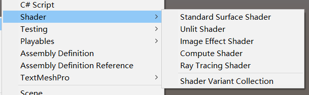
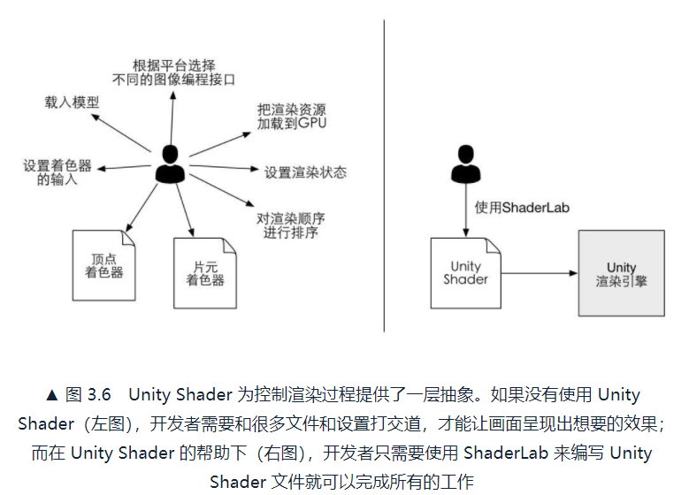
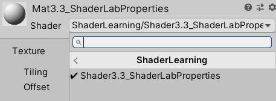
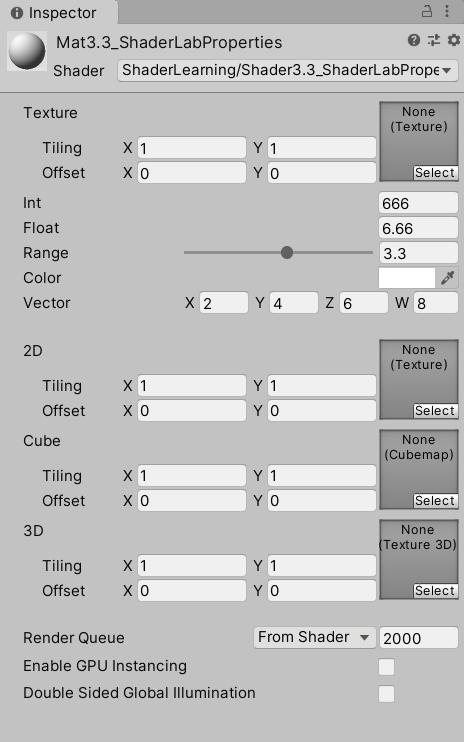

从本章开始，使用Unity2019.4.18f1c1实现UnityShader。作者使用的版本较老，是Unity5，会有一些区别。

# 3. UnityShader基础
Shader就是渲染流水线中某些特定阶段，如顶点着色器阶段、片元着色器阶段等。

如果没有Unity，对某个模型设置渲染的伪码：
```
// 初始化渲染设置
void Initialization(){
    // 从硬盘上加载顶点着色器的代码
    string vertexShaderCode=LoadShaderFromFile(VertexShader.shader);
    // 从硬盘上加载片元着色器的代码
    string fragmentShaderCode=LoadShaderFromFile(FragmentShader.shader);
    // 把顶点着色器加载到GPU中
    LoadVertexShaderFromString(vertexShaderCode);
    // 把片元着色器加载到GPU中
    LoadFragmentShaderFromString(fragmentShaderCode);

    // 设置名为[vertexPosition]的属性的输入，即模型顶点坐标
    SetVertexShaderProperty([vertexPosition],vertices);
    // 设置名为[MainTex]的属性的输入，someTexture是某张已加载的纹理
    SetVertexShaderProperty([MainTex],someTexture);
    // 设置名为[MVP]的属性的输入，MVP是之前由开发者计算好的变换矩阵
    SetVertexShaderProperty([MVP],MVP);

    // 关闭混合
    Disable(Blend);
    // 设置深度测试
    Enable(ZTest);
    SetZTestFunction(LessOrEqual);

    // 其他设置
    ...
}

// 每一帧进行渲染
void OnRendering(){
    // 调用渲染命令
    DrawCall();
    // 当涉及多种渲染设置时，我们可能还需要在这里改变各种渲染设置
    ...
}
```

VertexShader.shader：
```
// 输入：顶点位置、纹理、MVP变换矩阵
in float3 vertexPosition
in sampler2D MainTex;
in Matrix4x4 MVP;

// 输出：顶点经过MVP变换后的位置
out float4 position;

void main(){
    // 使用MVP对模型顶点左边进行变换
    position=MVP*vertexPosition;
}
```

FragmentShader.shader：
```
// 输入：VertexShader输出的position，经过光栅化程序插值后的该片元对应的position
in float4 position;

// 输出：该片元的颜色值
out float4 fragColor;

void main(){
    // 将片元颜色设为白色
    fragColor=float4(1.0,1.0,1.0,1.0);
}
```

## 3.1 UnityShader概述
### 3.1.1 一对好兄弟

Unity中常见的一个流程：
1. 创建一个材质
2. 创建一个UnityShader，赋给上一步的材质
3. 把材质赋给要渲染的对象
4. 在材质面板中调整UnityShader的属性

可见UnityShader定义了渲染所需的各种代码(VertexShader/FragmentShader)、属性(例如纹理)、指令（渲染和标签设置）。材质上调节这些属性。

### 3.1.2 Unity中的材质
创建材质，默认是使用Standard着色器，这是一种基于物理渲染的着色器。

### 3.1.3 Unity中的Shader
创建UnityShader，有4种UnityShader模板（Unity2019.4有5种模板，新增了光追着色器RayTracingShader）
* Standard Surface Shader：包含了标准光照模型的表面着色器模板
* Unlit Shader：不包含光照（但包含雾效）的基本的顶点/片元着色器
* Image Effect Shader：屏幕后处理效果的模板
* Compute Shader：特殊的Shader文件，利用GPU的并行性来进行一些与常规渲染流水线无关的计算



## 3.2 UnityShader的基础：ShaderLab
编写UnityShader的语言叫ShaderLab。



ShaderLab类似于CgFX和Direct3DEffects(.FX)语言，它们都定义了要显示一个材质所需的所有东西，而不仅仅是着色器代码。

```
Shader [ShaderName]{
    Properties{
        // 属性
    }
    SubShader{
        // 显卡A使用的子着色器
    }
    SubShader{
        // 显卡B使用的子着色器
    }
    Fallback [VertexLit]
}
```

## 3.3 UnityShader的结构
### 3.3.1 给我们的Shader起个名字
```
Shader "ShaderLearning/Shader3.3_ShaderLabProperties"{}
```

这个UnityShader的在材质面板中的位置就是 Shader->ShaderLearning->Shader3.3_ShaderLabProperties



### 3.3.2 材质和UnityShader的桥梁：Properties
```
Properties{
    Name([display name],PropertyType)=DefaultValue
    Name([display name],PropertyType)=DefaultValue
    // 更多属性
}
```


2D、Cube、3D后面的花括号是历史原因。下面的代码展示所有属性类型：
```
// Shader3.3_ShaderLabProperties
Shader "ShaderLearning/Shader3.3_ShaderLabProperties"
{
    Properties
    {
        _MainTex ("Texture", 2D) = "white" {}
        
        // Numbers and Sliders
        _Int("Int",Int)=666
        _Float("Float",Float)=6.66
        _Range("Range",Range(0.0,6.0))=3.3
        _Color("Color",Color)=(0,0,0,0)
        _Vector("Vector",Vector)=(2,4,6,8)
        
        // Textures
        _2D("2D",2D)=""{}
        _Cube("Cube",Cube)="blue"{}
        _3D("3D",3D)="red"{}
    }
    
    FallBack "Diffuse"
}
```

上述代码在材质面板中的显示结果如下图：



### 3.3.3 重量级成员：SubShader
每个UnityShader文件可以包含多个SubShader语义块，但最少要有一个。如果所有SubShader在目标平台都不支持，Unity就会使用Fallback指定的UnityShader。

SubShader语义块中包含的定义通常如下：
```
SubShader{
    // 可选的
    [Tags]

    // 可选的
    [RenderSetup]

    Pass{
    }
    // Other Passes
}
```

#### 3.3.3.1 状态设置
设置渲染状态
* Cull：Cull Back/Front/Off（设置剔除模式：剔除背面/正面/关闭）
* ZTest：ZTest Less Greater/LEqual/GEqual/Equal/NotEqual/Always（设置深度测试时使用的函数）
* ZWrite：ZWrite On/Off（开启/关闭深度写入）
* Blend：Blend SrcFactor DstFactor（开启并设置混合模式）

#### 3.3.3.2 SubShader的标签
字符串键值对，告诉引擎希望怎样以及何时渲染这个对象。
```
Tags{"TagName1"="Value1" "TagName2"="Value2"}
```

SubShader支持的标签类型：
* Queue：Tags{"Queue"="Transparent"}，控制渲染顺序，例如保证所有透明物体在不透明物体后渲染
* RenderType：Tags{"RenderType"="Opaque"}，对着色器分类，例如透明不透明
* DisableBatching：Tags{"DisableBatching"="True"}，是否使用批处理
* ForceNoShadowCasting：Tags{"ForceNoShadowCasting"="True"}，是否投射阴影
* IgnoreProjector：Tags{"IgnoreProjector"="True"}，通常用于半透明物体，是否不受Projector影响
* CanUseSpriteAtlas：Tags{"CanUseSpriteAtlas"="False"}，是否用于精灵
* PreviewType：Tags{"PreviewType"="Plane"}，指定材质面板如何预览该材质，默认是球

#### 3.3.3.3 Pass语义块
```
Pass{
    [Name]
    [Tags]
    [RenderSetup]
    // Other code
}
```

命名
```
Name "MyPassName"
```

用UsePass来使用这个Pass，名字要变大写
```
UsePass "MyShader/MYPASSNAME"
```

Pass可以设置标签，不同于SubShader的标签:
* LightMode：Tags{"LightMode"="ForwardBase"}，定义该Pass在Unity的渲染流水线中的角色
* RequireOptions：Tags{"RequireOptions"= "SoftVegetation"}，用于指定当满足某种条件时才渲染该Pass，它的值是一个由空格分隔的字符串

#### 3.3.3.4 UsePass和GrabPass
* UsePass：使用该命令来复用其他UnityShader中的Pass
* GrabPass：该Pass负责抓取屏幕并将结果储存在一张纹理中，以用于后续的Pass处理

### 3.3.4 留一条后路：Fallback
紧跟在各个SubShader语义块后面，它告诉Unity：如果上面所有SubShader在这块显卡上都不能运行，那么就使用这个最低级的Shader吧。它的语义如下：
```
Fallback [name]
// 或者 Fallback Off
```

### 3.3.5 ShaderLab还有其他的语义吗
有，但可能不常用。

## 3.4 UnityShader的形式
可以用下面3中形式来编写UnityShader，不管哪种形式，真正意义上的Shader代码都需要包含在ShaderLab语义块中：
```
Shader [MyShader]{
    Properties{
        // 所需的各种属性
    }
    SubShader{
        // 真正意义上的Shader代码会出现在这里
        // 表面着色器（Surface Shader）或者
        // 顶点/片元着色器（Vertex/Fragment Shader）或者
        // 固定函数着色器（Fixed Function Shader）
    }
    SubShader{
        // 和上一个SubShader类似
    }
}
```

### 3.4.1 Unity的宠儿：表面着色器
表面着色器（Surface Shader）是Unity自己创造，本质和顶点/片元着色器一样，但Unity做了很多东西如处理光照细节。是Unity对顶点/片元着色器的更高一层的抽象。
```
Shader "Custom/Simple Surface Shader"
{
    SubShader{
        Tags{"RenderType"="Opaque"}
        CGPROGRAM
        #pragma surface surf Lambert

        // 具体代码

        ENDCG
    }
    Fallback "Diffuse"
}
```

不写在Pass

### 3.4.2 最聪明的孩子：顶点/片元着色器
使用Cg/HLSL来编写顶点/片元着色器(Vertex/Fragment Shader)，复杂但灵活性强。
```
Shader "Custom/Simple VertexFragment Shader"{
    SubShader{
        Pass{
            CGPROGRAM
            #pragma vertex vert
            #pragma fragment frag

            // 具体代码

            ENDCG
        }
    }
}
```

写在Pass

### 3.4.3 被抛弃的角落：固定函数着色器
对旧设备使用固定函数着色器（Fixed Function Shader），玩玩只能完成很简单的效果。
```
Shader "Tutorial/Basic"{
    Properties{
        _Color{"Main Color",Color}={1,0.5,0.5,1}
    }
    SubShader{
        Pass{
            Material{
                Diffuse [_Color]
            }
            Lighting On
        }
    }
}
```

写在Pass，不使用Cg/HLSL，实际上会被编译为对应的顶点/片元着色器。

### 3.4.4 选择哪种UnityShader形式
* 除非你有明确是需求使用固定函数着色器，否则请用另外的
* 如果你想和各种光源打交道，用表面着色器，小心在移动平台的性能
* 如果你的光照很少，用顶点/片元着色器
* 自定义渲染效果，用顶点/片元着色器

## 3.5 本书使用的UnityShader形式
着重使用顶点/片元着色器

## 3.6 答疑解惑
### 3.6.1 UnityShader!=真正的Shader
在UnityShader（ShaderLab文件），我们可以做的事情 远多于一个传统意义的Shader：
* 传统Shader，仅可编写特定类型的Shader。在UnityShader，可以在同一个文件里包含顶点着色器和片元着色器代码
* 传统Shader，无法设置渲染设置，如是否开启混合、深度测试
* 传统Shader，要编写冗长的代码设置输入输出。UnityShader只需声明属性，用材质来修改属性

缺点是可以编写的Shader类型和语法被限制了，如曲面细分着色器、几何着色器。

### 3.6.2 UnityShader和Cg/HLSL之间的关系
Cg的代码片段通常位于Pass语义块内部，表面着色器的位于SubShader内部。本质上UnityShader只存在顶点/片元着色器。

### 3.6.3 我可以使用GLSL来写吗
当然可以，但可以发布的目标平台变少了。

## 3.7 扩展阅读
1. 官方文档：https://docs.unity3d.com/Manual/SL-Reference.html
2. Unity提供的简单的着色器教程：https://docs.unity3d.com/Manual/ShaderTut1.html
3. NVIDIA的Cg文档
4. NVIDIA的Cg教程：https://developer.download.nvidia.cn/CgTutorial/cg_tutorial_chapter01.html