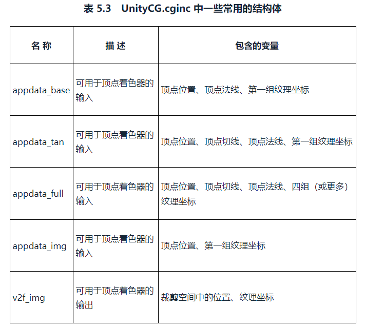
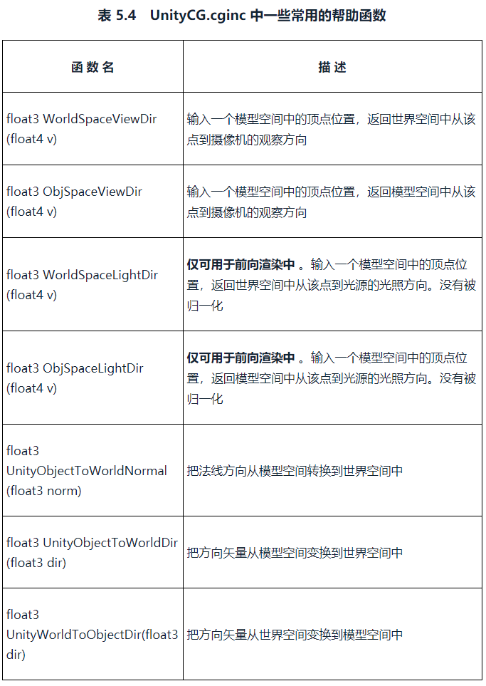

# 第2篇 初级篇
从最简单的Shader开始，讲解Shader中基础的光照模型、纹理和透明效果等初级渲染效果。

* 第5章 开始UnityShader学习之旅
* 第6章 Unity中的基础关照
* 第7章 基础纹理
* 第8章 透明效果

# 5. 开始UnityShader学习之旅
## 5.1 本书使用的软件和环境
本书使用的环境是Unity5.2.1免费版，Mac Os X 10.9.5。我使用的环境是Unity2019.4.18f1c1，Win10。

## 5.2 一个最简单的顶点/片元着色器
### 5.2.1 顶点/片元着色器的基本结构
包含了Shader/Properties/SubShader/Fallback，最重要的是Pass语义块。结构如下：

```
Shader [MyShaderName]{
  Properties{
    // 属性
  }
  SubShader{
    // 针对显卡A的SubShader
    Pass{
      // 设置渲染状态和标签

      // 开始Cg代码片段
      CGPROGRAM
      // 该代码片段的编译指令，例如：
      #pragma vertex vert
      #pragma fragment frag

      // Cg代码写在这里
      
      ENGCG

      // 其他设置
    }
    // 其他需要的Pass
  }
  SubShader{
    // 针对显卡B的SubShader
  }

  // 上述SubShader都失败后用于回调的UnityShader
  Fallback [VertexLit]
}
```

下面步骤创建一个最简单的顶点/片元着色器：

1. 新建场景，去掉天空盒
2. 新建UnityShader
3. 新建材质，使用2的UnityShader
4. 新建球体，使用3的材质
5. 修改UnityShader内容

书中内容：

```
Shader "ShaderLearning/Shader5.2_SimpleShader"{
    SubShader{
        Pass{
            CGPROGRAM
            #pragma vertex vert
            #pragma fragment frag

            float4 vert(float4 v:POSITION):SV_POSITION{
                return UnityObjectToClipPos(v);
            }

            fixed4 frag():SV_TARGET{
                return fixed4(1.0,1.0,1.0,1.0);
            }

            ENDCG
        }
    }
}
```

*保存这段代码后，编辑器警告说行尾不一致。再看这个UnityShdaer，Unity自动在开头的地方加了备注，说已经更新了，把mul(UNITY_MATRIX_MVP,*)换成了UnityObjectToClipPos(*)。*


*用Notepad查看这段代码，自动加的备注的行尾是LF，而我在Win10上通常的行尾是CR LF。这就是这个警告的原因。在Win10上，直接再次保存这个文件，行尾就会替换成CR LF，消除此告警。例如我使用的文本编辑器是VS Code，直接保存就会更换行尾。*


*更新后的代码如下*

```
// Upgrade NOTE: replaced 'mul(UNITY_MATRIX_MVP,*)' with 'UnityObjectToClipPos(*)'

Shader "ShaderLearning/Shader5.2_SimpleShader"{
    SubShader{
        Pass{
            CGPROGRAM
            #pragma vertex vert
            #pragma fragment frag

            float4 vert(float4 v:POSITION):SV_POSITION{
                //return mul(UNITY_MATRIX_MVP,v);
                return UnityObjectToClipPos(v);
            }

            fixed4 frag():SV_TARGET{
                return fixed4(1.0,1.0,1.0,1.0);
            }

            ENDCG
        }
    }
}
```

*那么这里到底更新了什么呢？根据第4节学习到的知识，UNITY_MATRIX_MVP表示当前的模型观察投影矩阵，用于将顶点/方向矢量从模型空间->裁剪空间，旧的写法是将变换矩阵和向量相乘来进行变换。查资料得知，在Unity5.6以后，UNITY_MATRIX_MVP被UnityObjectToClipPos()替代。相应的UNITY_MATRIX_VP、UNITY_MATRIX_P都有对应的封装方法，UnityWorldToClipPos、UnityViewToClipPos。（这个是由于内建矩阵可能会引入一个额外的矩阵乘法晕眩，使用封装方法，可以把这个额外的矩阵乘法优化为向量-矩阵乘法）*

回到正题，得到的结果如下图：


由CGPROGRAM和ENDCG包围的CG代码片段中，先是两条编译指令，告诉Unity哪个函数包含了顶点着色器或片元着色器的代码：

```
# pragma vertex name
# pragma fragment name
```

vert函数。POSITION告诉Unity，把模型的顶点坐标填充到输入参数v中，SV_POSITION告诉Unity，顶点着色器的输出是裁剪空间中的顶点坐标。返回值float4，是该顶点在裁剪空间中的位置

```
float4 vert(float4 v:POSITION):SV_POSITION{
    //return mul(UNITY_MATRIX_MVP,v);
    return UnityObjectToClipPos(v);
    }
```

frag函数。没有输出，输出是SV_Target，表示将用户的输出颜色存储到一个渲染目标（render target）中。返回值是fixed4的白色。

```
fixed4 frag():SV_TARGET{
    return fixed4(1.0,1.0,1.0,1.0);
}
```

### 5.2.2 模型数据从哪里来
为顶点着色器顶一个结构体，作为输入：

```
// Upgrade NOTE: replaced 'mul(UNITY_MATRIX_MVP,*)' with 'UnityObjectToClipPos(*)'

Shader "ShaderLearning/Shader5.2_SimpleShader"{
    SubShader{
        Pass{
            CGPROGRAM
            #pragma vertex vert
            #pragma fragment frag

            // 使用一个结构体来定义顶点着色器的输入
            struct a2v{
                // POSITION语义告诉Unity，用模型空间的顶点坐标填充vertex变量
                float4 vertex:POSITION;
                // NORMAL语义告诉Unity，用模型空间的法线方向填充normal变量
                float3 normal:NORMAL;
                // TEXCOORD0语义告诉Unity，用模型的第一套纹理坐标填充texcoord变量
                float4 texcoord:TEXCOORD0;
            };

            float4 vert(a2v v):SV_POSITION{
                //return mul(UNITY_MATRIX_MVP,v);
                // return UnityObjectToClipPos(v);

                // 使用v.vertex来访问模型空间的顶点坐标
                return UnityObjectToClipPos(v.vertex);
            }

            fixed4 frag():SV_TARGET{
                return fixed4(1.0,1.0,1.0,1.0);
            }

            ENDCG
        }
    }
}
```

Unity支持的语义还有 POSITION TANGENT NORMAL TEXCOORD0 TEXCOORD1 TEXCOORD2 TEXCOORD3 COLOR 等。a2v表示把数据从应用阶段（application）传递到顶点着色器中（vertex shader）。

填充到POSITION等语义中的数据，是MeshRender组件提供的。在每帧DrawCall的时候，MeshRender会把它负责渲染的模型数据发送给UnityShader。

### 5.2.3 顶点着色器和片元着色器之间如何通信
如把模型的法线、纹理坐标等传递给片元着色器，这需要再定义一个行的结构体：

```
// Upgrade NOTE: replaced 'mul(UNITY_MATRIX_MVP,*)' with 'UnityObjectToClipPos(*)'

Shader "ShaderLearning/Shader5.2_SimpleShader"{
    SubShader{
        Pass{
            CGPROGRAM

            #pragma vertex vert
            #pragma fragment frag

            // 使用一个结构体来定义顶点着色器的输入
            struct a2v{
                // POSITION语义告诉Unity，用模型空间的顶点坐标填充vertex变量
                float4 vertex:POSITION;
                // NORMAL语义告诉Unity，用模型空间的法线方向填充normal变量
                float3 normal:NORMAL;
                // TEXCOORD0语义告诉Unity，用模型的第一套纹理坐标填充texcoord变量
                float4 texcoord:TEXCOORD0;
            };

            struct v2f{
                // SV_POSITION语义告诉Unity，Pos里包含了顶点在裁剪空间中的位置信息
                float4 pos:SV_POSITION;
                // COLOR0语义可以用于存储颜色信息
                fixed3 color:COLOR0;
            };

            v2f vert(a2v v):SV_POSITION{
                // return mul(UNITY_MATRIX_MVP,v);
                // return UnityObjectToClipPos(v);

                // 使用v.vertex来访问模型空间的顶点坐标
                // return UnityObjectToClipPos(v.vertex);

                // 声明输出结构
                v2f o;
                o.pos=UnityObjectToClipPos(v.vertex);
                // v.normal包含了顶点的法线方向，其分量范围在[-1.0,1.0]
                // 下面的代码把分量范围映射到了[0.0,1.0]
                // 存储到o.color中传递给片元着色器
                o.color=v.normal*0.5+fixed3(0.5,0.5,0.5);
                // o.color=fixed3(0.5,0.5,0.5);
                return o;
            }

            fixed4 frag(v2f i):SV_TARGET{
                // return fixed4(1.0,1.0,1.0,1.0);

                // 将插值后的i.colol显示在屏幕上
                return fixed4(i.color,1.0);
            }

            ENDCG
        }
    }
}
```

这里声明了一个行的结构体v2f，用于在顶点...和片元...之间传递信息。

*可以发现，上面的代码中，vert函数的返回值类型从float4变成了v2f，使用新定义的结构体。但是！上述代码在Unity2019是有问题的，会报错如下，大意是SV_POSITION是错误的输出语义：*


*查资料得知，因为版本问题，这里的:SV_POSITION需要删除，顶点着色器部分的代码片段变成下面的形式：*

```
// 可能是版本问题，去掉了:SV_POSITION才能成功运行
// v2f vert(a2v v):SV_POSITION{
v2f vert(a2v v){
    // return mul(UNITY_MATRIX_MVP,v);
    // return UnityObjectToClipPos(v);

    // 使用v.vertex来访问模型空间的顶点坐标
    // return UnityObjectToClipPos(v.vertex);

    // 声明输出结构
    v2f o;
    o.pos=UnityObjectToClipPos(v.vertex);
    // v.normal包含了顶点的法线方向，其分量范围在[-1.0,1.0]
    // 下面的代码把分量范围映射到了[0.0,1.0]
    // 存储到o.color中传递给片元着色器
    o.color=v.normal*0.5+fixed3(0.5,0.5,0.5);
    // o.color=fixed3(0.5,0.5,0.5);
    return o;
}
```

*这时的运行结果如下，顶点位置的颜色根据法线方向而发生变化。*


*呈现这种颜色变化的原因是什么呢？根据Unity中的坐标轴方向：x向右，越往右红色R越大；Y向上，越往上绿色G越大；Z向前，越往前蓝色B越大。在Scene视口中观察，颜色变化确实满足这一解释。*


*既然顶点着色器返回值语义去掉了，那么片元着色器可不可以也去掉返回值语义，变成如下形式呢？*

```
fixed4 frag(v2f i){
    // return fixed4(1.0,1.0,1.0,1.0);

    // 将插值后的i.colol显示在屏幕上
    return fixed4(i.color,1.0);
}
```

*不行，报错了，函数返回值缺失语义：*


### 5.2.4 如何使用属性
在材质面板显示一个颜色拾取器，直接控制模型在屏幕上显示的颜色：

```
// Upgrade NOTE: replaced 'mul(UNITY_MATRIX_MVP,*)' with 'UnityObjectToClipPos(*)'

Shader "ShaderLearning/Shader5.2_SimpleShader"{
    Properties{
        // 声明一个Color类型的属性
        _Color ("Color Tint",Color)=(1.0,1.0,1.0,1.0)
    }
    SubShader{
        Pass{
            CGPROGRAM

            #pragma vertex vert
            #pragma fragment frag

            // 在Cg代码中，我们需要定义一个与属性名称和类型都匹配的变量
            fixed4 _Color;

            // 使用一个结构体来定义顶点着色器的输入
            struct a2v{
                // POSITION语义告诉Unity，用模型空间的顶点坐标填充vertex变量
                float4 vertex:POSITION;
                // NORMAL语义告诉Unity，用模型空间的法线方向填充normal变量
                float3 normal:NORMAL;
                // TEXCOORD0语义告诉Unity，用模型的第一套纹理坐标填充texcoord变量
                float4 texcoord:TEXCOORD0;
            };

            struct v2f{
                // SV_POSITION语义告诉Unity，Pos里包含了顶点在裁剪空间中的位置信息
                float4 pos:SV_POSITION;
                // COLOR0语义可以用于存储颜色信息
                fixed3 color:COLOR0;
            };

            // 可能是版本问题，去掉了:SV_POSITION才能成功运行
            // v2f vert(a2v v):SV_POSITION{
            v2f vert(a2v v){
                // return mul(UNITY_MATRIX_MVP,v);
                // return UnityObjectToClipPos(v);

                // 使用v.vertex来访问模型空间的顶点坐标
                // return UnityObjectToClipPos(v.vertex);

                // 声明输出结构
                v2f o;
                o.pos=UnityObjectToClipPos(v.vertex);
                // v.normal包含了顶点的法线方向，其分量范围在[-1.0,1.0]
                // 下面的代码把分量范围映射到了[0.0,1.0]
                // 存储到o.color中传递给片元着色器
                o.color=v.normal*0.5+fixed3(0.5,0.5,0.5);
                // o.color=fixed3(0.5,0.5,0.5);
                return o;
            }

            fixed4 frag(v2f i):SV_TARGET{
                // return fixed4(1.0,1.0,1.0,1.0)

                // 将插值后的i.colol显示在屏幕上
                // return fixed4(i.color,1.0);

                fixed3 c=i.color;
                // 使用_Color属性来控制输出颜色
                c*=_Color.rgb;
                return fixed4(c,1.0);
            }

            ENDCG
        }
    }
}
```

以上代码中，在属性中声明了Color类型的_Color，还在Cg代码片段中定义了和名称和类型一样的_Color，就可以在Cg代码中访问它了。运行结果如下：


在UnityShader中，Cg代码的关键词uniform可以省略。ShaderLab属性的类型和Cg中变量的类型对应如下表：


## 5.3 强大的援手：Unity提供的内置文件和变量
为了方便开发者的编码过程，Unity提供了很多内置文件，包含了很多提前定义的函数、变量和宏。

### 5.3.1 内置的包含文件
包含文件（include file），是类似与C++头文件的文件，在Unity中后缀是.cginc。可以这么包含进来：

```
CGPROGAM
//...
#include "UnityCG.cginc"
//...
ENDCG
```

这些文件的下载和说明：
1. 从官网上下载（需要选择对应版本的内置着色器BuiltInShaders）
2. CGIncludes：内置包含文件
3. DefaultResources：内置组件或功能所需要的UnithShader，如GUI元素使用的
4. DefaultResourcesExtra：所有Unity中内置的UnityShader
5. Editor：定义Unity5引入的StandardShader所用的材质面板
6. 也可以从Unity安装路径找到：Unity的安装路径/Data/CGIncludes


主要的包含文件和用处：


UnityCG.cginc最常用，例如可以直接使用里面预定义的结构体作为顶点着色器的输入和输出：



*这些预定义结构体在UnityCG.cginc的定义如下：*

```
struct appdata_base {
    float4 vertex : POSITION;
    float3 normal : NORMAL;
    float4 texcoord : TEXCOORD0;
    UNITY_VERTEX_INPUT_INSTANCE_ID
};

struct appdata_tan {
    float4 vertex : POSITION;
    float4 tangent : TANGENT;
    float3 normal : NORMAL;
    float4 texcoord : TEXCOORD0;
    UNITY_VERTEX_INPUT_INSTANCE_ID
};

struct appdata_full {
    float4 vertex : POSITION;
    float4 tangent : TANGENT;
    float3 normal : NORMAL;
    float4 texcoord : TEXCOORD0;
    float4 texcoord1 : TEXCOORD1;
    float4 texcoord2 : TEXCOORD2;
    float4 texcoord3 : TEXCOORD3;
    fixed4 color : COLOR;
    UNITY_VERTEX_INPUT_INSTANCE_ID
};

struct appdata_img
{
    float4 vertex : POSITION;
    half2 texcoord : TEXCOORD0;
    UNITY_VERTEX_INPUT_INSTANCE_ID
};

struct v2f_img
{
    float4 pos : SV_POSITION;
    half2 uv : TEXCOORD0;
    UNITY_VERTEX_INPUT_INSTANCE_ID
    UNITY_VERTEX_OUTPUT_STEREO
};
```

UnityCG.cginc提供了一些常用的帮助函数：



*这些函数在UnityCG.cginc的实现如下，有些函数有更新的替代实现，大概是在函数名前面再加上Unity：*

```
// Computes world space view direction, from object space position
inline float3 UnityWorldSpaceViewDir( in float3 worldPos )
{
    return _WorldSpaceCameraPos.xyz - worldPos;
}

// Computes world space view direction, from object space position
// *Legacy* Please use UnityWorldSpaceViewDir instead
inline float3 WorldSpaceViewDir( in float4 localPos )
{
    float3 worldPos = mul(unity_ObjectToWorld, localPos).xyz;
    return UnityWorldSpaceViewDir(worldPos);
}

// Computes object space view direction
inline float3 ObjSpaceViewDir( in float4 v )
{
    float3 objSpaceCameraPos = mul(unity_WorldToObject, float4(_WorldSpaceCameraPos.xyz, 1)).xyz;
    return objSpaceCameraPos - v.xyz;
}

// Computes world space light direction, from world space position
inline float3 UnityWorldSpaceLightDir( in float3 worldPos )
{
    #ifndef USING_LIGHT_MULTI_COMPILE
        return _WorldSpaceLightPos0.xyz - worldPos * _WorldSpaceLightPos0.w;
    #else
        #ifndef USING_DIRECTIONAL_LIGHT
        return _WorldSpaceLightPos0.xyz - worldPos;
        #else
        return _WorldSpaceLightPos0.xyz;
        #endif
    #endif
}

// Computes world space light direction, from object space position
// *Legacy* Please use UnityWorldSpaceLightDir instead
inline float3 WorldSpaceLightDir( in float4 localPos )
{
    float3 worldPos = mul(unity_ObjectToWorld, localPos).xyz;
    return UnityWorldSpaceLightDir(worldPos);
}

// Computes object space light direction
inline float3 ObjSpaceLightDir( in float4 v )
{
    float3 objSpaceLightPos = mul(unity_WorldToObject, _WorldSpaceLightPos0).xyz;
    #ifndef USING_LIGHT_MULTI_COMPILE
        return objSpaceLightPos.xyz - v.xyz * _WorldSpaceLightPos0.w;
    #else
        #ifndef USING_DIRECTIONAL_LIGHT
        return objSpaceLightPos.xyz - v.xyz;
        #else
        return objSpaceLightPos.xyz;
        #endif
    #endif
}

// Transforms normal from object to world space
inline float3 UnityObjectToWorldNormal( in float3 norm )
{
#ifdef UNITY_ASSUME_UNIFORM_SCALING
    return UnityObjectToWorldDir(norm);
#else
    // mul(IT_M, norm) => mul(norm, I_M) => {dot(norm, I_M.col0), dot(norm, I_M.col1), dot(norm, I_M.col2)}
    return normalize(mul(norm, (float3x3)unity_WorldToObject));
#endif
}

// Transforms direction from object to world space
inline float3 UnityObjectToWorldDir( in float3 dir )
{
    return normalize(mul((float3x3)unity_ObjectToWorld, dir));
}

// Transforms direction from world to object space
inline float3 UnityWorldToObjectDir( in float3 dir )
{
    return normalize(mul((float3x3)unity_WorldToObject, dir));
}
```

### 5.3.2 内置的变量
与访问时间、光照、雾效和环境光有关的变量，在这些文件中：

* Variables.cginc
* Lighting.cginc
* AutoLight.cginc

## 5.4 Unity提供的Cg/HLSL语义
在顶点/片元着色器的输入输出变量后，一个冒号加全部大写的名称。

### 5.4.1 什么是语义
语义（semantics），让Shader知道从哪里读取数据，并把数据输出到哪里。Unity并没有支持所有的语义。

在DX10以后，有了系统数值语义（system-value semantics），以SV开头，这些语义描述的变量是不可以随便赋值的。虽然有时能省略，但为了让我们的Shader有更好的跨平台性，对于这些有特殊含义的变量我们最好使用以SV开头的语义进行修饰。

### 5.4.2 Unity支持的语义
从应用阶段传递模型数据给顶点着色器时Unity常用语义，a2v：


从顶点着色器到片元着色器阶段Unity常用语义，v2f：


Unity中片元着色器的输出语义：


### 5.4.3 如何定义复杂的变量类型
使用语义来修饰不同类型变量的例子：

```
struct v2f{
  float4 pos:SV_POSITION;
  fixed3 color0:COLOR0;
  fixed4 color1:COLOR1;
  half value0:TEXCOORD0;
  float2 value1:TEXCOORD1;
}
```

*CG支持7种数据类型：*

* float：32位浮点数
* half：16位浮点数
* int：32位整型数
* fixed：12位定点数
* bool：布尔
* sampler：纹理对象的句柄
* string：字符串
* 额外的矩阵 float2x4 matrix

*类型使用技巧（雾）：*

* 精度够用就好
* 颜色和单位向量，使用fixed
* 其他情况，尽量使用half（即范围在[-6w,6w]，精确的小数点3.3位），否则才使用float

## 5.5 程序员的烦恼：Debug
Shader调试难，输出都不行。本节主要介绍了两种方法。

### 5.5.1 使用假彩色图像
假彩色图像（false-color image），指用假彩色技术生成的一种图像，相对的是真彩色图像（true-color image）。

把需要调试的变量映射到[0,1]，作为颜色输出到屏幕上，通过屏幕上显示的像素颜色来判断这个值是否正确。

下面使用假彩色图像的方法来可视化一些模型数据，如法线、切线、纹理坐标、顶点颜色，以及它们之间的运算结果等：

```
Shader "ShaderLearning/Shader5.5_FalseColor"{
    SubShader{
        Pass{
            CGPROGRAM

            #pragma vertex vert
            #pragma fragment frag

            # include "UnityCG.cginc"

            struct v2f{
                float4 pos:SV_POSITION;
                fixed4 color:COLOR0;
            };

            v2f vert(appdata_full v){
                v2f o;
                o.pos=UnityObjectToClipPos(v.vertex);

                // 可视化法线方向
                o.color=fixed4(v.normal*0.5+fixed3(0.5,0.5,0.5),1.0);

                // 可视化切线方向
                o.color=fixed4(v.tangent.xyz*0.5+fixed3(0.5,0.5,0.5),1.0);

                // 可视化副切线方向
                fixed3 binormal=cross(v.normal,v.tangent.xyz)*v.tangent.w;
                o.color=fixed4(binormal*0.5+fixed3(0.5,0.5,0.5),1.0);

                // 可视化第一组纹理坐标
                o.color=fixed4(v.texcoord.xy,0.0,1.0);

                // 可视化第二组纹理坐标
                o.color=fixed4(v.texcoord1.xy,0.0,1.0);

                // 可视化第一组纹理坐标的小数部分
                o.color=frac(v.texcoord);
                if(any(saturate(v.texcoord)-v.texcoord))
                {
                    o.color.b=0.5;
                }
                o.color.a=1.0;

                // 可视化第二组纹理坐标的小数部分
                o.color=frac(v.texcoord1);
                if(any(saturate(v.texcoord1)-v.texcoord1)){
                    o.color.b=0.5;
                }
                o.color.a=1.0;

                // 可视化顶点颜色
                // o.color=v.color;

                return o;
            }

            fixed4 frag(v2f i):SV_Target{
                return i.color;
            }

            ENDCG
        }
    }
}
```

使用作者提供的Scripts/Chapter5/ColorPicker.cs，拖到相机上，可以在运行后，鼠标单击屏幕得到该点的颜色值。


*以下是我运行的结果们，和作者的结果有区别：*


*法线方向，在Game窗口小球Z负方向的一面正对相机，z值对应蓝色蓝色B值越靠近屏幕越小，x从右往左越来越大对应红色R增加，y从下往上越来越大对应绿色G增加。切线方向，整体都是红色，说明切线大都的朝右的。副切线...是什么，看代码中的计算，先将法线和切线叉乘，再乘了切线的w分量。纹理坐标看起来第一套和第二套是有区别的，第一套整个球体是连续的，第二套切成了几个小方格。纹理坐标小数部分不清楚怎么算的，但和纹理坐标的颜色看起来很相似。顶点颜色我的结果是全白...*

### 5.5.2 利用神器：VisualStudio
Graphics Debugger，查看每个像素的最终颜色、位置等信息，还可以对顶点着色器和片元着色器进行单步调试。

### 5.5.3 最新利器：帧调试器
Frame Debugger。打开方式：Window->Analysis->FrameDebugger。可以查看渲染该帧时进行的各种渲染事件（event）。


还有一些外部工具，如上面的VS插件，还有Intel GPA、RenderDoc、NVIDIA NSight、AMD GPU PerfStudio等。

## 5.6 小心：渲染平台的差异
### 5.6.1 渲染纹理的坐标差异
OpenGL和DirectX的屏幕空间坐标有差异，竖直方向相反。OpenGL和OpenGlES中，原点在屏幕左下角；DirectX和Metal中原点在左上角。


### 5.6.2 Shader的语法差异
一是对float4等类型的构造写法不同：

```
// OpenGL上可以只写一个参数
float4 v=float4(0.0);

// DX上要写全
float4 v=float4(0.0,0.0,0.0,0.0);
```

二是表面着色器的顶点函数有一个使用了out修饰符的参数，在顶点函数中没有对这个参数的所有成员变量进行初始化的时候。

### 5.6.3 Shader的语义差异
尽可能使用下面的语义来描述Shader的输入输出变量：

* SV_POSITION来描述顶点着色器输出的顶点位置
* SV_Target来描述片元着色器的输出颜色

### 5.6.4 其他平台差异
看Unity官方文档

## 5.7 Shader整洁之道
### 5.7.1 float、half还是fixed
* float：最高精度的浮点值。通常使用32位来存储
* half：中等精度的浮点值。通常使用16位来存储，精度范围是-60000~60000
* fixed：最低精度的浮点值。通常使用11位来存储，精度范围是-2.0~2.0

通常来说：

* 大多数现代桌面GPU会按最高精度的浮点精度进行计算，所以上述类型是等价的
* 移动平台GPU有差异，所以要确保在真正的移动平台上验证Shader
* fixed精度实际上只在一些较旧的移动平台上有用，大多数现代GPU把fixed当作half来对待

建议尽可能使用精度较低的类型，用fixed来存储颜色和单位矢量，如果存更大范围的数据用half，最差情况下用float。

### 5.7.2 规范语法
DirectX平台对Shader的语义有更严格的要求。

### 5.7.3 避免不必要的计算
不同的ShaderTarget、不同的着色器阶段，我们可使用的临时寄存器和指令数目是不同的：


ShaderTarget是由微软提出的一套规范，通俗的理解就是它们决定了Shader中各个特性（feature）和能力（capability）。ShaderModel等级越高，Shader的能力就越大。

### 5.7.4 慎用分支和循环语句
大体来说，GPU使用了不同于CPU的技术来实现分支语句，最坏的情况下，花在一个分支的时间相当于运行了所有分支的时间。尽量把计算向流水线上端移动，如把片元着色器中的计算放在顶点着色器中。如果不可避免使用分支，建议：

* 分支判断语句中使用的条件变量最好是常数，在Shader运行过程中不会发生变化
* 每个分支中包含的操作指令数尽可能少
* 分支的嵌套层数尽可能少

### 5.7.5 不要除以0
结果不可预测。对除数可能为0的情况，强制截取到非0范围。用if判断，或者用很小的浮点值如0.000001来保证分母大于0。

## 5.8 扩展阅读
1. 深入了解为什么流程控制语句在GPU上会影响性能：《GPU精粹2》-GPU流程控制一章
2. ShaderModel相关资料Wiki：https://en.wikipedia.org/wiki/High-Level_Shading_Language
3. ShaderModel相关资料HLSL手册：https://docs.microsoft.com/zh-cn/windows/win32/direct3dhlsl/dx-graphics-hlsl-models?redirectedfrom=MSDN

# 999. 引用
1. UNITY_MATRIX_MVP和UnityObjectToClipPos：https://www.cnblogs.com/scotly/p/7147404.html
2. Unity Shader内置矩阵：https://gameinstitute.qq.com/community/detail/127405
3. unity shader入门精要之invalid output semantic 'SV_POSITION'：https://blog.csdn.net/qq_41950186/article/details/104169742
4. shader 变量类型fixed half float：https://blog.csdn.net/a133900029/article/details/80558332