# 6. Unity中的基础光照
从宏观上来说，渲染包含了两大部分：决定一个像素的可见性，决定这个像素上的光照计算。光照模型就是用于决定在一个像素上进行怎样的光照计算。

本章的Shader不能直接应用到实际项目中。

## 6.1 我们是如何看到这个世界的
要模拟真实的光照环境需要考虑的3种物理现象：

1. 首先，光线从光源（light source）中被发射出来
2. 然后，光线和场景中的一些物体相交：一些光线被物体吸收了，而另一些光线被散射到其他方向
3. 最后，摄像机吸收了一些光，产生了一张图像

### 6.1.1 光源
辐照度（irradiance）来量化光，描述一个光源发射出了多少光。辐照度和照射到物体表面时光线之间的距离d/cos乘反比的，因此辐照度和cos成正比。（*光线和法线的夹角θ越大，辐照度越小。θ=0，即光线和法线方向一样，垂直物体时，这个光的辐照度最大*）

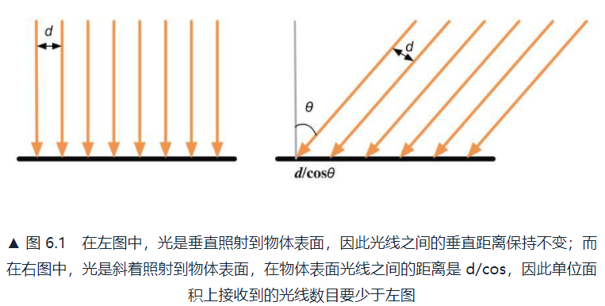

### 6.1.2 吸收和散射
光线和物体相交的结果：散射（scattering）和吸收（absorption）。散射只改变方向，不改变光线密度和颜色；吸收只改变密度和颜色，不改变方向：

* 散射
  * 折射（refraction）或投射（transmission）：散射到物体内部
  * 反射（reflection）：散射到物体外部

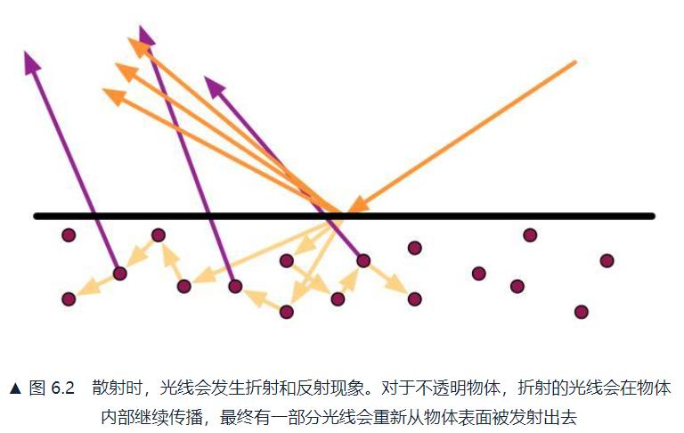

为了区分两种不同的散射方向，在光照模型中用不同的部分来计算：

* 高光反射（specular）：表示物体表面是如何反射光线的
* 漫反射（diffuse）：表示有多少光线会被折射、吸收和散射出表面。用出射度（exitance）来描述。

辐照度和出射度之间是满足线性关系的，它们之间的比值就是材质的漫反射和高光反射属性。

### 6.1.3 着色
着色（shading）是指根据材质属性、光源信息，使用一个等式去计算沿某个观察方向的出射度的过程。这个等式称为光照模型（Light Model）。

### 6.1.4 BRDF光照模型
BRDF（Bidirectional Reflectance Distribution Function）用来描述，当已知光源位置和方向、视角方向时，一个表面是如何和光照进行交互的。

## 6.2 标准光照模型
1973年，裴祥风（Bui Tuong Phong）提出了标准光照模型背后的基本理念。标准光照模型只关心直接光照（direct light）。它的基本方法是把进入到相机的光线分为4个部分，每个部分使用一种方法来计算它的贡献度：

* 自发光（emissive）：描述当给定一个方向时，一个表面本身会向该方向发射了多少辐射量
* 高光反射（specular）：描述当光线从光源照射到模型表面时，该表面会在完全镜面反射方向散射多少辐射量
* 漫反射（diffuse）：描述当光线从光源照射到模型表面时，该表面会向每个方向散射多少辐射量
* 环境光（ambient）：描述其他所有的间接光照

### 6.2.1 环境光
模拟间接光照（indirect light）。通常是一个全局变量，即场景中的所有物体都使用这个环境光：Cambient=Gambient

### 6.2.2 自发光
光线直接由光源发射进入摄像机，而不需要经过任何物体的反射：Cemissive=Memissive

### 6.2.3 漫反射
认为在任何反射方向上的分布是一样的，但是入射光线的角度很重要。

漫反射光照符合**兰伯特定律（Lambert's Law）**：反射光线的强度与表面法线和光源方向之间夹角的余弦成正比：Cdiffuse=(Clight·Mdiffuse)max(0,n·l)

其中n是表面法线，l是指向光源的单位矢量，Mdiffuse是材质的漫反射颜色，Clight是光源颜色。

### 6.2.4 高光反射
经验模型，并不完全符合真实世界的高光反射现象。需要知道表面法线、视角方向、光源方向、反射方向等。

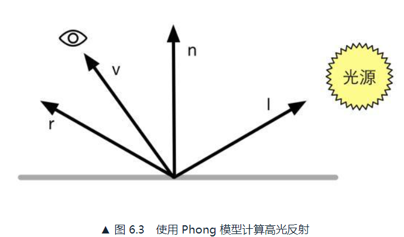

反射方向：r=2(n·l)n-l。*怎么来的呢，简单推导一下（写错了下图的v应该是r）：*


用Phong模型计算高光反射的部分：Cspecular=(Clight·Mspecular)max(0,v·r)^Mgloss。

其中Mgloss是材质的光泽度（gloss），也称为反光度（shininess），用于控制高光区域的“亮点”，Mgloss越大亮点越小
。Mspecular是高光反射强度和颜色，Clight是光源的颜色和强度。

Blinn模型，避免计算反射方向r，引入新的矢量h=(v+l)/|v+l|，然后使用n和h的夹角进行计算：

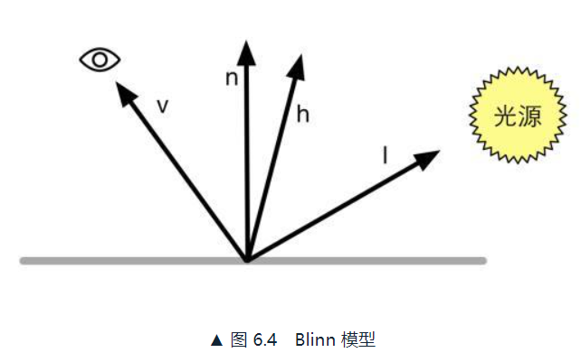

用Blinn模型计算高光反射的部分：Cspecular=(Clight·Mspecular)max(0,n·h)^Mgloss。

在硬件实现时，如果相机和光源距离模型足够远，Blinn模型会快于Phong模型，因为把v和l当作定值了所以h是常量。

### 6.2.5 逐像素还是逐顶点
在哪里计算光照模型：

* 逐像素光照（per-pixel lighting）：在片元着色器中计算
* 逐顶点光照（per-vertex lighting）：在顶点着色器中计算

逐像素光照，会以每个像素为基础，得到它的法线。这种在面片之间对顶点法线进行插值的技术称为Phong着色（Phong shading），不同于Phong光照模型。

逐顶点光照，也被称为高洛德着色（Gouraud shading）。在每个顶点上计算光照，在渲染图元内部进行线性差值，最后输出像素颜色。因为顶点数往往远小于像素数，因此逐顶点光照计算量往往小于逐像素。但光照模型中有非线性的计算（如高光反射）时，逐顶点光照会出问题。

### 6.2.6 总结
标准光照模型只是经验模型，并不完全符合真实世界中的光照现象。

有很多局限性：

* 无法表现菲涅尔反射（Fresnel reflection）
* Blinn-Phong模型是各项同性的（isotropic），无法表现各向异性（anisotropic）

## 6.3 Unity中的环境光和自发光
*环境光在Window->Rendering->LightingSettings中修改。其中AmbientColor中修改环境光的颜色和强度。在下面的RealtimeLighting中修改是否使用实时环境光照，默认是关闭的，上面的AmbientMode会显示Baked，即烘焙模型，否则就是实时。*

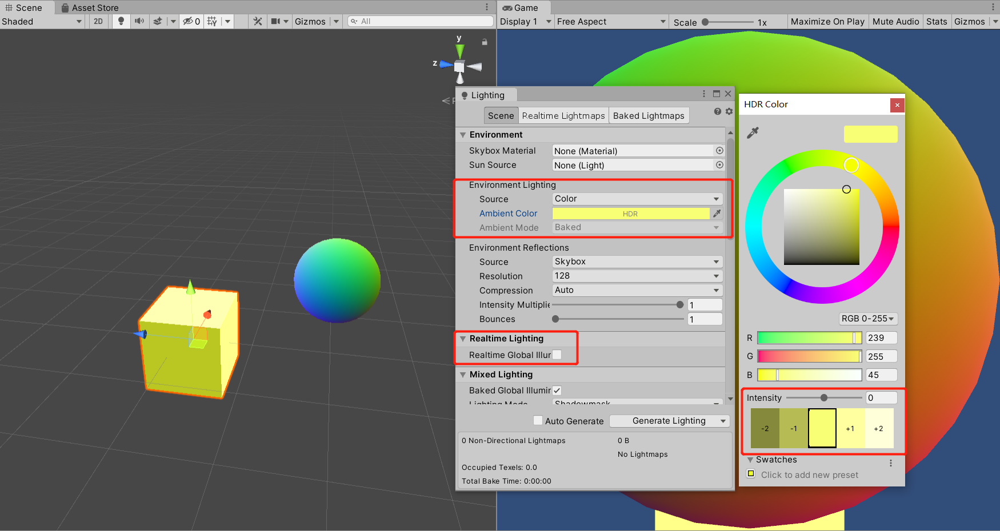

自发光是在片元着色器输出最后的颜色之前，把材质的自发光颜色添加到输出颜色上。

## 6.4 在UnityShader中实现漫反射光照模型
Cg中的函数 saturate(x)：把x截取在[0，1]，如果x是一个矢量，那么会对它的每一个分量进行这样的操作。

### 6.4.1 实践：逐顶点光照
```
// Upgrade NOTE: replaced '_World2Object' with 'unity_WorldToObject'

Shader "ShaderLearning/Shader6.4_DiffuseVertexLevel"{
    Properties{
        _Diffuse("Diffuse",Color)=(1,1,1,1)
    }
    SubShader{
        Pass{
            Tags{"LightMode"="ForwardBase"}

            CGPROGRAM

            #pragma vertex vert
            #pragma fragment frag
            #include "Lighting.cginc"

            fixed4 _Diffuse;

            struct a2v{
                float4 vertex:POSITION;
                float3 normal:NORMAL;
            };

            struct v2f{
                float4 pos:SV_POSITION;
                fixed3 color:COLOR;
            };

            v2f vert(a2v v){
                v2f o;

                // Transform the vertex from object space to projection space
                o.pos=UnityObjectToClipPos(v.vertex);

                // Get ambient term
                // 环境条件
                fixed3 ambient=UNITY_LIGHTMODEL_AMBIENT.xyz;

                // Transform the normal fram object space to world space
                fixed3 worldNormal=normalize(mul(v.normal,(float3x3)unity_WorldToObject));
                // Get the light direction in world space
                fixed3 worldLight=normalize(_WorldSpaceLightPos0.xyz);
                // Compute diffuse term
                fixed3 diffuse=_LightColor0.rgb*_Diffuse.rgb*saturate(dot(worldNormal,worldLight));

                o.color=ambient+diffuse;

                return o;
            }

            fixed4 frag(v2f i):SV_TARGET{
                return fixed4(i.color,1.0);
            }

            ENDCG
        }
    }

    Fallback "Diffuse"
}
```

运行结果如下：

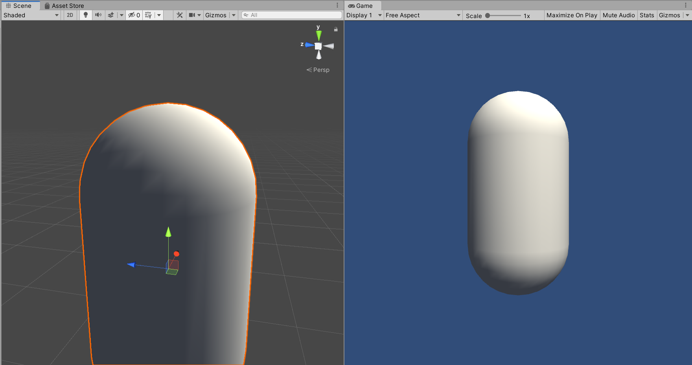

*从结构体v2f看出，我们想在顶点着色器里完成两件事，一是最基本的计算出裁剪空间中的顶点坐标pos，二是计算出每个顶点的颜色值，把这两个信息传给片元着色器。*

使用UnitytObjectToClipPos()得到裁剪空间顶点坐标。ambient是环境条件，从内置变量中得到，直接加在最后的结果中。worldNormal和worldLight分别是世界坐标系下的顶点法线和光源方向。_WorldSpaceLightPos0和_LightColor0都是内置变量。

*结果中可以发现背光面和向光面交界处有锯齿，不平滑。*

### 6.4.2 实践：逐像素光照
```
// Upgrade NOTE: replaced '_World2Object' with 'unity_WorldToObject'

Shader "ShaderLearning/Shader6.4_DiffusePixelLevel"{
    Properties{
        _Diffuse("Diffuse",Color)=(1,1,1,1)
    }
    SubShader{
        Pass{
            Tags{"LightMode"="ForwardBase"}

            CGPROGRAM

            #pragma vertex vert
            #pragma fragment frag
            #include "Lighting.cginc"

            fixed4 _Diffuse;

            struct a2v{
                float4 vertex:POSITION;
                float3 normal:NORMAL;
            };

            struct v2f{
                float4 pos:SV_POSITION;
                float3 worldNormal:TEXCOORD0;
            };

            v2f vert(a2v v){
                v2f o;

                // Transform the vertex from object space to projection space
                o.pos=UnityObjectToClipPos(v.vertex);

                // Transform the normal from object space to world space
                o.worldNormal=mul(v.normal,(float3x3)unity_WorldToObject);

                return o;
            }

            fixed4 frag(v2f i):SV_TARGET{
                // Get ambient term
                fixed3 ambient=UNITY_LIGHTMODEL_AMBIENT.xyz;

                // Get the normal in world space
                fixed3 worldNormal=normalize(i.worldNormal);
                // Get the light direction in world space
                fixed3 worldLightDir=normalize(_WorldSpaceLightPos0.xyz);

                // Compute diffuse term
                fixed3 diffuse=_LightColor0.rgb*_Diffuse.rgb*saturate(dot(worldNormal,worldLightDir));

                fixed3 color=ambient+diffuse;

                return fixed4(color,1.0);
            }

            ENDCG
        }
    }

    Fallback "Diffuse"
}
```

运行结果如下，更平滑一点：

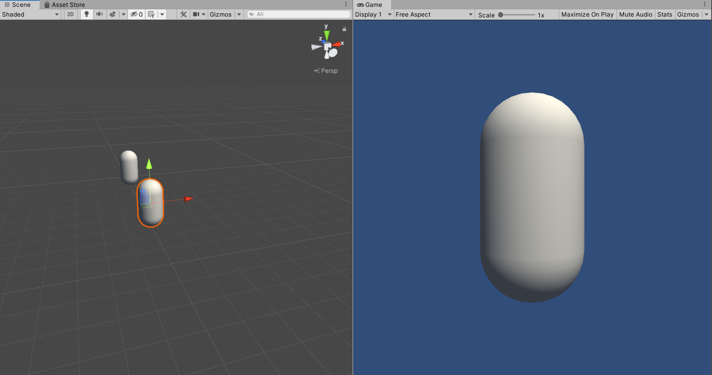

### 6.4.3 半兰伯特模型
半兰伯特光照模型（Half Lambert），为了解决光照不到的背面全黑的问题。上面两种符合兰伯特定律，平面某点漫反射光的光强与该反射点的法向量和入射角度的余弦值成正比。

广义的半兰伯特光照模型公式：Cdiffuse=(Clight·Mdiffuse)(α(n·l)+β)

绝大多数情况下的公式：Cdiffuse=(Clight·Mdiffuse)(0.5(n·l)+0.5)

将片元着色器中计算diffuse的代码，改成半兰伯特光照模型：

```
...
// Compute diffuse term
fixed halfLambert=dot(worldNormal,worldLightDir)*0.5+0.5;
fixed3 diffuse=_LightColor0.rgb*_Diffuse.rgb*halfLambert;

fixed3 color=ambient+diffuse;

return fixed4(color,1.0);
...
```

运行结果如下：

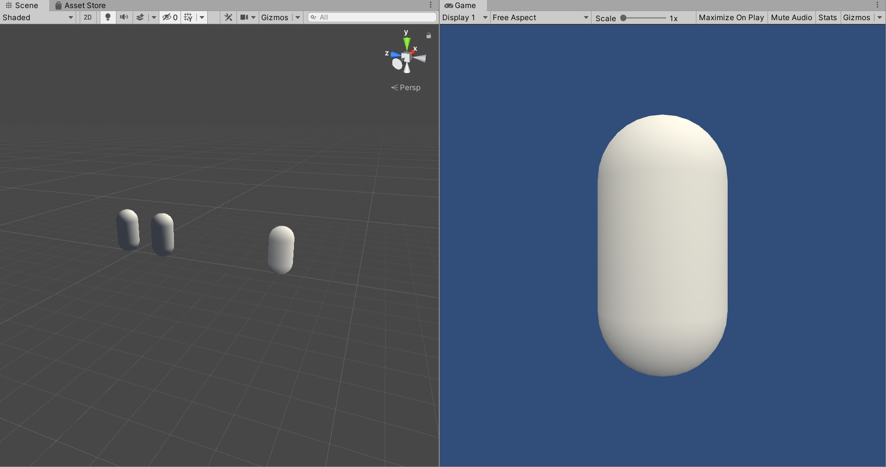

逐顶点漫反射光照、逐像素漫反射光照、半兰伯特光照的对比如下图：

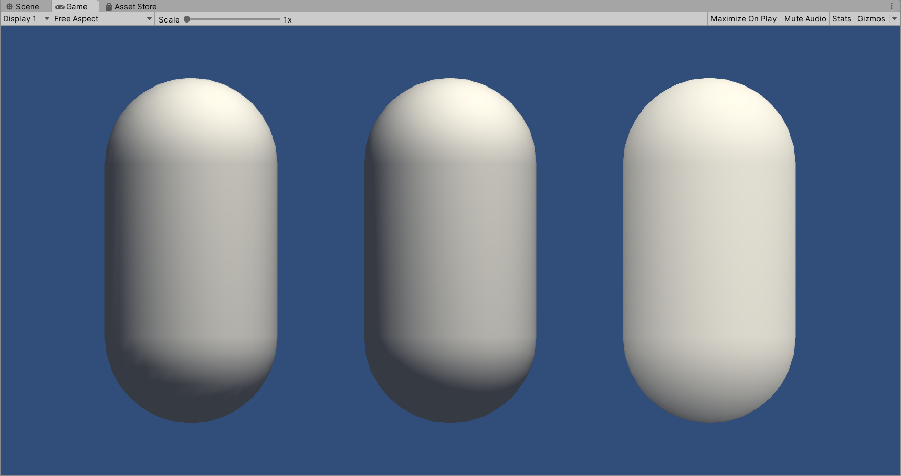

## 6.5 在UnityShader中实现高光反射光照模型
Cg提供了计算反射方向的函数reflect(i,n)，i入射方向，n法线方向

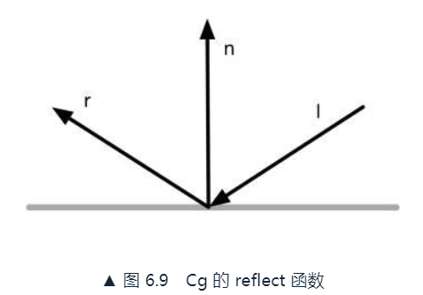

### 6.5.1 实践：逐顶点光照

```
Shader "ShaderLearning/Shader6.5_SpecularVertexLevel"{
    Properties{
        _Specular("Specular",Color)=(1,1,1,1)
        _Gloss("Gloss",Range(8.0,256))=20
    }
    SubShader{
        Pass{
            Tags{"LightMode"="ForwardBase"}

            CGPROGRAM

            #pragma vertex vert
            #pragma fragment frag
            #include "Lighting.cginc"

            fixed4 _Specular;
            float _Gloss;

            struct a2v{
                float4 vertex:POSITION;
                float3 normal:NORMAL;
            };
            struct v2f{
                float4 pos:SV_POSITION;
                fixed3 color:COLOR;
            };

            v2f vert(a2v v){
                v2f o;

                o.pos=UnityObjectToClipPos(v.vertex);
                fixed3 ambient=UNITY_LIGHTMODEL_AMBIENT.xyz;

                fixed3 worldNormal=normalize(mul(v.normal,(float3x3)unity_WorldToObject));
                fixed3 worldLightDir=normalize(_WorldSpaceLightPos0.xyz);

                // Get the reflect direction in world space
                fixed3 reflectDir=normalize(reflect(-worldLightDir,worldNormal));
                // Get the view direction in world space
                fixed3 viewDir=normalize(_WorldSpaceCameraPos.xyz-mul(unity_ObjectToWorld,v.vertex).xyz);

                // Compute specular term
                fixed3 specular=_LightColor0.rgb*_Specular.rgb*pow(saturate(dot(reflectDir,viewDir)),_Gloss);

                o.color=ambient+specular;

                return o;
            }

            fixed4 frag(v2f i):SV_Target{
                return fixed4(i.color,1.0);
            }

            ENDCG
        }
    }

    // Fallback "Specular"
}
```

*这里在作者的基础上，删除了漫反射部分，只看高光反射的部分。*

使用_WorldSpaceCameraPos得到世界空间中的相机位置，再把顶点位置从模型空间变换到世界空间下，和_WorldSpaceCameraPos相减即可得到世界空间下的视角方向。

运行结果如下，逐顶点高光反射有明显的锯齿：

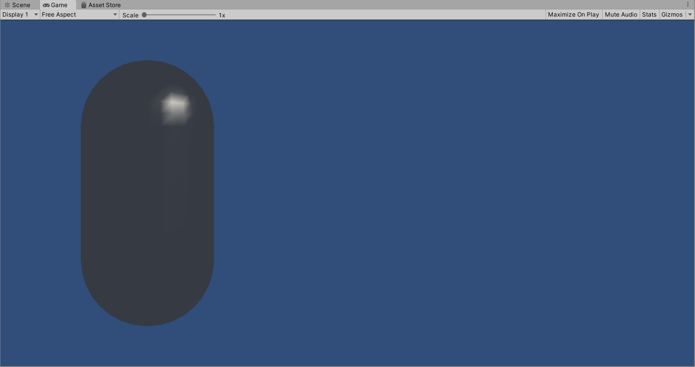

### 6.5.2 实践：逐像素光照
```
Shader "ShaderLearning/Shader6.5_SpecularPixelLevel"{
    Properties{
        _Specular("Specular",Color)=(1,1,1,1)
        _Gloss("Gloss",Range(8.0,256))=20
    }
    SubShader{
        Pass{
            Tags{"LightMode"="ForwardBase"}

            CGPROGRAM

            #pragma vertex vert
            #pragma fragment frag
            #include "Lighting.cginc"

            fixed4 _Specular;
            float _Gloss;

            struct a2v{
                float4 vertex:POSITION;
                float3 normal:NORMAL;
            };
            struct v2f{
                float4 pos:SV_POSITION;
                float3 worldNormal:TEXCOORD0;
                float3 worldPos:TEXCOORD1;
            };

            v2f vert(a2v v){
                v2f o;

                o.pos=UnityObjectToClipPos(v.vertex);
                o.worldNormal=UnityObjectToWorldNormal(v.normal);
                o.worldPos=UnityObjectToWorldDir(v.vertex);

                return o;
            }

            fixed4 frag(v2f i):SV_Target{
                fixed3 ambient=UNITY_LIGHTMODEL_AMBIENT.xyz;

                fixed3 worldNormal=normalize(i.worldNormal);
                fixed3 worldLight=normalize(_WorldSpaceLightPos0.xyz);

                // Get the reflect direction in world space
                fixed3 reflectDir=normalize(reflect(-worldLight,worldNormal));
                // Get the view direction in world space
                fixed3 viewDir=normalize(_WorldSpaceCameraPos.xyz-i.worldPos.xyz);
                // Compute specular term
                fixed3 specular=_LightColor0.rgb*_Specular.rgb*pow(saturate(dot(viewDir,reflectDir)),_Gloss);

                return fixed4(ambient+specular,1.0);
            }

            ENDCG
        }
    }

    // Fallback "Specular"
}
```

运行结果如下，平滑的高光：

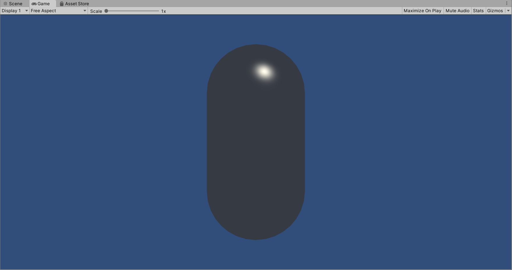

### 6.5.3 Blinn-Phong光照模型
```
...
// Get the view direction in world space
fixed3 viewDir=normalize(_WorldSpaceCameraPos.xyz-i.worldPos.xyz);
// Get the half direction in world space
fixed3 halfDir=normalize(worldLight+viewDir);
// Compute specular term
fixed3 specular=_LightColor0.rgb*_Specular.rgb*pow(max(0,dot(worldNormal,halfDir)),_Gloss);

return fixed4(ambient+specular,1.0);
...
```

运行结果如下：

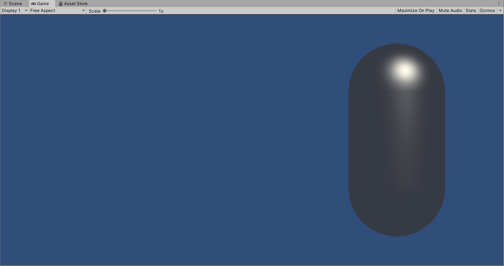

逐顶点高光反射、逐像素高光反射（Phong光照模型）、Blinn-Phong高光反射的对比如下：

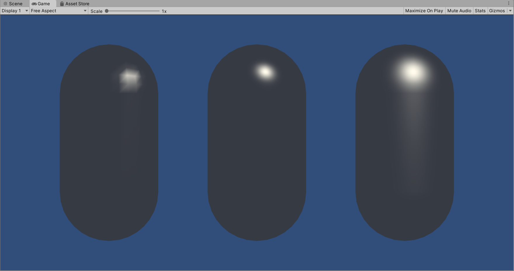

看起来Blinn-Phong光照模型的高光反射部分看起来更大、更亮一些。在实际渲染中，绝大多数情况会选择Blinn-Phong光照模型。

## 6.6 召唤神龙：使用Unity内置的函数
UnityCG.cginc提供了一些内置函数：

* WorldSpaceViewDir
* UnityWorldWorldSpaceViewDir
* ObjSpaceViewDir
* WorldSpaceLightDir
* UnityWorldSpaceLightDir
* ObjSpaceLightDir
* UnityObjectToWorldNormal
* UnityObjectToWorldDir
* UnityWorldToObjectDir

使用时需要归一化。