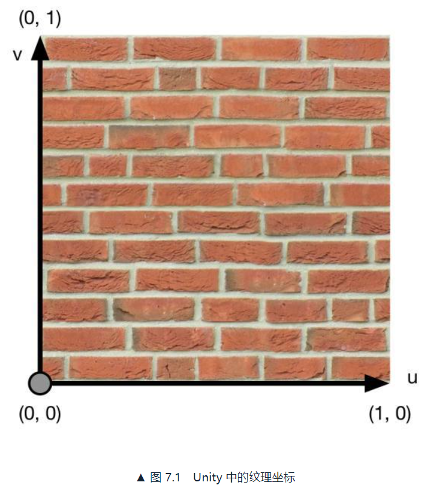
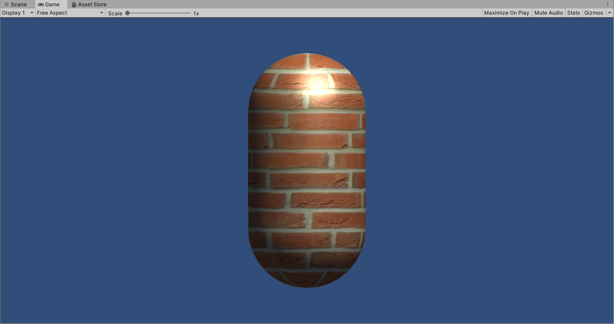
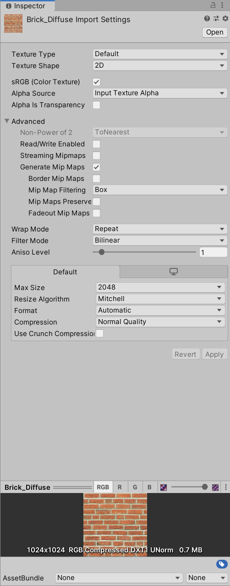
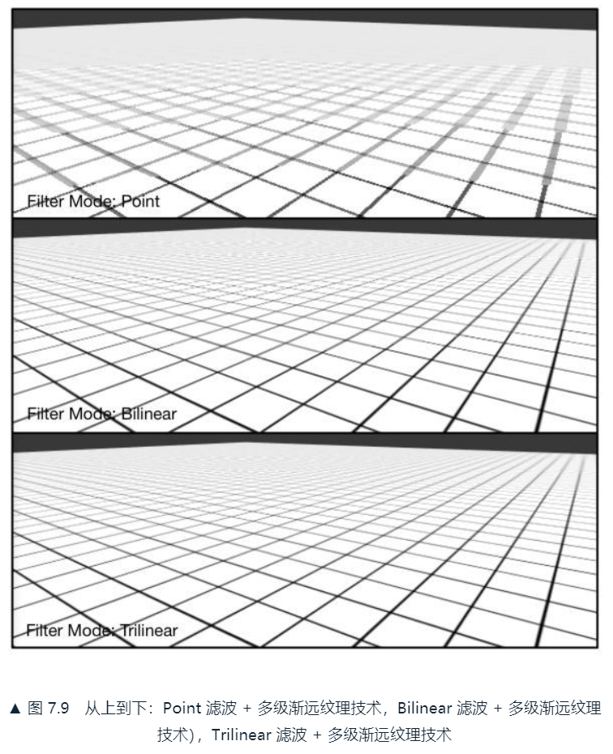
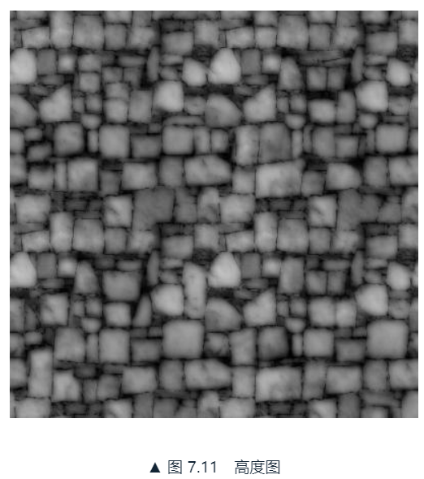
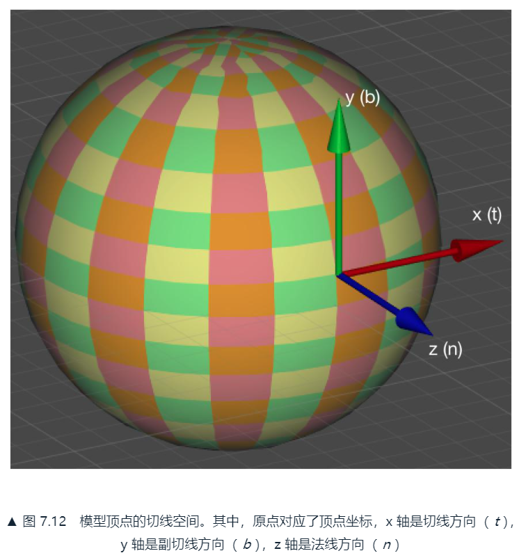
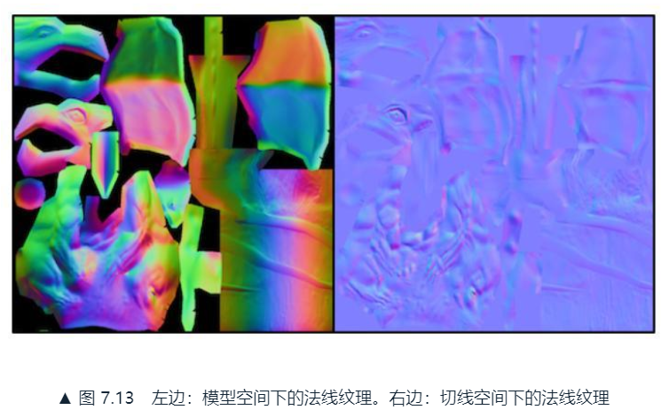
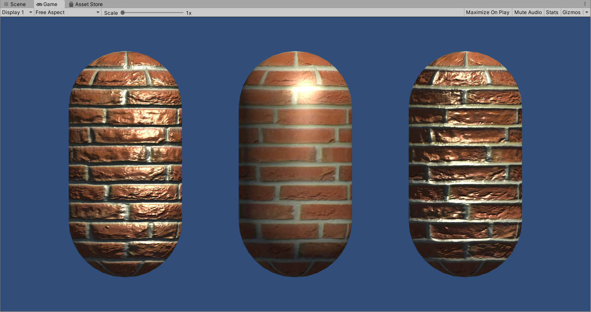

# 7. 基础纹理
纹理映射（texture mapping），逐纹素（texel）地控制模型的颜色。

建模时会利用纹理展开技术把纹理映射坐标（texture-mapping coordinates）存储在每个顶点上，纹理映射坐标也被称为UV坐标。

Unity使用的纹理空间是符合OpenGL传统的，原点位于纹理左下角。



## 7.1 单张纹理
通常会使用一张纹理来代替物体的漫反射颜色。

### 7.1.1 实践
```
Shader "ShaderLearning/Shader7.1_SingleTexture"{
    Properties{
        _Color("Color Tint",Color)=(1,1,1,1)
        _MainTex("Main Tex",2D)="White"{}
        _Specular("Specular",Color)=(1,1,1,1)
        _Gloss("Gloss",Range(8.0,256))=20
    }
    SubShader{
        Pass{
            Tags{"LightMode"="ForwardBase"}

            CGPROGRAM

            #pragma vertex vert
            #pragma fragment frag
            #include "Lighting.cginc"

            fixed4 _Color;
            sampler2D _MainTex;
            float4 _MainTex_ST; // 用纹理名_ST来声明纹理属性，ST表示缩放和平移
            fixed4 _Specular;
            float _Gloss;

            struct a2v{
                float4 vertex:POSITION;
                float3 normal:NORMAL;
                float4 texcoord:TEXCOORD0;
            };

            struct v2f{
                float4 pos:SV_POSITION;
                float3 worldNormal:TEXCOORD0;
                float3 worldPos:TEXCOORD1;
                float2 uv:TEXCOORD2;
            };

            v2f vert(a2v v){
                v2f o;
                o.pos=UnityObjectToClipPos(v.vertex);
                o.worldNormal=UnityObjectToWorldNormal(v.normal);
                o.worldPos=UnityObjectToWorldDir(v.vertex);

                o.uv=v.texcoord.xy*_MainTex_ST.xy+_MainTex_ST.zw;
                // Or just call the built-in function
                // o.uv=TRANSFORM_TEX(v.texcoord,_MainTex);

                return o;
            }

            fixed4 frag(v2f i):SV_Target{
                fixed3 worldNormal=normalize(i.worldNormal);
                fixed3 worldLight=normalize(UnityWorldSpaceLightDir(i.worldPos));

                // Use the texture to sample the diffuse color
                fixed3 albedo=tex2D(_MainTex,i.uv).rgb*_Color.rgb;

                fixed3 ambient=UNITY_LIGHTMODEL_AMBIENT.xyz*albedo;

                fixed3 diffuse=_LightColor0.rgb*albedo*max(0,dot(worldNormal,worldLight));

                fixed3 viewDir=normalize(UnityWorldSpaceViewDir(i.worldPos));
                fixed3 halfDir=normalize(worldLight+viewDir);
                fixed3 specular=_LightColor0.rgb*_Specular.rgb*pow(max(0,dot(worldNormal,halfDir)),_Gloss);

                return fixed4(ambient+diffuse+specular,1.0);
            }

            ENDCG
        }
    }
}
```

在顶点着色器中，得到最终的纹理坐标o.uv。

在片元着色器中，使用Cg的tex2D函数对纹理进行采样。采样结果和颜色属性_Color的乘积作为材质的反射率albedo，使用albedo来计算环境光照和漫反射光照结果，加上高光反射就是最后的结果。

在材质中MainTex属性使用作者提供的Brick_Diffuse贴图，最终结果如下：



### 7.1.2 纹理的属性
向Unity中导入一张纹理资源后，可以在它的材质面板上调整属性。



* AlphaSource：透明通道的值是如何生成的
* WrapMode：平铺模式
  * Repeat：如果纹理坐标超过1，舍弃整数部分，用小数部分进行采样。结果是纹理不断重复
  * Clamp：如果纹理坐标大于1，将会截取到1；如果小于0，将会截取到0
* FilterMode：滤波模式，当纹理由于变换而产生拉伸时。3种模式效果依次提升，开销依次增大
  * Point
  * Bilinear
  * Trilinear

纹理缩小时，要处理抗锯齿问题，常用多级渐远纹理技术（mipmapping），min是拉丁文“multum in parvo”的缩写。将原纹理提前用滤波处理得到很多更小的图像，实时运行时可以快速得到像素。缺点是需要用更多的空间来存储这些多级渐远纹理，通常多33%内存，空间换时间。在Advanced种选择GenerateMipMaps开启。

滤波原理。一般使用Bilinear滤波模式，如果需要像素风用Point模式：

* Point：采样像素数目通常只有1个，因此图像看起来有像素风格
* Bilinear：线性滤波，对每个目标像素找4个临近像素插值得到最终图像，因此图像看起来被模糊了
* Trilinear：滤波几乎和Bilinear一样，但会在多级渐远纹理之间进行混合



处于性能和空间的考虑，应该尽量使用2的幂大小的纹理。可以是非正方形，但长宽都应该是2的幂。如果使用了非2的幂（Non Power of Two, NPOT），这些纹理往往会占用更多的内存，而且GPU读取该纹理的速度也会下降，甚至不支持。

Format决定了Unity内部使用哪种格式来存储该纹理，适当选择。

## 7.2 凹凸映射
凹凸映射（bump mapping），目的是使用一张纹理来修改模型表面的法线，有两种主要方法：

* 高度映射（height mapping）：用高度纹理（height map）来模拟表面位移（displacement）
* 法线映射（normal mapping）：用法线纹理（normal map）直接存储表面法线

### 7.2.1 高度纹理
高度图种存储的是强度值（intensity），表示模型表面局部的海拔高度。颜色越浅表明该位置的表面越向外凸起，越深越凹。

* 好处：直观
* 缺点：计算更加复杂。实时计算不能直接得到表面法线，需要由像素的灰度值计算

高度图通常会和法线映射一起使用，给出表面凹凸的额外信息。



### 7.2.2 法线纹理
法线分量范围[-1,1]，像素分量范围[0,1]：

* 法线映射到像素：pixel=(normal+1)/2
* 法线纹理中存储的就是表面的法线方向：normal=pixel*2-1

* 模型空间的法线纹理（object-space normal map）：将修改后的模型空间中的表面法线存储在一张纹理中
* 切线空间的法线纹理（tangent-space normal map）：使用模型顶点的切线空间（tangent space）来存储法线，z轴是顶点的法线方向n，x轴是顶点的切线方向t，y轴由法线和切线叉积而得，称为副切线t（bitangent）或副法线




法线纹理的视觉颜色：

* 模型空间下的法线纹理看起来五颜六色，是因为每个点法线方向各异
* 切线空间下的法线纹理看起来大部分是浅蓝色，顶点的大部分法线和模型本身法线一样，不需要改变。例如一个点在切线空间中，法线是z轴方向即(0,0,1)，映射在纹理上的颜色就是(0.5,0.5,1)浅蓝色

使用模型空间来存储法线的优点：

* 实现简单，更加直观
* 在纹理坐标的缝合处和尖锐的边角部分，可见的突变（缝隙）较少，可以提供平滑的边界

使用切线空间来存储法线的优点：

* 自由度很高。模型空间下的法线纹理记录的是绝对法线信息，仅可用于创建它时的哪个模型，用到其他模型效果就错了。而切线空间下的法线记录的是相对信息，可以用于完全不同的网格
* 可进行UV动画，如移动纹理的UV坐标来实现凹凸移动的效果
* 可以重用法线纹理
* 可压缩。因为z总是正方向，可以仅存储xy方向推导z方向，而模型空间各个方向都有可能，不可压缩

### 7.2.3 实践
因为计算光照模型要统一各个方向矢量所在的坐标空间，有两种选择：

* 在切线空间下进行光照计算：效率高一点，在顶点着色器中完成光照方向和视角方向的变换
* 在世界空间下进行光照计算：因为要先对法线纹理进行采样，所以变换过程必须在片元着色器中实现。但通用性高，例如使用Cubemap进行环境映射时，需要使用世界空间下的反射方向对Cubemap采样

**1. 在切线空间下计算**

```
Shader "ShaderLearning/Shader7.2_NormalMapTangentSpace"{
    Properties{
        _Color("Color Tint",Color)=(1,1,1,1)
        _MainTex("Main Tex",2D)="white"{}
        _BumpMap("Normal Map",2D)="bump"{}
        _BumpScale("Bump Scale",Float)=1.0
        _Specular("Specular",Color)=(1,1,1,1)
        _Gloss("Gloss",Range(8.0,256))=20
    }
    SubShader{
        Pass{
            Tags{"LightMode"="ForwardBase"}

            CGPROGRAM

            #pragma vertex vert
            #pragma fragment frag
            #include "Lighting.cginc"

            fixed4 _Color;
            sampler2D _MainTex;
            float4 _MainTex_ST;
            sampler2D _BumpMap;
            float4 _BumpMap_ST;
            float _BumpScale;
            fixed4 _Specular;
            float _Gloss;

            struct a2v{
                float4 vertex:POSITION;
                float3 normal:NORMAL;
                float4 tangent:TANGENT;
                float4 texcoord:TEXCOORD0;
            };

            struct v2f{
                float4 pos:SV_POSITION;
                float4 uv:TEXCOORD0;
                float3 lightDir:TEXCOORD1;
                float3 viewDir:TEXCOORD2;
            };

            v2f vert(a2v v){
                v2f o;
                o.pos=UnityObjectToClipPos(v.vertex);
                o.uv.xy=v.texcoord.xy*_MainTex_ST.xy+_MainTex_ST.zw;
                o.uv.zw=v.texcoord.xy*_BumpMap_ST.xy+_BumpMap_ST.zw;

                // Compute the binormal
                // float3 binormal=cross(normalize(v.normal),normalize(v.tangent.xyz))*v.tangent.w;
                // Construct a matrix which transform vectors from object space to tangent space
                // float3x3 rotation=float3x3(v.tangent.xyz,binormal,v.normal);
                // Or juse use the built-in macro
                TANGENT_SPACE_ROTATION;

                // Transform the light direction from object space to tangent space
                o.lightDir=mul(rotation,ObjSpaceLightDir(v.vertex)).xyz;
                // Tranform the view direction from object space to tangent space
                o.viewDir=mul(rotation,ObjSpaceViewDir(v.vertex)).xyz;

                return o;
            }

            fixed4 frag(v2f i):SV_TARGET{
                fixed3 tangentLightDir=normalize(i.lightDir);
                fixed3 tangentViewDir=normalize(i.viewDir);

                // Get the texel in the normal map
                fixed4 packedNormal=tex2D(_BumpMap,i.uv.zw);
                fixed3 tangentNormal;
                // If the texture is not marked as "Normal map"
                // tangentNormal.xy=(packedNormal.xy*2-1)*_BumpScale;
                // tangentNormal.z=sqrt(1.0-saturate(dot(tangentNormal.xy,tangentNormal.xy)));

                // Or mark the texture as "Normal map", and use the built-in fuction
                tangentNormal=UnpackNormal(packedNormal);
                tangentNormal*=_BumpScale;
                tangentNormal.z=sqrt(1.0-saturate(dot(tangentNormal.xy,tangentNormal.xy)));

                fixed3 albedo=tex2D(_MainTex,i.uv).rgb*_Color.rgb;
                fixed3 ambient=UNITY_LIGHTMODEL_AMBIENT.xyz*albedo;
                fixed3 diffuse=_LightColor0.rgb*albedo*max(0,dot(tangentNormal,tangentLightDir));
                fixed3 halfDir=normalize(tangentLightDir+tangentViewDir);
                fixed3 specular=_LightColor0.rgb*_Specular.rgb*pow(max(0,dot(tangentNormal,halfDir)),_Gloss);

                return fixed4(ambient+diffuse+specular,1.0);
            }

            ENDCG
        }
    }
}
```

在顶点着色器中，使用模型空间下的切线方向x、副切线方向y和法线方向z按行排列，得到从模型空间到切线空间的变换矩阵rotation（从模型空间到切线空间的变换矩阵就是从切线空间到模型空间的变换矩阵的转置矩阵）。或者用内置宏TANGENT_SPACE_ROTATION，直接计算得到rotation。

在片元着色器中，先对法线纹理进行采样，在切线空间下进行光照计算。

不同BumpScale（-1，0，1）下的结果：



**2. 在世界空间下计算**

```
Shader "ShaderLearning/Shader7.2_NormalMapWorldSpace"{
    Properties{
        _Color("Color Tint",Color)=(1,1,1,1)
        _MainTex("Main Tex",2D)="white"{}
        _BumpMap("Normal Map",2D)="bump"{}
        _BumpScale("Bump Scale",Float)=1.0
        _Specular("Specular",Color)=(1,1,1,1)
        _Gloss("Gloss",Range(8.0,256))=20
    }
    SubShader{
        Pass{
            Tags{"LightMode"="ForwardBase"}

            CGPROGRAM

            #pragma vertex vert
            #pragma fragment frag
            #include "Lighting.cginc"

            fixed4 _Color;
            sampler2D _MainTex;
            float4 _MainTex_ST;
            sampler2D _BumpMap;
            float4 _BumpMap_ST;
            float _BumpScale;
            fixed4 _Specular;
            float _Gloss;

            struct a2v{
                float4 vertex:POSITION;
                float3 normal:NORMAL;
                float4 tangent:TANGENT;
                float4 texcoord:TEXCOORD0;
            };

            struct v2f{
                float4 pos:SV_POSITION;
                float4 uv:TEXCOORD0;
                float4 TtoW0:TEXCOORD1;
                float4 TtoW1:TEXCOORD2;
                float4 TtoW2:TEXCOORD3;
            };

            v2f vert(a2v v){
                v2f o;
                o.pos=UnityObjectToClipPos(v.vertex);
                o.uv.xy=v.texcoord.xy*_MainTex_ST.xy+_MainTex_ST.zw;
                o.uv.zw=v.texcoord.xy*_BumpMap_ST.xy+_BumpMap_ST.zw;

                float3 worldPos=UnityObjectToWorldDir(v.vertex);
                fixed3 worldNormal=UnityObjectToWorldNormal(v.normal);
                fixed3 worldTangent=UnityObjectToWorldDir(v.tangent);
                fixed3 worldBinormal=cross(worldNormal,worldTangent)*v.tangent.w;

                // Compute the matrix that transform directions from tangent space to world space
                // Put the world position in w component for optimization
                o.TtoW0=float4(worldTangent.x,worldBinormal.x,worldNormal.x,worldPos.x);
                o.TtoW1=float4(worldTangent.y,worldBinormal.y,worldNormal.y,worldPos.y);
                o.TtoW2=float4(worldTangent.z,worldBinormal.z,worldNormal.z,worldPos.z);

                return o;
            }

            fixed4 frag(v2f i):SV_TARGET{
                // Get the position in world space
                float3 worldPos=float3(i.TtoW0.w,i.TtoW1.w,i.TtoW2.w);
                // Compute the light and view dir in world space
                fixed3 lightDir=normalize(UnityWorldSpaceLightDir(worldPos));
                fixed3 viewDir=normalize(UnityWorldSpaceViewDir(worldPos));

                // Get the normal in tangent space
                fixed3 bump=UnpackNormal(tex2D(_BumpMap,i.uv.zw));
                bump.xy*=_BumpScale;
                bump.z=sqrt(1.0-saturate(dot(bump.xy,bump.xy)));
                // Tansform the normal from tangent space to world space
                bump=normalize(half3(dot(i.TtoW0.xyz,bump),dot(i.TtoW1.xyz,bump),dot(i.TtoW2.xyz,bump)));

                fixed3 albedo=tex2D(_MainTex,i.uv).rgb*_Color.rgb;
                fixed3 ambient=UNITY_LIGHTMODEL_AMBIENT.xyz*albedo;
                fixed3 diffuse=_LightColor0.rgb*albedo*max(0,dot(bump,lightDir));
                fixed3 halfDir=normalize(lightDir+viewDir);
                fixed3 specular=_LightColor0.rgb*_Specular.rgb*pow(max(0,dot(bump,halfDir)),_Gloss);

                return fixed4(ambient+diffuse+specular,1.0);
            }

            ENDCG
        }
    }
}
```

在顶点着色器的输出结构体v2f中，TwoW0、TwoW1、TwoW2依次存储了从切线空间到世界空间的变换矩阵的每一行。一个插值寄存器只能存储float4这么大，矩阵需要拆开存。为了充分利用储存空间，把世界空间下的顶点位置存储在w分量中。

在顶点着色器中，计算了世界空间下的顶点切线、副切线和法线，按列摆放得到从切线空间到世界空间的变换矩阵。并且把世界空间下的顶点位置的xyz分量分别存储在了w分量中。

在片元着色器中，得到世界空间下的光照和视角方向。然后通过点乘，把法线变换到世界空间下。最后在世界空间中计算光照。

最后的效果和使用切线空间来计算的效果一样。

### 7.2.4 Unity中的法线纹理类型
当把法线纹理的类型识别成NormalMap时，可以使用内置函数UnpackNormal来得到正确的法线方向。

在某些平台上，这个函数对DXT5nm格式的法线纹理进行了解码。

## 7.3 渐变纹理