# 8. 透明效果
要实现透明效果，通常会在渲染模型时控制它的**透明通道（Alpha Channel）**。在Unity中，有两种方法来实现透明效果：

* 透明度测试（Alpha Test）
* 透明度混合（Alpha Blending）

之前我们没有强调渲染顺序的问题，因为对于不透明（opaque）物体，不考虑它们的渲染顺序也能得到正确的排序结果，这是由于强大的深度缓冲的存在（depth buffer，也被称为z-buffer）。如果要渲染的片元，深度值和深度缓冲的比较，距离摄像机更远，就不应该渲染在屏幕上（有物体遮挡住了）。

透明度测试和透明度混合的基本原理：

* **透明度测试：** “霸道极端”，只要一个片元的透明度不满足条件（通常是小于某个阈值），就舍弃。不需要关闭深度写入（ZWrite），要么完全透明看不见，要么完全不透明像不透明物体。
* **透明度混合：** 可以得到真正的半透明效果，使用当前片元的透明度作为混合因子，与已经存储在颜色缓冲中的颜色值进行混合，得到新的颜色值。需要关闭深度写入，不用关闭深度测试，需要非常小心物体的渲染顺序。（*没有写入深度，如何进行深度测试，判断这个透明物体是在不透明物体前面还是后面？*）

## 8.1 为什么渲染顺序很重要
为什么透明度混合要关闭深度写入呢？如果不关闭，会导致半透明物体表面后面的物体被剔除。关闭深度写入导致渲染顺序变得非常重要。

不同渲染顺序的结果，A遮挡B时：（*如何控制渲染顺序呢？*）

* A是半透明物体，B是不透明物体：
  * 先渲染B再A：B先写入颜色缓冲和深度缓冲，再用A的透明度和颜色缓冲中的B颜色进行混合，得到正确的半透明效果
  * 先渲染A再B：A写入颜色缓冲，但因为关闭了深度写入，不会修改深度缓冲。B通过了深度测试，直接覆盖A的颜色，视觉上B出现在A前面，错误结果
* A和B都是半透明物体：
  * 先B再A：正确结果
  * 先A再B：A先写入，B和颜色缓冲中的A混合，看起来B在A前面，错误结果

渲染引擎一般都会对物体进行排序，再渲染：

1. 先渲染所有不透明物体，并开启它们的深度测试和深度写入
2. 把半透明物体按它们距离摄像机的远近进行排序，从后往前渲染；并开启它们的深度测试，关闭深度写入

循环重叠的半透明物体，永远无法得到正确的结果（*2021年了有办法了吗？*）。因为深度缓冲中的值是像素级别的，我们现在对单个物体级别进行排序，会造成要么物体A在B前面渲染，要么B在A前，无法一部分在前一部分在后。

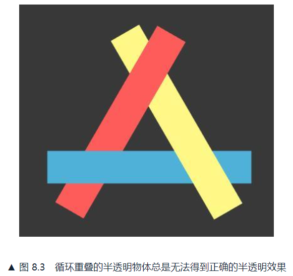

有时无论选取网格上哪点的深度值进行排序，都会得到错误的结果。解决方法通常是分割网格。

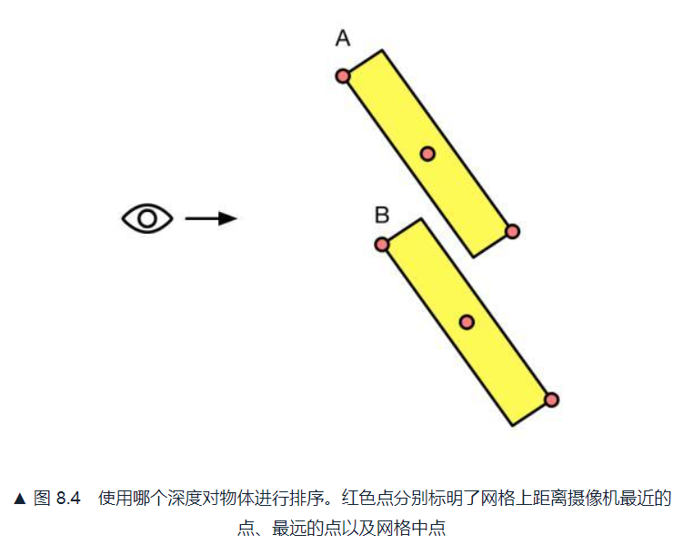

## 8.2 UnityShader的渲染顺序
为解决渲染顺序使用了**渲染队列（render queue）**，可以使用SubShader的Queue标签来决定模型归于哪个渲染队列。Unity内部使用整数索引来表示每个渲染队列，索引越小越早渲染。

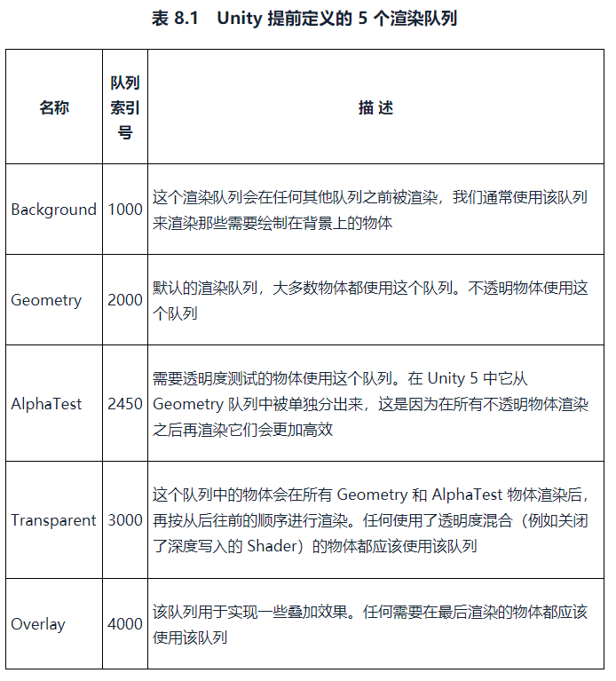

使用透明度测试的代码类似这样：

```
SubShader{
    Tags{"Queue"="AlphaTest"}
    Pass{
        ...
    }
}
```

使用透明度混合的代码类似这样：

```
SubShader{
    Tags{"Queue"="Transparent"}
    Pass{
        ZWrite Off
        ...
    }
}
```

## 8.3 透明度测试
在片元着色器中使用clip函数进行透明度测试，原理：

```
void clip(float4 x){
    if(any(x<0)) discard;
}
```

```
Shader "ShaderLearning/Shader8.3_AlphaTest"{
    Properties{
        _Color("Main Tint",Color)=(1,1,1,1)
        _MainTex("Main Tex",2D)="white"{}
        _Cutoff("Alpha Cutoff",Range(0,1))=0.5 // 调用clip进行透明度测试的判断条件
    }

    SubShader{
        // 使用AlphaTest队列
        // 不受投影器（Projectors）影响
        // 归入TransparentCutout组，表示这是使用了透明度测试的Shader
        // 使用透明度测试的Shader都应在SubShader中设置这3个标签
        Tags{"Queue"="AlphaTest" "IgnoreProjector"="True" "RenderType"="TranspparentCutout"}

        Pass{
            Tags{"LightMode"="ForwardBase"}

            CGPROGRAM

            #pragma vertex vert
            #pragma fragment frag
            #include "Lighting.cginc"

            fixed4 _Color;
            sampler2D _MainTex;
            float4 _MainTex_ST;
            fixed _Cutoff;

            struct a2v{
                float4 vertex:POSITION;
                float3 normal:NORMAL;
                float4 texcoord:TEXCOORD0;
            };

            struct v2f{
                float4 pos:SV_POSITION;
                float3 worldNormal:TEXCOORD0;
                float3 worldPos:TEXCOORD1;
                float2 uv:TEXCOORD2;
            };

            v2f vert(a2v v){
                v2f o;
                o.pos=UnityObjectToClipPos(v.vertex);
                o.worldNormal=UnityObjectToWorldNormal(v.normal);
                o.worldPos=UnityObjectToWorldDir(v.vertex);
                o.uv=TRANSFORM_TEX(v.texcoord,_MainTex);

                return o;
            }

            // 在片元着色器进行透明度测试
            fixed4 frag(v2f i):SV_Target{
                fixed3 worldNormal=normalize(i.worldNormal);
                fixed3 worldLight=normalize(UnityWorldSpaceLightDir(i.worldPos));

                fixed4 texColor=tex2D(_MainTex,i.uv);

                // Alpha test
                clip(texColor.a-_Cutoff);
                // Equal to
                // if((texColor.a-_Cutoff)<0.0){discard;}

                fixed3 albedo=texColor.rgb*_Color.rgb;
                fixed3 ambient=UNITY_LIGHTMODEL_AMBIENT.xyz*albedo;
                fixed3 diffuse=_LightColor0.rgb*albedo*max(0,dot(worldNormal,worldLight));

                return fixed4(ambient+diffuse,1.0);
            }

            ENDCG
        }
    }

    Fallback "Transparent/Cutout/VertexLit" // 还可以保证使用透明度测试的物体可以正确向其他物体投射阴影
}
```

*使用作者提供的transparent_texture带透明度的贴图进行测试，这张贴图有4个方块分别带有不同透明度。调整材质中的AlphaCutoff，不同值时结果如下，要么透明要么不透明：*

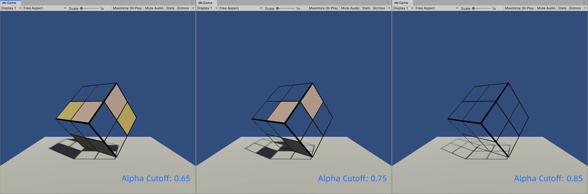

然而得到的透明效果边缘往往参差不齐有锯齿，这是因为边界处纹理的透明度变化精度问题，为了更顺滑可以用透明度混合。

*另外发现一点，在我的实践中，这个Cube是有阴影的，而作者的图片是没有阴影的。发现注释掉最后一行Fallback后，我的方块也没有了阴影，所以Cube的阴影是Fallback的这个Shader提供的。那么有个问题，Fallback不应该是当SubShader不起作用时才调用的吗？（详见本书第3章3.3.4小节）在这里我自定义的Shader生效了，调整AlphaCutoff可以得到不同的效果，Fallback也同时起作用了。*

*查阅资料发现，很多人同样有这个疑惑，我得到了这个解释：*

> 这是因为unity在表面着色器上有个机制，就是投影是单独的系统（大概是这样），如果你没有被称为"ShadowCaster" 或者"ShadowCollector"的pass，而且没有fallback那么shader将不产生阴影，所以你需要至少用Fallback进来Diffuse或者VertexLit（Diffuse实际上包含了VertexLit）来保证表面着色器能自动生成投影的pass。所以这里的Fallback并不是备胎，而是必要的保存投影的方式。当然投影的方式你也能自己写

***简而言之，当我们自己的Shader中没有阴影的实现时，会从Fallback中实现阴影***

*这一观点可参考笔记后引用部分的1/2/3条。*

## 8.4 透明度混合
要用到Unity提供的混合命令Blend：

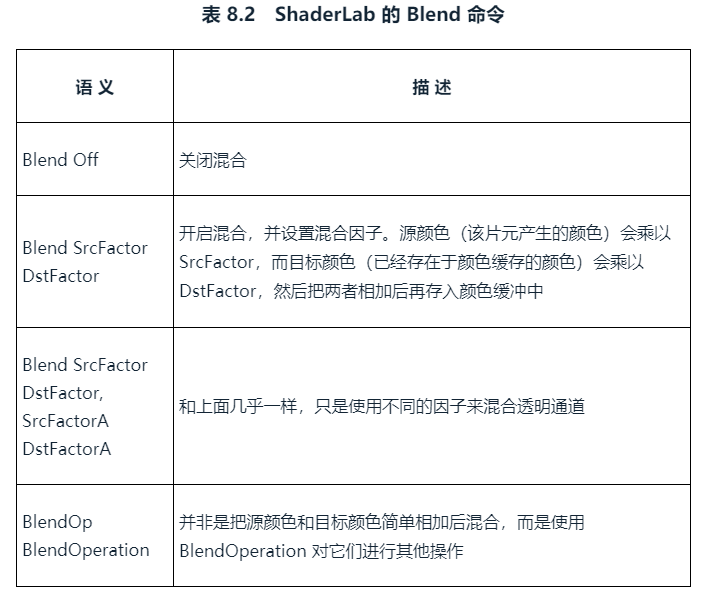

本节使用 Blend SrcFactor DstFactor 来进行混合，使用Blend命令的时候，Unity就打开了混合模式。经过混合后的新颜色是：


```
Shader "ShaderLearning/Shader8.4_AlphaBlend"{
    Properties{
        _Color("Main Tint",Color)=(1,1,1,1)
        _MainTex("Main Tex",2D)="white"{}
        _AlphaScale("Alpha Scale",Range(0,1))=1 // 用于在透明纹理的基础上控制整体的透明度
    }

    SubShader{
        // 使用Transparent队列
        // 不受投影器（Projectors）影响
        // 归入Transparent组，表示这是使用了透明度混合的Shader
        // 使用透明度混合的Shader都应在SubShader中设置这3个标签
        Tags{"Queue"="Transparent" "IgnoreProjector"="True" "RenderType"="Transparent"}

        Pass{
            Tags{"LightMode"="ForwardBase"}

            ZWrite Off // 关闭深度写入
            Blend SrcAlpha OneMinusSrcAlpha // 开启该Pass的混合模式

            CGPROGRAM

            #pragma vertex vert
            #pragma fragment frag
            #include "Lighting.cginc"

            fixed4 _Color;
            sampler2D _MainTex;
            float4 _MainTex_ST;
            fixed _AlphaScale;

            struct a2v{
                float4 vertex:POSITION;
                float3 normal:NORMAL;
                float4 texcoord:TEXCOORD0;
            };

            struct v2f{
                float4 pos:SV_POSITION;
                float3 worldNormal:TEXCOORD0;
                float3 worldPos:TEXCOORD1;
                float2 uv:TEXCOORD2;
            };

            v2f vert(a2v v){
                v2f o;
                o.pos=UnityObjectToClipPos(v.vertex);
                o.worldNormal=UnityObjectToWorldNormal(v.normal);
                o.worldPos=UnityObjectToWorldDir(v.vertex);
                o.uv=TRANSFORM_TEX(v.texcoord,_MainTex);

                return o;
            }

            // 在片元着色器进行透明度测试
            fixed4 frag(v2f i):SV_Target{
                fixed3 worldNormal=normalize(i.worldNormal);
                fixed3 worldLight=normalize(UnityWorldSpaceLightDir(i.worldPos));

                fixed4 texColor=tex2D(_MainTex,i.uv);

                fixed3 albedo=texColor.rgb*_Color.rgb;
                fixed3 ambient=UNITY_LIGHTMODEL_AMBIENT.xyz*albedo;
                fixed3 diffuse=_LightColor0.rgb*albedo*max(0,dot(worldNormal,worldLight));

                // 设置了返回值中的透明通道
                return fixed4(ambient+diffuse,texColor.a*_AlphaScale);
            }

            ENDCG
        }
    }

    Fallback "Transparent/VertexLit"
}
```

*透明度混合的关键是，在Pass的开头设置了透明度混合所需要的Tags，并开启了混合模式Blend；并在片元着色器最后的返回值的透明通道中，将整体透明度系数和贴图透明通道值相乘，作为最终颜色的透明度。*

不同AlphaScale下的半透明效果如下：

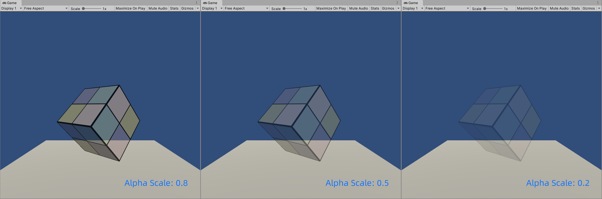

*在透明度混合中，即使设置了Fallback，也没有阴影（这个是正常现象，印象中在UE4里，半透明物体也是不投射阴影的）。*

*如果在Pass的Tags中，不进行正确的设置，会如何呢？例如把Queue设置为AlphaTest，或者把RenderType设置为TransparentCutout，结果也是能正常渲染的，效果和都设置为Transparent一致。猜测这是由于场景比较简单，只有背景、不透明平面和半透明方块，它们的渲染顺序没有变化。如果场景复杂了，可能会产生问题，总之Tags还是需要按要求设置好。*

当模型本身有复杂的遮挡关系，或是包含了复杂的非凸网格的时候，会有各种各样因为排序错误产生的错误的透明效果，这是由于无法对模型进行像素级别的深度排序造成的。下图为渲染Knot（环形节）的效果：

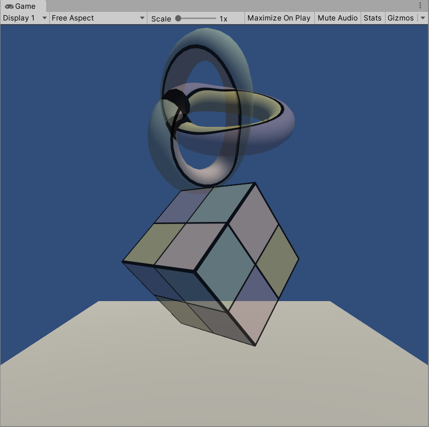

## 8.5 开启深度写入的半透明效果
为了解决由于关闭深度写入而造成的错误排序的情况，可以使用两个Pass来渲染模型：

* 第一个Pass开启深度写入，但不输出颜色，仅把该模型的深度值写入深度缓冲
* 第二个Pass进行正常的透明度混合，因为有了深度信息，就可以按照像素级别的深度排序结果进行渲染

损失了一定的性能，实现模型与后面背景的混合，但模型内部没有真正的半透明效果。

开启深度写入的Pass，只需要在原来使用的Pass前面增加一个新的Pass。

```
 Tags{"Queue"="Transparent" "IgnoreProjector"="True" "RenderType"="Transparent"}

// Extra pass that renders to depth buffer only
Pass{
    ZWrite On
    ColorMask 0 // 该Pass不写入任何颜色通道，即不输出任何颜色
}

Pass{
    // ...透明度混合
}
```

渲染Knot的结果如下，会被自身片元遮挡的，但看起来还是不够真实...

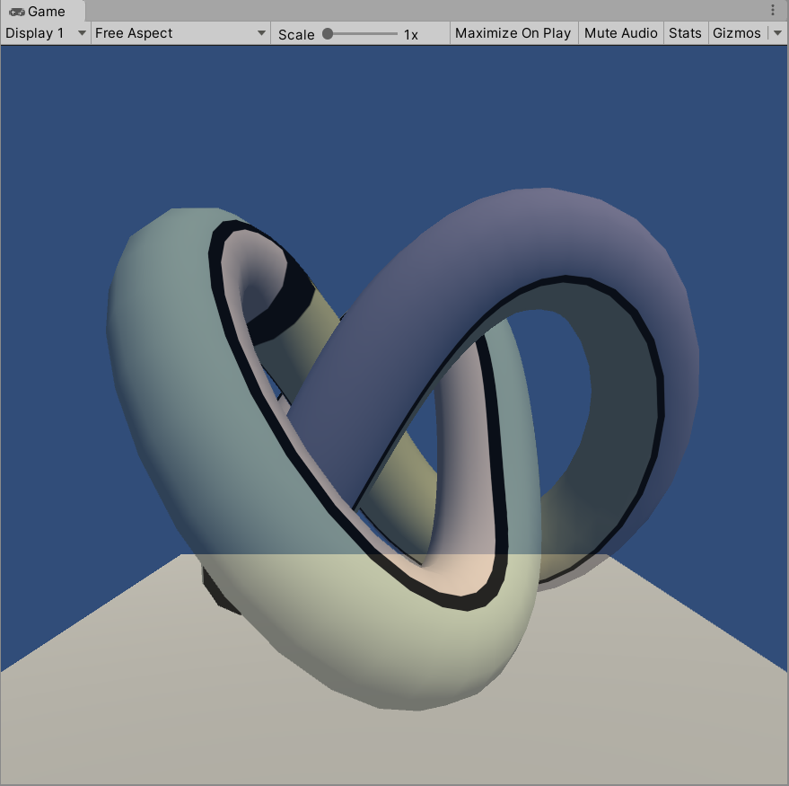

## 8.6 ShaderLab的混合命令
混合还有很多其他用处，不仅仅用于透明度混合。

混合的实现：**源颜色（source color）**和**目标颜色（destination color）**。

* 源颜色S：由片元着色器产生的颜色
* 目标颜色D：从颜色缓冲中读取到的颜色值
* 输出颜色O：混合后的颜色，重新写入颜色缓冲

### 8.6.1 混合等式和参数
**混合等式（blend equation）**：已知S和D，得到O的等式。

混合是一个逐片元的操作，不可编程，但高度可配置。可以设置混合时使用的运算操作、混合因子，需要两个等式分别用于RGB和A。

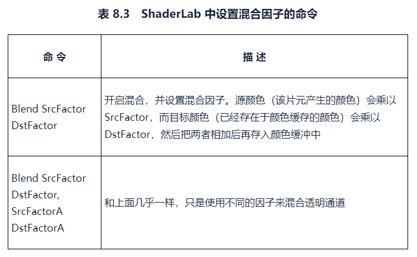

第一个命令使用同样的因子来混合RGB通道和A通道。使用这些因子进行加法混合时使用的混合等式：

* Orgb=SrcFactor*Srgb+DstFactor*Drgb
* Oa=SrcFactor*Sa+DstFactor*Da

ShaderLab支持的混合因子如下：

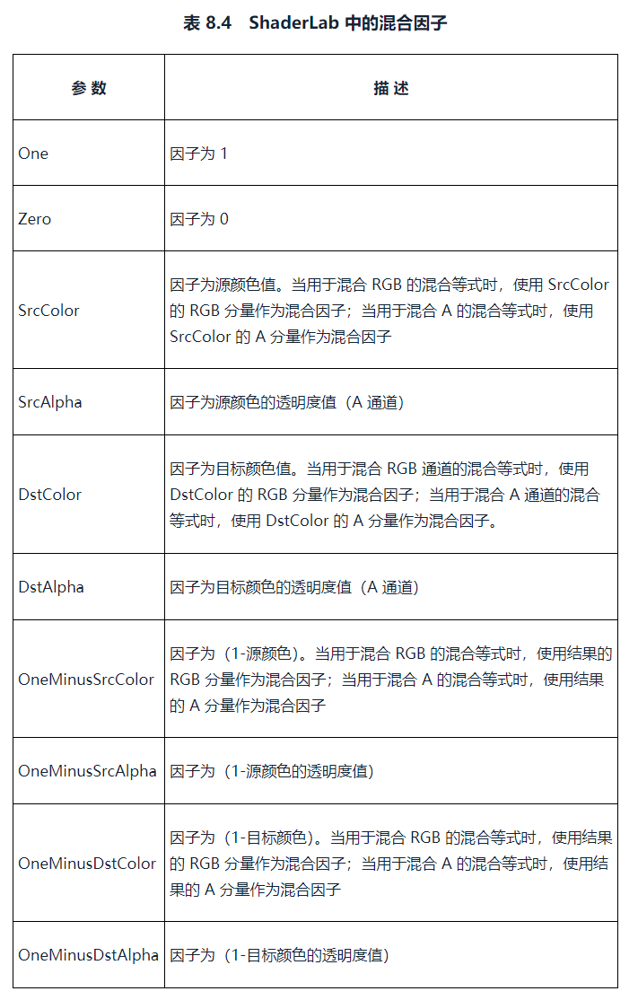

使用不同参数混合A通道的命令如下：

```
Blend SrcAlpha OneMinusSrcAlpha, One Zero
```

### 8.6.2 混合操作
以上的混合等式默认是使用加法，使用ShaderLab的混合操作命令**BlendOp BlendOperation**，可以进行更改例如减法：

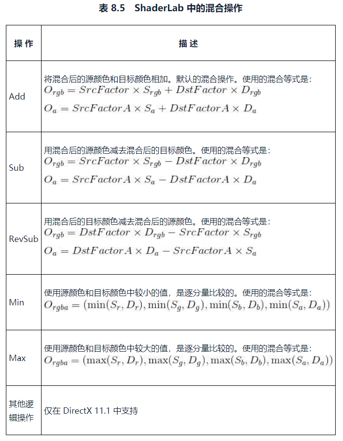

### 8.6.3 常见的混合类型
通过混合操作和混合因子命令的组合，可以得到类似Photoshop混合模式中的混合效果：

```
// 正常（Normal），即透明度混合
Blend SrcAlpha OneMinusSrcAlpha

// 柔和相加（Soft Additive）
Blend OneMinusDstColor One

// 正片叠底（Multiply），即相乘
Blend DstColor Zero

// 两倍相乘（2x Multiply）
Blend DstColor SrcColor

// 变暗（Darken）
BlendOp Min
Blend One One

// 变亮（Lighten）
BlendOp Max
Blend One One

// 滤色（Screen）
Blend OneMinusDstColor One
// 等同于
Blend One OneMinusSrcColor

// 线性减淡（Linear Dodge）
Blend One One
```

*分析一下以上混合模式的公式，S源颜色、D颜色缓冲中的颜色（认为是后面物体的颜色吧）、O输出：*

* 正常：O=SxSa+Dx(1-Sa)
* 柔和相加：O=Sx(1-Drgba)+D
* 正片叠底：O=SxDrgba=(SrxDr,SgxDg,SbxDb,SaxDa)
* 两倍相乘：O=SxDrgba+DxSrgba=(SrxDr+DrxSr,SgxDg+DgxSg,SbxDb+DbxSb,SaxDa+DaxSa)=2(SrxDr,SgxDg,SbxDb,SaxDa)
* 变暗：O=Min(S,D)
* 变亮：O=Max(S,D)
* 滤色：O=Sx(1-Drgba)+D，同柔和相加？
* 线性减淡：O=S+D

*为了验证混合模式，新建场景放置Cube在(-0.25,1,0)，放置Cylinder在(0.25,1,-2)，使圆柱遮挡方块方块。*

*方块使用Shader5.2_SimpleShader，将片元着色器输出的颜色值改为固定的(0.0,1.0,0.0,1.0)，即不透明绿色(0,255,0,255)，方块在屏幕上的颜色也是(0,255,0,255)。*

*圆柱使用Shader8.6_BlendOperation，将片元着色器输出的颜色改为fixed4(_Color.rgb,texColor.ax_AlphaScale)，不受环境光和漫反射影响。MainTint使用红色(255,0,0,255)，AlphaScale设置为0.4，最终圆柱片元着色器输出颜色应该为(255,0,0,102)，圆柱在屏幕上的颜色应该是(255,0,0,102)x0.4=(102,0,0,41)。相机位置在(0,1,-10)，设置为正交投影，Size1.3，挂上脚本ColorPicker用于直观查看色值。相机背景颜色设置为纯黑(0,0,0,0)，方便计算。*

*那么各混合模式圆柱和重叠部分的在屏幕上的色值应该如下：*

* 正常：(255,0,0,102)x0.4=(102,0,0,41),(255,0,0,102)x0.4+(0,255,0,255)x0.6=(102,153,0,194)
* 柔和相加：(255,0,0,102)x1=(255,0,0,102),(255x1+0,0+255x1,0,102x0+255x1)=(255,255,0,255)
* 正片叠底：(255x0,0x0,0x0,102x0)=(0,0,0,0),(255x0,0x1,0x0,102x1)=(0,0,0,102)
* 两倍相乘：(0,0,0,0)x2=(0,0,0,0),(0,0,0,102)x2=(0,0,0,204)
* 变暗：(0,0,0,0),(0,0,0,102)
* 变亮：(255,0,0,102),(255,255,0,255)
* 滤色：同柔和相加
* 线性减淡：(255,0,0,102),(255,255,0,102+255)=(255,255,0,255)

*结果如下，有很多重复了，不是很有代表性...*

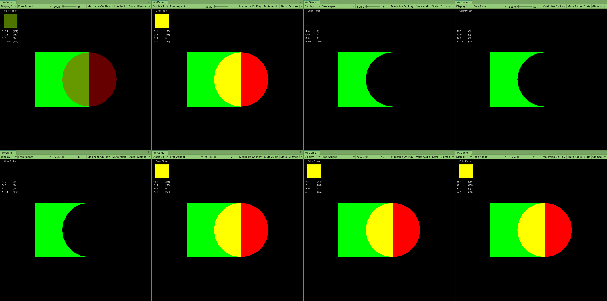

## 8.7 双面渲染的透明效果
之前无论是透明度测试还是透明度混合，都无法观测到正方体内部和背面的形状。这是因为默认下渲染引擎剔除了物体背面（相对于相机的方向），只渲染了正面。可以使用Cull指令来控制需要剔除哪个面，语法如下：

```
Cull Back|Front|Off
```

### 8.7.1 透明度测试的双面渲染
只需要在Pass的渲染设置中使用Cull指令来关闭剔除：

```
Pass{
    Tags{"LightMode"="ForwardBase"}

    // Turn off culling
    Cull Off

    CGPROGRAM
    ...
```

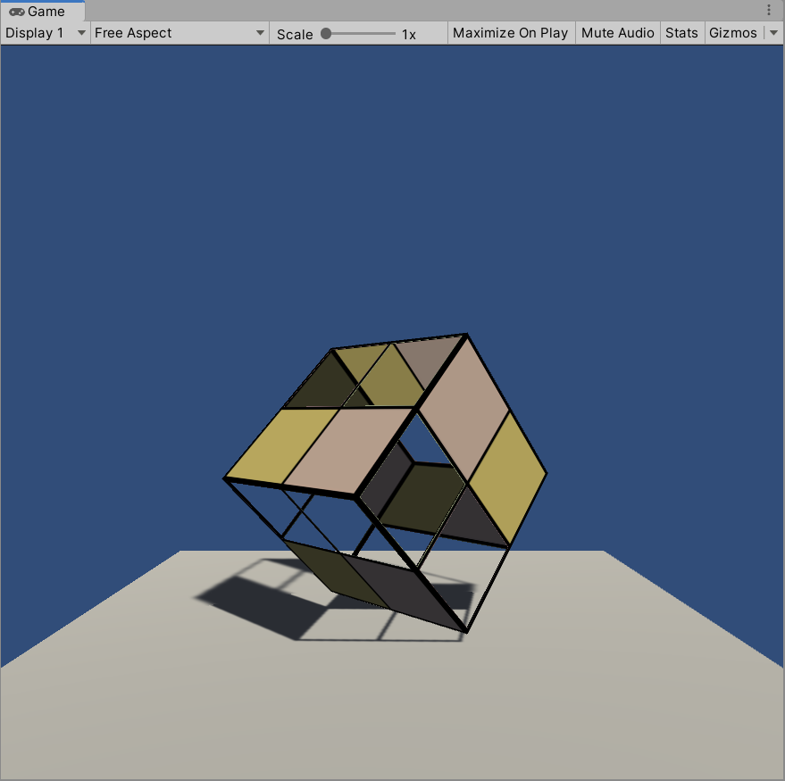

### 8.7.2 透明度混合的双面渲染
因为透明度混合需要关闭深度写入，所以不能直接关闭剔除功能，这样无法保证同一物体的正面和背面图元的渲染顺序。

为此我们把双面渲染的工作分成两个Pass——第一个Pass只渲染背面，第二个Pass只渲染正面。

将透明度混合的Pass复制一个，在两个Pass中分别使用Cull指令剔除不同朝向的渲染图元：

```
Pass{
    Tags{"LightMode"="ForwardBase"}

    // First pass renders only back faces
    Cull Front
    ...
}

Pass{
    Tags{"LightMode"="ForwardBase"}

    // Second pass renders only front faces
    Cull Back
    ...
}
```

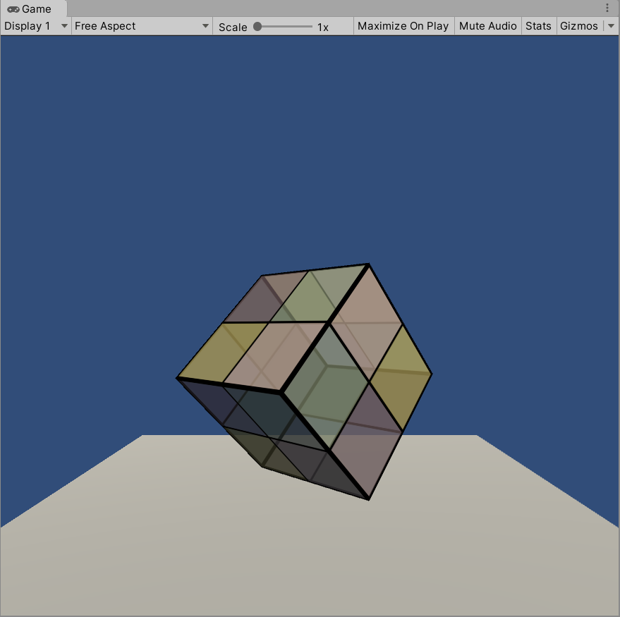

# 999. 引用
1. unity关于shader投影 Fallback实际上并不是备胎：https://www.it610.com/article/5036292.htm
2. ShaderLab：Fallback：https://docs.unity3d.com/cn/2019.4/Manual/SL-Fallback.html
3. Fallback Off turns off shadows in surface shader：https://forum.unity.com/threads/fallback-off-turns-off-shadows-in-surface-shader.257430/