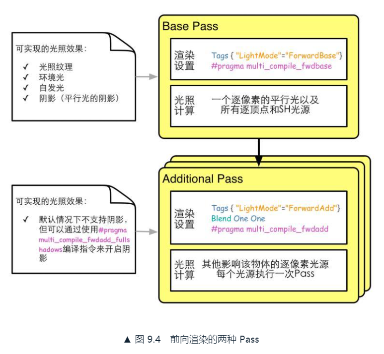
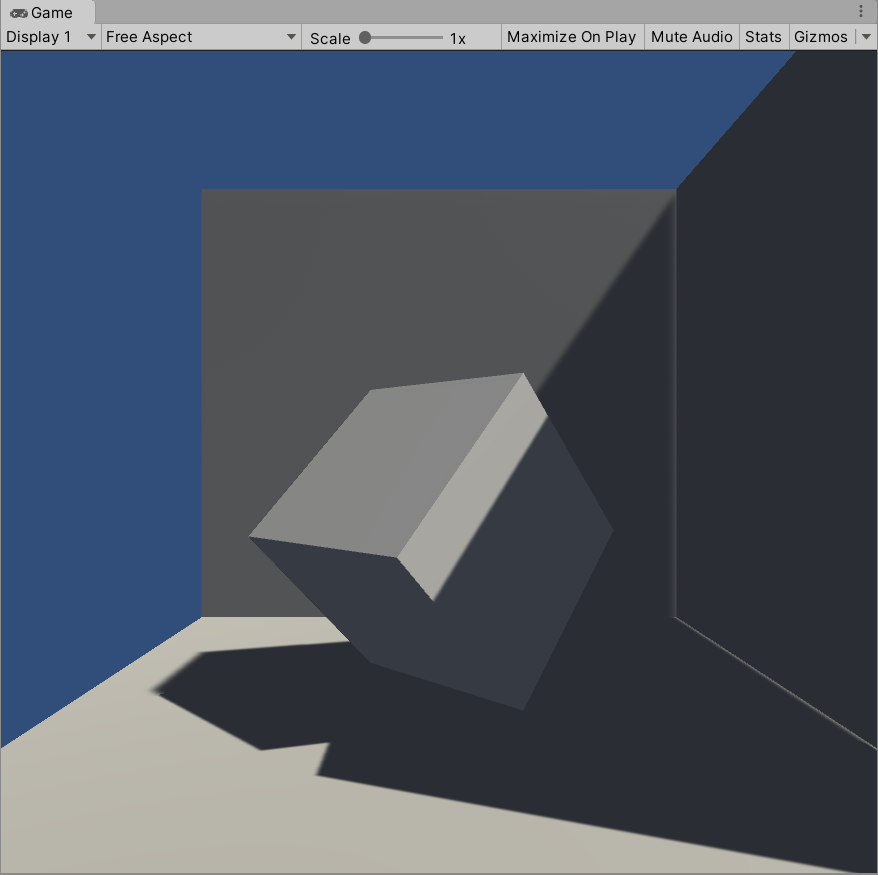

# 第3篇 中级篇
中级篇是本书的进阶篇，将讲解Unity中的渲染路径、如何计算光照衰减和阴影、如何使用高级纹理和动画等一系列的进阶内容。

* 第9章 更复杂的光照
* 第10章 高级纹理
* 第11章 让画面动起来

# 9. 更复杂的光照
不光是处理单个平行光，还需要处理数目更多、类型更复杂的光源，得到阴影。

## 9.1 Unity的渲染路径
**渲染路径（Rendering Path）** 决定了光照是如何应用到UnityShader中的。要为每个Pass指定它使用的渲染路径，该Shader的光照计算才能被正确执行。

在Unity5.0之前，有3中渲染路径（*现在也基本是*）：

* **前向渲染路径（Forward Rendering Path）**
* **延迟渲染路径（Deferred Rendering Path）**
* **顶点照明渲染路径（Vertex Lit Rendering Path）**

这样设置默认的渲染路径：Edit->Project Settings->Player->Other Settings->Rendering Path（在Unity2019中，Edit->Graphics->Tier Settings->...->Rendering Path），或者在Camera中设置来覆盖默认渲染路径。


完成设置后，就可以在每个Pass中使用标签来指定该Pass使用的渲染路径：


### 9.1.1 前向渲染路径
传统的渲染方式，最常用的渲染路径。

#### 1. 前向渲染路径的原理
渲染该对象的渲染图元，并计算颜色缓冲区和深度缓冲区的信息。大致过程：

```
Pass{
    for(each primitive in this model){
        for(each fragment covered by this primitive){
            if(failed in depth test){
                // 如果没有通过深度测试，说明该片元是不可见的
                discard;
            }else{
                // 如果该片元可见，就进行光照计算
                float4 color=Shading(materialInfo,pos,normal,lightDir,viewDir);
                // 更新帧缓冲
                writeFrameBuffer(fragment,color);
            }
        }
    }
}
```

对每个逐像素光源，都需要进行上面一次完整的渲染流程。假设场景中有N个物体，每个物体受M个光源的影响，一个需要N*M个Pass。

#### 2. Unity中的前向渲染
在Unity中前向渲染路径有3种处理光照（照亮物体）的方式：

* **逐顶点处理**
* **逐像素处理**
* **球谐函数处理（Spherical Harmonics, SH）**

决定一个光源使用哪种处理模式，取决于它的类型和渲染模式。渲染模式指光源是否是**重要的（Important）**，如果是重要的，就会进行逐像素光源处理。

在光源的Light组件中设置类型和渲染模式：


前向渲染中，Unity会根据场景中各个光源的设置以及这些光源对物体的影响程度（例如，距离物体的远近、光源强度等）对这些光源进行重要度排序。其中一定数目的光源按逐像素处理，最多4个光源按逐顶点处理，剩下的可以按SH处理。规则如下：

* 场景中最亮的平行光总是按逐像素处理
* 渲染模式被设置成NotImportant的光源，逐顶点或SH
* 渲染模式被设置成Important的光源，逐像素
* 如果根据以上规则得到的逐像素光源数量小于QualitySetting中的逐像素光源数量（Pixel Light Count），会有更多的光源逐像素处理

*QualitySetting中的逐像素光源数量设置：*


BasePass和AdditionalPass两种前向渲染：



补充说明：

* #pragma multi_compile_fwdbase和#pargma multi_compile_fwdadd。使用了这两个编译指令，才可以在相关Pass中得到正确的光照变量，如光照衰减值
* BasePass旁边的注释给出一些支持的光照特性
* BasePass中渲染的平行光默认是支持阴影的，AdditionalPass中默认是没阴影的
* 环境光和自发光也是在BasePass中计算的，不在AdditionalPass中计算是为了防止叠加多次环境光和自发光
* AdditionalPass开启和设置了混合模式，最终得到多个光照的渲染结果
* 对前向渲染，一个UnityShader通常定义一个BasePass和一个AdditionalPass。前者仅执行一次（双面渲染等多个情况除外），后者会根据影响该物体的其他逐像素光源数目被多次调用

#### 3. 内置的光照变量和函数
对于前向渲染（**LightMode**为**ForwardBase**或**ForwardAdd**），可以在Shader中访问到的光照变量：


前向渲染中可以使用的内置光照函数：


### 9.1.2 顶点照明渲染路径
对硬件配置要求最少、运算性能最高，但同时也是效果最差的类型，不支持那些逐像素才能得到的效果，例如阴影、法线映射、高精度的高光反射等。

#### 1. Unity中的顶点照明渲染
通常在一个Pass就可以完成。这是Unity中最快速的渲染路径，并具有广泛的硬件支持（游戏机上不支持）。

因为顶点照明渲染路径仅仅是前向渲染路径的一个子集，因此在Unity5中作为一个遗留的渲染路径，未来可能会移除（*都Unity2019了还在*）。

#### 2. 可访问的内置变量和函数
一个顶点照明的Pass最多访问到8个逐顶点光源。顶点照明渲染路径中可以使用的内置变量：


顶点照明渲染路径中可以使用的内置函数：


### 9.1.3 延迟渲染路径
前向渲染的问题是，场景中有大量的实时光源时，性能会急速下降。

延迟渲染是一种更古老的渲染方法，由于前向渲染可能的瓶颈问题，近几年又流行起来。除了颜色缓冲和深度缓冲，延迟渲染会利用额外的缓冲区，统称为**G缓冲（G-buffer）**，G是Geometry的缩写。G-buffer存储了我们所关心的表面（通常指的是离相机最近的表面）的其他信息，如表面法线、位置、用于光照计算的材质属性等。

#### 1. 延迟渲染的原理
主要包含了两个Pass：

* 第一个Pass。不进行任何光照计算，仅通过深度缓冲技术，计算哪些片元是可见的。如果可见，就把它的相关信息存储到G缓冲。
* 第二个Pass。利用G缓冲的各个片元信息，例如表面法线、视角方向、漫反射系数等，进行真正的光照计算。

大致过程：

```
Pass1{
    // 第一个Pass不进行真正的光照计算
    // 仅仅把光照计算需要的信息存储到G缓冲中
    for(each primitive in this model){
        for(each fragment covered by this primitive){
            // 如果没有通过深度测试，说明该片元不可见
            discard;
        }else{
            // 如果该片元可见，就把需要的信息存储到G缓冲中
            writeGBuffer(materialInfo,pos,normal);
        }
    }
}

Pass2{
    // 利用G缓冲中的信息进行真正的光照计算
    for(each pixel in the screen){
        if(the pixel is valid){
            // 如果该像素的有效的，读取它对应的G缓冲中的信息
            readGBuffer(pixel,materialInfo,pos,normal);

            // 根据读取到的信息进行光照计算
            float4 color=Shading(materialInfo,pos,normal,lightDir,viewDir);
            // 更新帧缓冲
            writeFrameBuffer(pixel,color);
        }
    }
}
```

延迟渲染使用的Pass数目通常就是两个，和场景中包含的光源数目没有关系，只和我们使用的屏幕空间大小有关。

#### 2. Unity中的延迟渲染
有两种，Unity5之前遗留的和Unity5.x中使用的，差别很小。遗留的不支持Unity5基于物理的StandardShader，以下仅讨论Unity5后使用的延迟渲染路径。

延迟渲染路径适合在场景光源数目很多，如果使用前向渲染会造成性能瓶颈的情况下使用。每个光源都可以按逐像素处理。有一些缺点：

* 不支持真正的抗锯齿（anti-aliasing）功能
* 不能处理半透明物体
* 对显卡有一定要求。显卡必须支持MRT（Multiple Render Targets）、ShaderMode3.0及以上、深度渲染纹理以及双面的模板缓冲

使用延迟渲染时，Unity要求我们提供两个Pass：

* 第一个用于渲染G缓冲。把物体的漫反射颜色、高光反射颜色、平滑度、法线、自发光、深度等信息渲染到屏幕空间的G缓冲中，每个物体这个Pass执行一次
* 第二个用于计算真正的光照模型。用上个Pass中渲染的数据来计算最终的光照颜色，在存储到帧缓冲中

默认的G缓冲区包含了以下几个渲染纹理（Render Texture, RT）：

* RT0:格式是ARGB32，RGB通道存储漫反射颜色，A通道没有使用
* RT1：格式是ARGB32，RGB通道存储高光反射颜色，A通道存储高光反射指数部分
* RT2：格式是ARGB2101010，RGB通道存储法线，A通道没有使用
* RT3：格式是ARGB32（非HDR）或ARGBHalf（HDR），用于存储自发光+lightmap+反射探针（reflection probes）
* 深度缓冲和模板缓冲

第二个Pass中计算光照时，默认情况下仅可以使用Unity内置的Standard光照类型。如果要使用其他的光照模型，需要替换原有的Internal-DefferredShading.shader文件。

#### 3. 可访问的内置变量和函数
这些变量可以在UnityDefferredLibrary.cginc中找到它们的声明：


### 9.1.4 选择那种渲染路径
参考官方文档，给出了4种渲染路径的详细比较（前向渲染、延迟渲染、遗留的延迟渲染、顶点照明）：


总体来说要根据游戏发布的目标平台来渲染渲染路径，如果当前显卡不支持所选的，会自动使用低一级的。

在本书中主要使用Unity的前向渲染路径。

## 9.2 Unity的光源类型
Unity一共支持4种光源类型：**平行光、点光源（point light）、聚光灯（spot light）和面光源（area light）**。面光源仅在烘焙时才可发挥作用，本节讨论点光源和聚光灯。

### 9.2.1 光源类型有什么影响
最常用的光源属性有5个：**光源的位置、方向**（到某点的方向）**、颜色、强度以及衰减**（到某点的衰减，与该点到光源的距离有关）。

#### 1. 平行光
作为太阳光，位置任意，几何属性只有方向，不会衰减。


#### 2. 点光源
照亮空间有限，由空间中的一个球体定义，表示由一个点发出的、向所有方向延申的光。

有范围，有位置，会衰减。


#### 3. 聚光灯
照亮空间有限，由空间中一块锥形区域定义，表示由一个特定位置出发、向特定方向延申的光。

有范围，有位置，会衰减。


*点光源和聚光灯都有个警告：Realtime and indirect bounce shadowing is not supported for Spot and Point lights。意思是不支持实时间接反弹阴影。查资料说是“这意味着由点光源创建的光线将继续穿过物体并在另一侧反射，除非被范围衰减。这可能会导致墙壁和地板发出“漏光”，因此灯必须小心放置以避免出现此类问题。然而，这在使用烘焙GI时不是问题。”如下将一块平面挡住另一块平面，聚光灯穿透上面的平面，继续照到下方了：*


*这个可能和光源模式也有关系，如果将聚光灯的Mode从Realtime改为Baked，就没有这个警告。如果将IndirectMultiplier间接系数改为0，也没有这个提示了，从字面意思看就是不使用这个光源进行间接反射阴影了。*

*Unity光源的Mode属性中Realtime/Mixed/Baked（实时/混合/烘焙），可能分别对应UE4中的Movable/Stationary/Static（可移动/固定/静态）。这里先不讨论这个问题了。*

### 9.2.2 在前向渲染中处理不同的光源类型
本小节看如何使用前向渲染路径，在UnityShader中访问这3种光源的5个属性：**位置、方向、颜色、强度、衰减**。

#### 1. 实践
使用Blinn-Phong光照模型，用BasePass和AdditionalPass来处理多个光源。

BasePass处理最重要的平行光。#pragma要加上#pragma multi_compile_fwdbase。片元着色器中，使用_WorldSpaceLightPos0得到最亮的平行光的方向，使用_LightColor0得到它的颜色和强度，衰减值为1.0没有衰减。

```
// Base Pass
Pass{
    // Pass for ambient light & first pixel light (directional light)
    Tags{"LightMode"="ForwardBase"}

    CGPROGRAM

    // Apparently need to add this declaration
    #pragma multi_compile_fwdbase

    #pragma vertex vert
    #pragma fragment frag
    #include "Lighting.cginc"

    ...

    fixed4 frag(v2f i):SV_Target{
        // Get ambient term
        // 首先计算场景中的环境光
        fixed3 ambient=UNITY_LIGHTMODEL_AMBIENT.xyz;

        fixed3 worldNormal=normalize(i.worldNormal);
        // 使用_WorldSpaceLightPos0得到最亮平行光的方向（位置对平行光没有意义）
        fixed3 worldLight=normalize(_WorldSpaceLightPos0.xyz);

        fixed3 viewDir=normalize(_WorldSpaceCameraPos.xyz-i.worldPos.xyz);
        fixed3 halfDir=normalize(worldLight+viewDir);

        // Compute diffuse term
        // 使用_LightColor0得到最亮平行光的颜色和强度
        // _LightColor0已经是颜色和强度相乘后的结果
        fixed3 diffuse=_LightColor0.rgb*_Diffuse.rgb*max(0,dot(worldNormal,worldLight));

        // Compute specular term
        fixed3 specular=_LightColor0.rgb*_Specular.rgb*pow(max(0,dot(worldNormal,halfDir)),_Gloss);

        // The attenuation of directional light is always 1
        // 平行光没有衰减，令衰减值为1.0
        fixed atten=1.0;

        return fixed4(ambient+(diffuse+specular)*atten,1.0);
    }

    ENDCG
}
```

AdditionalPass处理其他逐像素光源。光照模式使用ForwardAdd，设置混合模式，然后要加上#pragma multi_compile_fwdadd。在片元着色器中，用#ifdef/#else/#endif来判断光源类型，不同光源方向和衰减有区别。

```
// Additional Pass
Pass{
    // Pass for other pixel lights
    Tags{"LightMode"="ForwardAdd"}

    Blend One One

    CGPROGRAM

    // Apparently need to add this declaration
    #pragma multi_compile_fwdadd

    #pragma vertex vert
    #pragma fragment frag
    #include "Lighting.cginc"
    // 为了使用unity_WorldToLight（_LightMatrix0）
    #include "AutoLight.cginc" 

    ...

    fixed4 frag(v2f i):SV_Target{
        fixed3 worldNormal=normalize(i.worldNormal);

        // 不同光源的光线方向
        #ifdef USING_DIRECTIONAL_LIGHT
            // 如果是平行光，光线方向
            fixed3 worldLight=normalize(_WorldSpaceLightPos0.xyz);
        #else
            // 如果不是平行光，光线方向
            fixed3 worldLight=normalize(_WorldSpaceLightPos0.xyz-i.worldPos.xyz);
        #endif

        fixed3 viewDir=normalize(_WorldSpaceCameraPos.xyz-i.worldPos.xyz);
        fixed3 halfDir=normalize(worldLight+viewDir);

        // Compute diffuse term
        fixed3 diffuse=_LightColor0.rgb*_Diffuse.rgb*max(0,dot(worldNormal,worldLight));

        // Compute specular term
        fixed3 specular=_LightColor0.rgb*_Specular.rgb*pow(max(0,dot(worldNormal,halfDir)),_Gloss);

        // 不同光源的衰减
        #ifdef USING_DIRECTIONAL_LIGHT
            // 平行光没有衰减
            fixed atten=1.0;
        #else
            float3 lightCoord=mul(unity_WorldToLight,float4(i.worldPos,1)).xyz;
            fixed atten=tex2D(_LightTexture0,dot(lightCoord,lightCoord).rr).UNITY_ATTEN_CHANNEL;
        #endif

        // AdditionalPass中，不计算环境光
        return fixed4((diffuse+specular)*atten,1.0);
    }

    ENDCG
}
```

*这里补充说明，在AdditionalPass中，作者计算atten时，使用了内置矩阵_LightMatrix0，因为版本问题Unity2019将它自动修改成了unity_WorldToLight。这个是从世界空间到光照空间的变换矩阵，用于将世界空间中的物体坐标，转到光照空间通过_LightTexture0采样获取衰减值。*

*另外，需要在AdditionalPass中加上#include "AutoLight.cginc"，否则获取不到unity_WorldToLight。*

运行结果如下，场景中放置了一个直线光和一个点光源，点光源是绿色的：


#### 2. 实验：Base Pass 和 Additional Pass 的调用
***首先说明一个很重要的问题，顶点着色器中作者计算顶点的世界坐标，使用的是o.worldPos=mul(unity_ObjectToWorld,v.vertex).xyz。而我自作聪明，使用了内置函数改为了o.worldPos=UnityObjectToWorldDir(v.vertex)，这个是错误的。***

*在观察点光源的光照效果时，发现点光源虽然离物体很近，但依然不够亮。即使把Intensity调很高，也不够亮。更离谱的是，能从前面看到物体后方点光源的效果！如下图：*


*这个感觉就是虽然我把胶囊体放在了(0,1,-8)，但计算光照是按照(0,0,0)。原因是UnityObjectToWorldDir用于把模型空间下的矢量转换到世界空间，最终得到的也只是方向矢量；而使用unity_ObjectToWorld，才是把物体的顶点坐标从模型空间转换到了世界空间。*

*将顶点着色器改为：*

```
v2f vert(a2v v){
    v2f o;
    o.pos=UnityObjectToClipPos(v.vertex);
    o.worldNormal=UnityObjectToWorldNormal(v.normal);
    // o.worldPos=UnityObjectToWorldDir(v.vertex);
    o.worldPos=mul(unity_ObjectToWorld,v.vertex).xyz;
    return o;
}
```

*现在的点光源符合我的认知了，点光源位置和物体位置和最终的光照结果正确：*


将直线光调到红色。调整点光源强度、范围，使它们保持一致。移动点光源，呈现以下效果：


默认情况下光源的**Render Mode**是**Auto**，在此场景中一共5个光源，1个是平行光在BasePass中被处理，其余4个点光源在AdditionalPass中被处理，默认情况下一个物体可以接受除最亮的平行光以外的4个逐像素光照。

开启帧调试器（Frame Debugger），Window->Analysis->FrameDebugger（Unity5是Widow->FrameDebugger）。可以看到前向渲染的绘制过程：


Unity处理这些点光源的顺序是按照重要度排序的，在这里因为所有点光源颜色和强度都相同，因此它们的重要度取决于它们距离胶囊体的远近。官方文档没有给出光源强度、颜色、距离物体的远近是如何影响重要度的，只知道有关系。

## 9.3 Unity的光照衰减
Unity使用一张纹理作为查找表来在片元着色器中计算逐像素光照的衰减，好处是不依赖数学公式，弊端如下：

* 需要预处理得到采样纹理，纹理大小也会影响衰减的精度
* 不直观也不方便，一旦存储到查找表，就无法使用其他数学公式来计算衰减

Unity默认还是用纹理查找的方式计算逐像素的点光源和聚光灯的衰减。

### 9.3.1 用于光照衰减的纹理
Unity内部使用一张名为_LightTexture0的纹理来计算光源衰减。(0,0)表示与光源位置重合的点的衰减值，(1,1)表示在光源空间中所关心的距离最远的点的衰减。

为了对_LightTexture0纹理采样得到指定点到该光源的衰减值，首先要得到该点到光源空间中的位置，通过_LightMatrix0变换矩阵得到：

```
float3 lightCoord=mul(_LightMatrix0,float4(i.worldPosition,1)).xyz;
```

然后可以使用这个坐标的模的平方对衰减纹理进行采样：

```
fixed atten=tex2D(_LightTexture0,dot(lightCoord,LightCoord).rr).UNITY_ATTEN_CHANNEL;
```

*以上代码中.rr是啥呢？首先是由点积得到光源的距离平方，这是一个标量，我们对这个变量进行.rr操作相当于构建了一个二维矢量，这个二维矢量每个分量的值都是这个标量值，由此得到一个二维采样坐标。这个操作是shader中常见的swizzling操作，Cg的官网上也有说明。*

### 9.3.2 使用数学公式计算衰减
有时候希望可以在代码中利用公式来计算光源的衰减，如下：

```
float distance=length(_WorldSpaceLightPos0.xyz-i.worldPosition.xyz);
fixed atten=1.0/distance; // linear attenuation
```

因为无法在Shader通过内置变量得到光源的范围、聚光灯的朝向、张开角度等信息，效果不尽人意。灵活度低。

## 9.4 Unity的阴影
### 9.4.1 阴影是如何实现的
实时渲染中，最常用的技术是**Shadow Map**。原理是它会首先把相机位置放在与光源重合的位置上，那么场景中该光源的阴影区域就是那些相机看不到的地方。

在前向渲染路径中，如果场景中最重要的平行光开启了阴影，Unity就会为该光源计算它的阴影映射纹理ShadowMap，本质是一张深度图。

Unity使用一个额外的LightMode标签被设置为ShadowCaster的Pass来更新光源的阴影映射纹理，这个Pass的渲染目标不是帧缓存，而是ShadowMap。如果没有，就会在Fallback指定的UnityShader中寻找。

在传统的阴影映射纹理实现中，会在正常渲染的Pass中把顶点位置变换到光源空间下，然后使用xy分量对ShadowMap进行采样得到深度值，判断是否处于阴影中。

Unity5中，使用了**屏幕空间的阴影映射技术（Screenspace Shadow Map）**。首先通过调用LightMode为ShadowCaster的Pass得到ShadowMap和相机深度纹理；然后据此得到屏幕空间的阴影图；如果相机的深度图中记录的表面深度大于转换到ShadowMap中的深度值，说明表面可见但在阴影中。如果想要一个物体接受来自其他物体的阴影，只需要在Shader中对阴影图采样。

总结，一个物体接受阴影，以及向其他物体投射阴影是两个过程：

* 接受阴影。在Shader中对ShadowMap进行采样，把采样结果和最后的光照结果相乘
* 投射阴影。必须把该物体加入到光源的ShadowMap计算中。

### 9.4.2 不透明物体的阴影
#### 1. 让物体投射阴影
先把正方体和两个平面的**CastShadows**和**ReceiveShadows**都设为开启状态，如下效果：


为什么Mat9.4_Shadow使用的Shader9.2_ForwardRendering中只有BasePass和AdditionalPass，没有LightMode为ShadowCaster的Pass，正方体也能投射阴影呢？因为Fallback使用了Specular，而Specular的Fallback调用了VertexLit，这里进行了渲染ShadowMap和深度图的工作。Unity2019的内置着色器（builtin_shaders-2019.4.18f1\DefaultResourcesExtra\Normal-VertexLit.shader）：

```
// Pass to render object as a shadow caster
Pass {
    Name "ShadowCaster"
    Tags { "LightMode" = "ShadowCaster" }

    CGPROGRAM
    #pragma vertex vert
    #pragma fragment frag
    #pragma target 2.0
    #pragma multi_compile_shadowcaster
    #pragma multi_compile_instancing // allow instanced shadow pass for most of the shaders
    #include "UnityCG.cginc"

    struct v2f {
        V2F_SHADOW_CASTER;
        UNITY_VERTEX_OUTPUT_STEREO
    };

    v2f vert( appdata_base v )
    {
        v2f o;
        UNITY_SETUP_INSTANCE_ID(v);
        UNITY_INITIALIZE_VERTEX_OUTPUT_STEREO(o);
        TRANSFER_SHADOW_CASTER_NORMALOFFSET(o)
        return o;
    }

    float4 frag( v2f i ) : SV_Target
    {
        SHADOW_CASTER_FRAGMENT(i)
    }
    ENDCG

}
```

右边的平面默认是不会从背面朝正面投影的，需要将**CastShadows**从**On**设置为**TwoSided**。


下面的平面接收了阴影，是因为用了内置的StandardShader，而正方体使用的Chapter9.2_ForwardRendering没有对阴影进行处理，不接收阴影。

#### 2. 让物体接收阴影
基于9.2节的Shader9.2_ForwardRendering，新建Shader9.4_Shadow。

先在BasePass中包含一个新的内置文件：

```
#include "AutoLight.cginc" // 下面计算阴影时所用的宏是在这个文件中声明的
```

在顶点着色器的输出结构体v2f中添加内置宏**SHADOW_COORDS**：

```
struct v2f{
    float4 pos:SV_POSITION;
    float3 worldNormal:TEXCOORD0;
    float3 worldPos:TEXCOORD1;

    // 声明一个用于对阴影纹理采样的坐标
    // 参数是下一个可用的插值寄存器的索引值，2
    SHADOW_COORDS(2)
};
```

在顶点着色器返回之前添加内置宏**TRANSFER_SHADOW**：

```
vf vert(a2v v{
    v2f o;
    ...
    // Pass shadow coordinates to pixel shader
    // 用于在顶点着色器中计算上一步中声明的阴影纹理坐标
    TRANSFER_SHADOW(o);

    return o;
})
```

在片元着色器中计算阴影，使用了内置宏**SHADOW_ATTENUATION**：

```
// Use shadow coordinates to sample shadow map
fixed shadow=SHADOW_ATTENUATION(i);
```

最后在片元着色器中，把阴影值shadow和漫反射以及高光反射颜色相乘：

```
return fixed4(ambient+(diffuse+specular)*atten*shadow,1.0);
```

运行结果如下，正方体可以接收来自右侧平面的阴影了：



**SHADOW_COORDS、TRANSFER_SHADOW、SHADOW_ATTENUATION**是计算阴影的“三剑客”，可以在AutoLight.cginc中找到他们的声明（略）。

### 9.4.3 使用帧调试器查看阴影绘制过程
打开FrameDebug，渲染事件可以分为4个部分：

* UpdateDepthTexture：更新相机深度纹理
* RenderShadowmap：渲染得到的平行光阴影映射纹理
* CollectShadows：根据深度纹理和阴影映射纹理得到屏幕空间的阴影图
* 最后绘制渲染结果

*版本不同，渲染事件好像不一样，看不懂，先跳过（？）：*


### 9.4.4 统一管理光照衰减和纹理
实际上，光照衰减和阴影对物体最终渲染结果的影响本质上是相同的——我们都是把光照衰减和阴影值及光照结果相乘得到最终的渲染结果。通过内置的**UNITY_LIGHT_ATTENUATION**，可以同时计算两个信息。

在Shader9.4_Shadow基础上稍作修改。片元着色器中，使用UNITY_LIGHT_ATTENUATION直接计算光照衰减和阴影值的共同结果，保存在第一个参数中。

```
// UNITY_LIGHT_ATTENUATION not only compute attenuation, but also shadow infos
UNITY_LIGHT_ATTENUATION(atten,i,i.worldPos);

// return fixed4(ambient+(diffuse+specular)*atten*shadow,1.0);
return fixed4(ambient+(diffuse+specular)*atten,1.0);
```

运行结果和单独计算衰减及阴影一致。

### 9.4.5 透明度物体的阴影
对大多数不透明物体来说，把Fallback设为VertexLit就可以得到正确的阴影。对于透明物体，要小心处理。

透明度测试如果使用VertexLit、Diffuse、Specular等作为回调，往往无法得到正确的阴影。（*实际上看起来阴影也是正确的，如下图使用的是Shader8.3_AlphaTest，它回调使用的是Transparent/Cutout/VertexLit*）


下面改造Shader8.3_AlphaTest增加关于阴影的计算，手动实现透明度测试的物体投射阴影。新Shader名字是Shader9.4_AlphaTestWithShadow。

首先包含进需要的头文件：

```
#include "Lighting.cginc"
#include "AutoLight.cginc"
```

在v2f中使用内置宏SHADOW_COORDS声明阴影纹理坐标：

```
struct v2f{
    float4 pos:SV_POSITION;
    float3 worldNormal:TEXCOORD0;
    float3 worldPos:TEXCOORD1;
    float2 uv:TEXCOORD2;
    SHADOW_COORDS(3) // 已经占用了3个插值寄存器，所以阴影纹理坐标将占用第4个
};
```

在顶点着色器中使用内置宏TRANSFER_SHADOW计算阴影纹理坐标后传递给片元着色器：

```
v2f vert(a2v v){
    v2f o;
    ...
    // Pass Shadow coordinates to pixel shade
    TRANSFER_SHADOW(o);

    return o;
}
```

在片元着色器中，使用内置宏UNITY_LIGHT_ATTENUATION计算阴影和光照衰减：

```
fixed4 frag(v2f i):SV_Target{
    ...
    // UNITY_LIGHT_ATTENUATION ont only compute attenuation, but also shadow infos
    UNITY_LIGHT_ATTENUATION(atten,i,i.worldPos);

    // return fixed4(ambient+diffuse,1.0);
    return fixed4(ambient+diffuse*atten,1.0);
}
```

最后使用VertexLit作为回调：

```
Fallback "VertexLit"
```

效果如下，投射出了整个立方体的阴影没有镂空的感觉。这是因为内置的VertexLit提供的ShadowCaster没有进行透明度测试的计算。将Fallback改为Transparent/Cutout/VertexLit，就有镂空的阴影了，在这个Fallback中，使用了名为_Cutoff的属性来进行透明度测试。


最后将正方体MeshRenderer组件中的CastShadows属性设置为TwoSided，得到的结果如下：


对于透明度混合，因为关闭了深度写入，所以阴影处理很复杂。所有内置的透明度混合的UnityShader，如Transparent/VertexLit都不包含阴影投射的Pass，它不会向其他物体投射阴影，也不会接收来自其他物体的阴影。

如果强行设置它们的Fallback为VertexLit、Diffuse等，阴影会投射到半透明物体表面，也是不正确的。


## 9.5 本书使用的标准UnityShader
之前作者一直强调，代码不能用到实际项目中，因为缺少了一些光照计算。现在已经学习了Unity中所有的基础光照计算，如多光源、阴影和光照衰减，可以整合到一起实现一个标准光照着色器了。

在本书资源的Assets/Shaders/Common中提供了BumpedDiffuse和BumpedSpecular，都包含了对法线纹理、多光源、光照衰减和阴影的处理。BumpedDiffuse使用了Phong光照模型，BumpedSpecular使用了Blinn-Phong光照模型。

*代码不贴了，就是把这章之前的内容整合在一起。*

# 999. 引用
1. 官方文档-渲染路径：https://docs.unity3d.com/cn/current/Manual/RenderingPaths.html
2. Unity Lighting - Light Types 灯光类型（八）：https://blog.csdn.net/weixin_30439031/article/details/99428936
3. 官方文档-光源模式：Realtime：https://docs.unity.cn/cn/2019.4/Manual/LightMode-Realtime.html
4. unity shader里 dot(lightCoord, lightCoord).rr：https://zhidao.baidu.com/question/396565460520823045.html
5. What does ".rrrr" and ".zzzz" do?：https://forum.unity.com/threads/what-does-rrrr-and-zzzz-do.152507/
6. Source register swizzling (HLSL PS reference)：https://docs.microsoft.com/en-us/windows/win32/direct3dhlsl/dx9-graphics-reference-asm-ps-registers-modifiers-source-register-swizzling